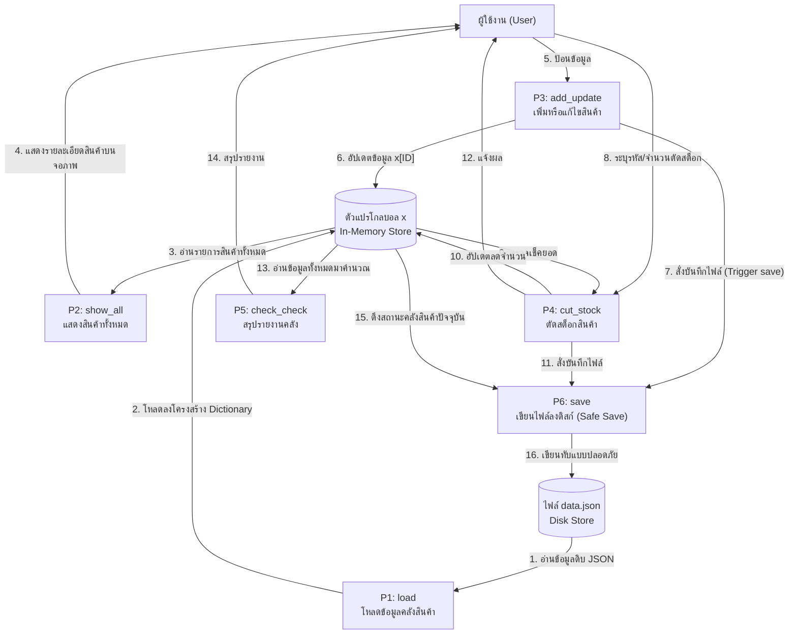

# รายงานข้อเสนอโครงการฉบับสมบูรณ์ (Integrated Planning Proposal)
**ระบบ:** CLI Inventory Management System
**รายวิชา:** Software Project Management
**GitHub:** [GitHub รายวิชา](https://github.com/Panuwat-ta/software-project-management)

เอกสารฉบับนี้เป็นการรวบรวมงานและแผนการดำเนินงานจากสัปดาห์ที่ 1 ถึงสัปดาห์ที่ 4 เพื่อเป็นข้อเสนอโครงการ (Integrated Planning Proposal) ในการปรับปรุงและบำรุงรักษาซอฟต์แวร์ระบบจัดการคลังสินค้า

---

## 1. Project Charter & Final Scope (WBS)

### 1.1 เป้าหมายโครงการ (Project Objectives)
1. **ปรับปรุงเสถียรภาพการทำงาน (Stability Improvement):** ทำให้ระบบจัดการสินค้ามีความทนทานต่อข้อผิดพลาด (Fault Tolerance) ไม่หยุดทำงานหรือพังลงจากการรับข้อมูลนำเข้าที่ไม่ถูกต้อง (Crash Prevention)
2. **ปรับปรุงโครงสร้างโค้ด (Refactoring):** ทำความสะอาดโค้ดเดิม ยุบโค้ดส่วนที่ซ้ำซ้อน แยกฟังก์ชันออกเป็นโมดูล (Modularized) ให้ชัดเจน
3. **รักษาความสมบูรณ์ของข้อมูล (Data Integrity):** ปรับปรุงฟังก์ชันการบันทึกฐานข้อมูล JSON ให้ปลอดภัย ป้องกันความเสี่ยงจากข้อมูลสูญหาย
4. **สร้างระบบทดสอบแบบอัตโนมัติ (Automated Testing):** จัดทำชุดทดสอบเพื่อให้มั่นใจว่าการปรับปรุงโค้ดเดิมจะไม่ส่งผลเสียต่อการทำงานที่มีอยู่ (Regression Testing)

### 1.2 ขอบเขตการทำงาน (Final Scope - WBS)
เพื่อประกันความเสถียรสูงสุดของระบบและป้องกันปัญหาซอฟต์แวร์แครช ทีมพัฒนาได้แบ่งขอบเขตการทำงานออกเป็น 4 เฟสหลัก ดังนี้:

* **เฟส 1: การวางรากฐานและจัดโครงสร้างสถาปัตยกรรม (Refactoring & Infrastructure)**
  * แยกไฟล์ฐานข้อมูลเป็น `members.json` แยกจาก `data.json`
  * เปลี่ยนไปใช้การสร้าง Class (`InventoryManager`, `MemberManager`) แทนตัวแปร Global
  * ยุบส่วนตรรกะที่ซ้ำซ้อนในโค้ดต้นฉบับ
* **เฟส 2: การจัดการฐานข้อมูลสมาชิก (Member Database Integration)**
  * กำหนดโครงสร้างข้อมูลโมเดลสมาชิก
  * สร้างเมธอดสำหรับการเพิ่ม ค้นหา และบันทึกข้อมูลสมาชิก (LOAD/SAVE)
  * ประยุกต์ใช้วิธี **Safe Atomic Write** ในการเขียนไฟล์
* **เฟส 3: ปรับปรุงตรรกะการคำนวณและทำรายการขาย (Discount & Checkout Engine)**
  * พัฒนาระบบรับข้อมูลการจ่ายยอดสินค้า
  * ตรรกะคำนวณส่วนลด (Discount Logic Engine)
  * การแสดงผลรายละเอียดการคิดเงินก่อนหักสต็อก
* **เฟส 4: เพิ่มระบบดักข้อผิดพลาดเชิงลึกและทดสอบ (Exception Handling & QA)**
  * เขียนดักจับประเภทข้อมูลนำเข้าที่แปลกปลอม
  * ทำระบบตรวจสอบสถานะความเสียหายของฐานข้อมูล (Graceful Degradation)
  * พัฒนา Unit Tests ครอบคลุมเคสการคิดคำนวณ

---

## 2. ตารางแผนเวลาและเครื่องมือติดตาม (Time Schedule & Tracking Tools)

ทีมพัฒนาใช้ **Trello (Kanban Board)** เป็นเครื่องมือหลักในการติดตามสถานะของงาน โดยแบ่งบอร์ดออกเป็นคอลัมน์: Backlog, To Do, In Progress, Review, และ Done 

ตารางเวลาการดำเนินงานตามเฟส:

| ช่วงเวลา (สัปดาห์) | เฟสการทำงาน | งานหลักที่ดำเนินการ | สถานะ/เครื่องมือติดตาม |
| :--- | :--- | :--- | :--- |
| **สัปดาห์ที่ 1** | Phase 1: Refactoring & Infrastructure | วิเคราะห์โครงสร้างโค้ดเดิม, จัดทำ Project Charter, ร่าง Scope การทำงาน | Trello: Backlog / To Do |
| **สัปดาห์ที่ 2** | Phase 2: Member Database Integration | ออกแบบโครงสร้าง DFD, ประเมินความเสี่ยงเชิงระบบ, วางแผนจัดการสถานะ Global | Trello: Done |
| **สัปดาห์ที่ 3** | Phase 3: Discount & Checkout Engine | เขียนโค้ดระบบจัดการสินค้า, จัดทำระบบจัดการข้อผิดพลาด (Exception Handling) | Trello: Done / Review |
| **สัปดาห์ที่ 4** | Phase 4: Exception Handling & QA | จัดทำ Unit Test ด้วย PyTest, ทำเอกสารสรุป Integrated Planning Proposal | Trello: Done |

---

## 3. ตารางวิเคราะห์ความเสี่ยงและแผนรับมือเชิงระบบ (Risk Matrix & Mitigation)

| ลำดับ | หัวข้อความเสี่ยง (Risk Topic) | ผลกระทบต่อระบบ (Impact) | แผนบรรเทาความเสี่ยง (Mitigation Plan) |
| :---: | :--- | :--- | :--- |
| 1 | **ความเสี่ยงจากการขัดแย้งของสถานะตัวแปรระดับ Global (Global State Conflict Risk)** | การประกาศ global x อาจทำให้เกิดการเขียนทับข้อมูลโดยไม่ได้ตั้งใจ ทำให้การคำนวณราคาสินค้าหรือส่วนลดผิดพลาด และทำ Unit Test ได้ยาก | **ทำการแปลงระบบเป็น OOP (MVC Pattern)**: Refactor โค้ดโดยแยก Business Logic ออกจาก Presentation Layer (CLI) ในรูปของ Class เพื่อหลีกเลี่ยงการใช้ตัวแปร global ตรงๆ |
| 2 | **ความเสี่ยงจากการเขียนทับไฟล์ข้อมูลดั้งเดิมโดยตรงแล้วแอปพลิเคชันล่ม (Data Corruption)** | ฟังก์ชันการเซฟแบบเดิมใช้วิธี json.dump ตรงๆ มีความเสี่ยงสูงที่ข้อมูลจะหายหากไฟดับหรือแอปพลิเคชันค้างขณะบันทึก | **ใช้กระบวนการบันทึกข้อมูลที่ปลอดภัย (Atomic Write หรือ SQLite)**: ใช้การบันทึกผ่าน Temporary Files หรือใช้ SQLite Transaction เพื่อให้มั่นใจว่าข้อมูลบันทึกสมบูรณ์ 100% |
| 3 | **ความเสี่ยงจากการรับประเภทข้อมูลนำเข้าผิดประเภท (Input Type Mismatch Risk)** | การขาด Input Validation เมื่อรับค่าเป็นตัวอักษรแทนตัวเลข จะทำให้ระบบส่งผ่าน Error `ValueError` และล่มกะทันหัน | **บังคับใช้ระบบ Input Validation อย่างเคร่งครัด**: ดักจับข้อมูลนำเข้าเพื่อคัดกรองตัวเลขที่ไม่ใช่ลบ และดักจับ ValueError ด้วย try-except ก่อนส่งค่าไปประมวลผล |
| 4 | **ความเสี่ยงจากการเข้ารหัสภาษาไทยผิดเพี้ยนในการจัดเก็บข้อมูล (Encoding Risk)** | การเปิดไฟล์ข้อมูลโดยไม่ระบุ `encoding='utf-8'` อาจทำให้ชื่อสินค้าหรือภาษาไทยผิดเพี้ยนบน OS อื่น | **ตั้งค่า Encoding ให้เป็นมาตรฐาน UTF-8 เสมอ**: กำหนดให้การอ่าน/เขียนไฟล์ (เช่น JSON หรือ SQLite) รองรับ UTF-8 อย่างชัดเจน |

---

## 4. แผนภาพโครงสร้างระบบเดิมพร้อมจุดล็อกเกราะป้องกัน (DFD & PyTest Snippet)

### 4.1 แผนภาพกระแสข้อมูลบริบทระดับ 1 (DFD Level 1)
แผนภาพนี้แสดงโครงสร้างข้อมูลในระบบที่ได้รับการออกแบบเพื่อจัดการข้อมูลอย่างปลอดภัย (ข้อมูลในหน่วยความจำและไฟล์):



### 4.2 จุดล็อกเกราะป้องกันด้วย Automated Testing (PyTest Snippet)
การใช้ PyTest เป็นเกราะป้องกันไม่ให้จุดบกพร่องเก่าที่แก้ไปแล้วกลับมาพังอีก (Regression Prevention) ตัวอย่างการทดสอบฟังก์ชันสำคัญ:

```python
import pytest
from app import InventoryManager, Product

def test_cut_stock_success(manager):
    """ทดสอบการหักสต็อกสำเร็จเมื่อมีสินค้าพอเพียง (Happy Path)"""
    success, msg, remaining = manager.cut_stock("1", 5)
    assert success is True
    assert remaining == 15
    assert manager.products["1"].quantity == 15

def test_cut_stock_not_enough(manager):
    """ทดสอบการหักสต็อกล้มเหลวเมื่อยอดเบิกเกินสต็อก (Edge Case ป้องกันบั๊กค่าติดลบ)"""
    success, msg, remaining = manager.cut_stock("2", 15)
    assert success is False
    assert msg == "Error: Not enough stock!"
    assert remaining == 10

def test_cut_stock_not_found(manager):
    """ทดสอบการตัดสต็อกด้วย ID ที่ไม่มีในระบบ (Edge Case ดัก Error)"""
    success, msg, remaining = manager.cut_stock("999", 5)
    assert success is False
    assert msg == "Product not found!"
    assert remaining is None
```
