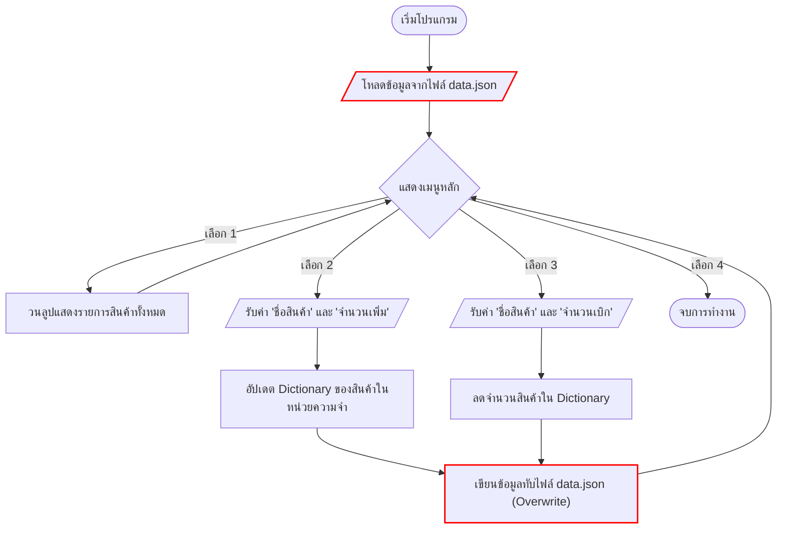
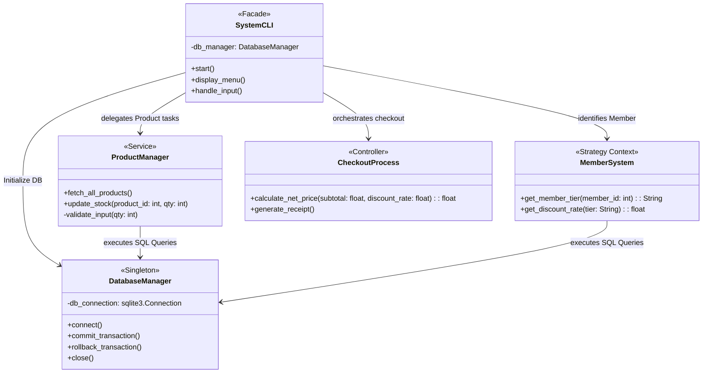

# สถาปัตยกรรมระบบ (System Architecture)

เอกสารนี้แสดงการเปรียบเทียบสถาปัตยกรรมของระบบคลังสินค้าเดิม (As-is) และระบบคลังสินค้าใหม่ (To-be) ตามที่ได้วางแผนไว้

---

## 1. ผังงานระบบเดิม (As-is Architecture Flowchart)
ผังงาน (Flowchart) แสดงกระบวนการทำงานของระบบแบบ Monolithic Script ที่ใช้ JSON เป็นฐานข้อมูลชั่วคราว ขาดการดักจับข้อผิดพลาดและโครงสร้างแบบ OOP

---

## 2. โครงสร้างคลาสระบบใหม่ (To-be Architecture UML Class Diagram)
แผนภาพคลาส (UML Class Diagram) สำหรับระบบใหม่ที่ถูกจัดโครงสร้างใหม่เป็นแบบเชิงวัตถุ (OOP) นำ SQLite มาใช้เพื่อให้รองรับ Transaction และเพิ่มระบบสมาชิกลดราคา (Membership System)

