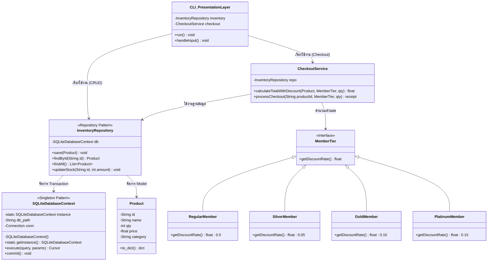

# แผนภาพสถาปัตยกรรม To-Be (To-Be Architecture Class Diagram)

เอกสารนี้อธิบายสถาปัตยกรรมเป้าหมายของระบบคลังสินค้าที่ถูกปรับปรุง (Refactor) จากสคริปต์ `app_v1.py` แบบดั้งเดิม ไปสู่สถาปัตยกรรมที่รองรับ **SQLite Database** และ **ระบบสมาชิก (Member System)** ตามแผนงาน Evolution ในโปรเจค

## แผนภาพคลาส (Mermaid Class Diagram)

## คำอธิบาย Architecture และ Patterns

1. **Repository Pattern (`InventoryRepository`)**: ทำหน้าที่ครอบระบบฐานข้อมูล SQLite เอาไว้ ทำให้ส่วนอื่นๆ ของโปรแกรม เช่น `CheckoutService` และ `CLI_PresentationLayer` ไม่ต้องเขียนคำสั่ง SQL โดยตรง ลดช่องโหว่ SQL Injection ผ่าน Parameterized Query
2. **Singleton Pattern (`SQLiteDatabaseContext`)**: ควบคุมให้มีจุดเชื่อมต่อฐานข้อมูลเพียงจุดเดียว ป้องกันปัญหา Database Locked เมื่อมีการเรียกเขียนไฟล์พร้อมๆ กัน (แก้ปัญหาการใช้ `with open()` ซ้ำซ้อนในโค้ดเก่า)
3. **Strategy Pattern (`MemberTier`)**: ออกแบบระบบสมาชิกให้แต่ละระดับ (Tier) แยกจากกันอย่างชัดเจน ทำให้เราสามารถเพิ่มสมาชิกระดับใหม่ (เช่น Diamond) ในอนาคตได้ทันทีโดยไม่ต้องไปยุ่งกับคำสั่ง `if-else` ที่วุ่นวายในหน้า Checkout
