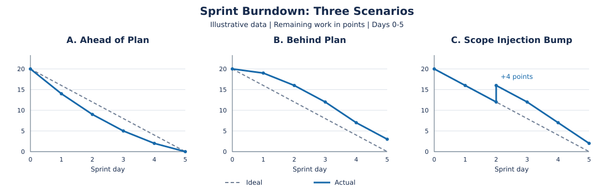

# คำตอบ Pre-Final — ENGSE202: การจัดการโครงการซอฟต์แวร์

เอกสารนี้ตอบโจทย์หลัก 5 ข้อ และโจทย์เพิ่มเติมด้าน Requirements/System Analysis อีก 5 ข้อ จาก `Software Project Management.md` โดยอ่านบทเรียนทั้งสองวิชาสัปดาห์ที่ 1–15 ประกอบ ตัวเลขตามโจทย์และสไลด์เป็นข้อมูลกรณีศึกษา ส่วนตัวเลขที่เสนอเพิ่มระบุเป็นสมมุติฐาน ไม่ใช่ค่าใช้จ่ายหรือผลดำเนินงานจริงของ repository นี้

## ส่วนที่ 1: โจทย์หลัก

> คำชี้แจง: จงตอบคำถามอัตนัยต่อไปนี้โดยใช้กรอบมาตรฐานสากล PMBOK Guide (7th Edition), ทฤษฎี Earned Value Management (EVM) และระเบียบวิธี Agile/Scrum ในการวิเคราะห์และแก้ไขปัญหาทางการบริหาร (ข้อละ 10 คะแนน รวม 50 คะแนน)  

### ข้อ 1: Agile Monitoring และ Blocker

**บริบทโจทย์**

> ข้อที่ 1: การติดตามควบคุมโครงการแบบ Agile และการบริหาร Blocker (สัปดาห์ที่ 8)  

#### โจทย์ 1.1

> 1.1 ในการติดตามสุขภาพของรอบการพัฒนาผ่าน Sprint Burndown Chart บน Jira จงวาดภาพและวิเคราะห์ลักษณะเส้นกราฟจริง (Actual Line) ใน 3 สภาวะต่อไปนี้:  
>
> สภาวะที่เส้น Actual ทอดตัวอยู่ใต้เส้น Ideal Line  
> สภาวะที่เส้น Actual ลอยสูงกว่าเส้น Ideal Line  
> สภาวะที่เส้น Actual เกิดอาการหักหัวพุ่งสูงขึ้นกะทันหันกลาง Sprint (Scope Injection Bump)  
>

#### คำตอบ 1.1: Sprint Burndown Chart 3 สภาวะ

Burndown แสดงงานคงเหลือบนแกนตั้งและเวลาบนแกนนอน เส้น Ideal ลดจากงานตั้งต้นจนเป็นศูนย์ในวันจบ Sprint เส้น Actual แสดงข้อมูลจริงตามวิธีวัดที่ทีมกำหนด เช่น remaining hours หรือ story points ของงานที่เสร็จตาม DoD ต้องใช้หน่วยเดียวกันตลอดกราฟ



ภาพใช้ข้อมูลสมมุติ Sprint 5 วัน ตารางนี้เป็นข้อมูลของเส้นในภาพเพื่ออ่านได้แม้โปรแกรมไม่แสดง SVG:

| วัน | Ideal | Actual: ใต้ Ideal | Actual: เหนือ Ideal | Actual: Scope Bump |
|---:|---:|---:|---:|---:|
| 0 | 20 | 20 | 20 | 20 |
| 1 | 16 | 14 | 19 | 16 |
| 2 | 12 | 9 | 16 | 12 ก่อนเพิ่มงาน / 16 หลังเพิ่มงาน |
| 3 | 8 | 5 | 12 | 12 |
| 4 | 4 | 2 | 7 | 7 |
| 5 | 0 | 0 | 3 | 2 |

**Actual อยู่ใต้ Ideal:** งานเหลือน้อยกว่าแนวอ้างอิง อาจเสร็จเร็วหรือประมาณงานเผื่อมาก PM ตรวจ DoD และ scope ว่าไม่ได้ตัดงานออกโดยไม่มีบันทึก แล้วใช้ capacity ที่เหลือช่วย review/QA ไม่ดึงฟีเจอร์เพิ่มอัตโนมัติ

**Actual อยู่เหนือ Ideal:** งานเหลือมากกว่าแนวอ้างอิง มีความเสี่ยงไม่จบ Sprint ตรวจ blocker, งานรอ review, งานใหญ่เกินไปหรือประมาณต่ำ แล้วช่วยเคลียร์ dependency และเจรจาปรับงานกับ Product Owner หากจำเป็น การอยู่เหนือเส้นเพียงวันเดียวไม่ใช่หลักฐานว่าทีมล้มเหลว เพราะงานอาจเสร็จเป็นช่วง

**Actual พุ่งขึ้นกลาง Sprint:** มีงานเพิ่ม, re-estimate สูงขึ้น หรืองานถูกเปิดใหม่ ต้องดู change log จึงสรุปเหตุได้ เช่น CR-02 เพิ่ม 4.5 ชั่วโมงคน PM บันทึกมติและผลกระทบ ให้เห็นว่าปริมาณงานเพิ่มโดยไม่ตีความว่าเป็นความช้าของทีมอย่างเดียว

ใน Jira การ Log Work ไม่ทำให้ burndown แบบ story points ลดลงโดยอัตโนมัติ ต้องตรวจ setting ว่ากราฟนับ remaining estimate หรือ issue completion; logged hours ใช้หาต้นทุนจริงและ remaining estimate ใช้แสดงงานที่ยังเหลือ ไม่ใช่สิ่งเดียวกัน

#### โจทย์ 1.2

> 1.2 เมื่อสมาชิกในทีมแจ้งใน Daily Standup ว่า "ติด Blocker ไม่สามารถเขียนโค้ดต่อได้เนื่องจากรอเพื่อนส่ง Pull Request" ในฐานะ Project Manager (PM) ท่านมีขั้นตอนในการบันทึกและปลดล็อกปัญหานี้บนกระดาน Jira (เช่น การใช้ระบบ Flagging) อย่างไร?  

#### คำตอบ 1.2: การบันทึกและปลดล็อก Blocker ที่รอ Pull Request

1. รับข้อมูลใน Daily Standup ว่าการ์ดใดหยุดเพราะรอ PR ใด ตั้งแต่เมื่อไร และกระทบ Sprint Goal อย่างไร แยกการแก้รายละเอียดไปคุยต่อหลัง standup
2. Flag การ์ดบน Jira และใส่ comment ระบุ dependency/PR link, ผู้ที่ช่วยได้, วันเวลาที่เริ่ม blocked และขั้นตอนถัดไป สร้าง issue link เช่น “is blocked by” ไปยังงานต้นทาง
3. ใส่ลง Impediment Log/Backlog มอบหมายผู้ประสานและกำหนดเวลาตรวจติดตาม เช่น Tech Lead ต้อง triage PR ภายในครึ่งวันตามข้อตกลงทีม
4. ตรวจสาเหตุ: PR ยังไม่เปิด, CI แดง, reviewer ไม่ว่าง หรือ interface ยังไม่ตกลง ถ้า CI แดงช่วยเจ้าของแก้; ถ้ารอคนตรวจให้จัด reviewer เพิ่ม/pair review; ถ้ารอ interface ใช้ contract/stub ชั่วคราวสำหรับงานที่ทำแยกได้
5. ให้ทีมช่วยทำ review/QA เพื่อลดงานค้าง หรือหยิบงานที่ไม่พึ่ง PR มาทำตาม WIP limit โดยไม่ bypass test หรือ approve โค้ดโดยไม่ตรวจ
6. เมื่อ PR ผ่าน CI/review และ dependency พร้อมจริง ให้สมาชิกยืนยันว่างานต่อได้ จึง remove flag บันทึกเวลาที่ปลดล็อกและอัปเดต remaining estimate หากยังไม่ทันเป้าหมายให้ PM/PO เจรจาจัดลำดับใหม่

ใน Scrum จริง Scrum Master มี accountability ช่วยขจัด impediments และ Developers ร่วมปรับแผน ส่วน PM ในโจทย์รับบทประสานโครงการ ไม่สั่งการข้ามการตัดสินใจของทีมทุกเรื่อง ตาม [Scrum Guide](https://scrumguides.org/scrum-guide.html)

อ้างอิงบทเรียน: ENGSE202 สัปดาห์ 3, 6 และ 8

### ข้อ 2: EVM และ Agile Ceremonies

**บริบทโจทย์**

> ข้อที่ 2: การประเมินผลต่างประสิทธิภาพ (EVM) และพิธีกรรม Agile (สัปดาห์ที่ 9)  

#### โจทย์ 2.1

> 2.1 โครงการหนึ่งตั้งเป้าหมายใน Sprint 1 ไว้ที่ Planned Value (PV) = 4,000 บาท เมื่อสิ้นสุด Sprint พบว่าทีมทำงานเสร็จสมบูรณ์ผ่าน DoD คิดเป็นมูลค่าเนื้องาน (EV) = 3,000 บาท แต่มีการบันทึก Log Time ค่าแรงจริง (AC) = 4,200 บาท:  
>
> จงคำนวณหาค่า Schedule Variance (SV) และ Cost Variance (CV) พร้อมตีความสถานะทางการบริหาร  
> จงเสนอแนวทางแก้ไขทางการเงินว่า PM ต้องนำเงินจากส่วนใดมาชดเชยผลต่างที่ติดลบนี้  
>

#### คำตอบ 2.1: คำนวณ SV, CV และแนวทางการเงิน

กำหนด PV=4,000 บาท, EV=3,000 บาท และ AC=4,200 บาท EV เป็นมูลค่าตามงบของงานที่เสร็จผ่าน DoD ไม่ใช่เงินที่จ่ายไปหรือจำนวนชั่วโมงที่ทำงาน

| ตัวชี้วัด | วิธีคำนวณ | ผล | ความหมาย |
|---|---|---:|---|
| SV | EV − PV = 3,000 − 4,000 | **−1,000 บาท** | ส่งมอบมูลค่างานน้อยกว่าแผน ณ วันวัด |
| CV | EV − AC = 3,000 − 4,200 | **−1,200 บาท** | งานที่เสร็จมีต้นทุนเกินมูลค่าตามงบ 1,200 บาท |
| SPI (ประกอบการวิเคราะห์) | 3,000 ÷ 4,000 | 0.75 | ได้มูลค่างาน 75% ของที่วางแผนไว้ ณ จุดวัด |
| CPI (ประกอบการวิเคราะห์) | 3,000 ÷ 4,200 | ≈0.7143 | ใช้เงิน 1 บาท ได้มูลค่างานตามงบประมาณ 0.7143 บาท |

สูตรเป็นไปตาม [PMI: Earned Value Management](https://www.pmi.org/learning/library/evm-data-analysis-executive-action-8520) ค่า SV มีหน่วยเป็นบาทเพราะ EVM วัดงานด้วยมูลค่างบ จึงแปลงเป็นจำนวนวันล่าช้าโดยตรงไม่ได้ ต้องดู dependencies และ schedule เพิ่ม

**แนวทางตามบทเรียน:** วิเคราะห์ว่าเกินงบจากหนี้เทคนิค/merge conflict และใช้ **Contingency Reserve** ที่เตรียมสำหรับความเสี่ยงนั้นตามวงเงินและอำนาจอนุมัติ โดยบันทึกการใช้ 1,200 บาทพร้อมสาเหตุ ผู้อนุมัติและยอดคงเหลือ ถ้าไม่มีวงเงินพอหรือไม่ได้อยู่ใน risk response ที่อนุมัติ ให้ขอ Sponsor/CCB พิจารณางบ/ขอบเขต/แผนใหม่ ส่วน Management Reserve สำหรับความเสี่ยงไม่คาดหมายอยู่ภายใต้อำนาจผู้บริหารตามนโยบาย ดู [PMI: Risk Contingency Reserve](https://www.pmi.org/learning/library/model-risk-contingency-reserve-9310)

การเบิก reserve ไม่ทำให้ CV ที่เกิดไปแล้วกลายเป็นศูนย์ ต้องเก็บ performance variance ไว้และ forecast งานที่ยังไม่เสร็จด้วย CV=−1,200 ก็ไม่เท่ากับ cash shortfall ของทั้งโครงการโดยอัตโนมัติ แม้ AC−PV ตอนนี้เป็นเพียง 200 บาท แต่ยังมีงานตามแผนที่ไม่ได้ทำเสร็จ จึงไม่ควรอ้างว่าขอเงินอีก 200 บาทแล้วโครงการจบแน่นอน

#### โจทย์ 2.2

> 2.2 จงเปรียบเทียบความแตกต่างระหว่างพิธีกรรม Sprint Review กับ Sprint Retrospective และอธิบายว่าการใช้เทคนิค Mad / Sad / Glad หรือ Start / Stop / Continue ช่วยให้ทีมสร้าง Actionable Items ไปปรับปรุงการทำงานใน Sprint ถัดไปได้อย่างไร?  

#### คำตอบ 2.2: Sprint Review และ Sprint Retrospective

| ประเด็น | Sprint Review | Sprint Retrospective |
|---|---|---|
| สิ่งที่ตรวจ | Increment และการเปลี่ยนแปลงบริบทธุรกิจ | คน ปฏิสัมพันธ์ กระบวนการ เครื่องมือและคุณภาพ |
| ผู้เข้าร่วม | Scrum Team และ stakeholders ที่เกี่ยวข้อง | Scrum Team |
| คำถาม | งานที่เสร็จสร้างคุณค่าอะไร และควรทำอะไรต่อ? | อะไรช่วย/ขัดขวางทีม และจะปรับปรุงอย่างไร? |
| ผลลัพธ์ | Feedback และการปรับ Product Backlog | แผนปรับปรุงที่ทำได้จริงใน Sprint ถัดไป |

Review ไม่ใช่เพียง demo หรือด่านอนุมัติ release; demo เป็นส่วนหนึ่งของการตรวจและปรับแผน ส่วน Retrospective ต้องมีบรรยากาศที่พูดปัญหาได้โดยไม่โทษคน ตาม [Scrum Guide](https://scrumguides.org/scrum-guide.html)

**Mad/Sad/Glad** ช่วยรวบรวมความหงุดหงิด ความเสียดาย และสิ่งที่ทำได้ดี ก่อนหา pattern และสาเหตุ **Start/Stop/Continue** ช่วยเปลี่ยนประเด็นเป็นพฤติกรรมที่เริ่ม หยุด หรือทำต่อ จากนั้นเลือก 1–2 action items ที่มีเจ้าของ วันครบกำหนดและวิธีวัด

ตัวอย่าง: “PR รอนาน” → “ตั้ง reviewer สำรองและ triage PR ภายใน 12 ชั่วโมงทำงาน” เจ้าของ Tech Lead; เริ่ม Sprint ถัดไป; วัดสัดส่วน PR ที่ได้รับ first review ภายในเกณฑ์ แล้วทบทวนใน retro รอบหน้า อีกข้อคือ “เริ่มเขียน failing test ของ CR ก่อน implementation” โดย QA/Dev จับคู่ตรวจ test กับ acceptance criteria

อ้างอิงบทเรียน: ENGSE202 สัปดาห์ 9

### ข้อ 3: Scope Creep, Iron Triangle และ CCB

**บริบทโจทย์**

> ข้อที่ 3: การควบคุมการเปลี่ยนแปลงขอบเขต และคณะกรรมการ CCB (สัปดาห์ที่ 10)  

#### โจทย์ 3.1

> 3.1 Scope Creep คืออะไร และส่งผลร้ายต่อโครงการซอฟต์แวร์อย่างไร? จงอธิบายการรักษาสมดุลของ Project Management Iron Triangle (Scope, Time, Cost) เมื่อลูกค้ายื่นคำขอเปลี่ยนแปลงฉุกเฉิน (CR-02) เข้ามากลางคัน  

#### คำตอบ 3.1: Scope Creep และการรักษาสมดุล

Scope Creep คือการเพิ่มขอบเขตโดยไม่ผ่านการควบคุมและไม่ปรับเวลา งบหรือทรัพยากรที่เกี่ยวข้อง เช่น ผู้ใช้ขอ CSV “นิดเดียว” แต่ทีมเพิ่มทันทีโดยไม่คิด testing/UI/error handling ผลคือ overload, defects, งานหลักช้า และค่าแรงเกิน การเปลี่ยนที่มีมติและปรับแผนอย่างชัดเจนเป็น controlled change ไม่ใช่ scope creep

CR-02 เพิ่มงาน 4.5 ชั่วโมงคนตาม ENGSE225 สัปดาห์ 10 PM ต้องแสดงทางเลือกเพื่อรักษา Scope–Time–Cost และคุณภาพ เช่น:

- ทำทันทีและ **swap** งานสำคัญน้อยออกจาก Sprint โดยยังรักษา Sprint Goal
- ถ้างานทั้งหมดจำเป็น ให้อนุมัติงบ/ทรัพยากรหรือปรับ release schedule ตามผลกระทบจริง การเพิ่มคนอาจไม่เพิ่ม throughput ทันทีเพราะมี onboarding/dependency
- Defer ไป Sprint ถัดไปและตกลงวิธีรายงานสต็อกชั่วคราว หากคุณค่าด่วนยังไม่คุ้มความเสี่ยง

ไม่ชดเชยด้วยการตัด tests/Code Review ที่เป็น DoD ต้องคิดทั้ง effort และเวลารอ review/UAT โดย 4.5 ชั่วโมงคนไม่ได้แปลว่าเสร็จใน 4.5 ชั่วโมงตามนาฬิกาเสมอ

#### โจทย์ 3.2

> 3.2 จงอธิบายบทบาท หน้าที่ และองค์ประกอบของ Change Control Board (CCB) พร้อมอธิบายคำตัดสิน 3 รูปแบบ (Approve, Reject, Defer) หาก CCB มีมติว่า "Approve ให้ทำฟังก์ชันส่งออก CSV ทันที" PM จะต้องดำเนินการปรับปรุงเอกสารงบประมาณ (Contingency Reserve Utilization Log) และปรับแผนงานบน Jira อย่างไร?  

#### คำตอบ 3.2: บทบาท CCB และการปรับงบ/บอร์ด

CCB เป็นกลุ่มที่ได้รับมอบอำนาจพิจารณาคำขอเปลี่ยนแปลง ตรวจคุณค่า ผลกระทบ ความเสี่ยงและ baseline องค์ประกอบในกรณีศึกษาได้แก่ Sponsor/ลูกค้า, User Representative, PM และ Tech Lead; เพิ่ม QA/ฝ่ายการเงินเมื่อการเปลี่ยนเกี่ยวข้องกับความรับผิดชอบนั้น

| มติ | ความหมาย | ผลต่อแผน |
|---|---|---|
| Approve | ยอมรับพร้อมเงื่อนไขและวงเงิน/เวลาที่ชัดเจน | อัปเดต scope, plan, funding และเกณฑ์ตรวจรับ |
| Reject | ไม่ยอมรับเพราะไม่คุ้ม เสี่ยงหรืออยู่นอกเป้าหมาย | บันทึกเหตุผลและแจ้งผู้ร้องขอ |
| Defer | ยังไม่ทำตอนนี้ | กำหนดเหตุ/วันพิจารณาใหม่และจัด backlog |

เมื่อ Approve CSV ทันที PM บันทึก CCB minutes, acceptance criteria และอนุมัติ funding ก่อนปรับแผน บทเรียน ENGSE202 สัปดาห์ 10 ใช้อัตราเฉลี่ย 300 บาท/ชม. จึงได้ **4.5×300=1,350 บาท** และตัวอย่าง reserve เริ่มต้น 2,025 บาท:

| รายการ | รับเข้า/เบิกใช้ | คงเหลือ | หลักฐาน |
|---|---:|---:|---|
| เงินสำรองตั้งต้นของตัวอย่าง Week 10 | +2,025 | 2,025 | Approved budget |
| CR-02: 4.5h × 300 | −1,350 | **675** | CCB approval และ CR-02 |

หากคำนวณตามบทบาทที่ ENGSE225 ระบุและ rate ใน Week 5 จะเป็น Senior Dev 2×400 + Dev 1×300 + QA 1.5×250 = **1,475 บาท** ดังนั้น 1,350 เป็นสมมุติฐานอัตราเฉลี่ยในตารางฝั่งบริหาร ต้องเลือกฐานที่ CCB อนุมัติและเปิดเผยเหตุผล ไม่สลับฐานโดยเงียบๆ

บน Jira สร้าง `[CR-02] Export Low Stock Products to CSV` มี estimate รวม 4.5h, subtasks ของ Exporter/UI/QA, ผู้รับผิดชอบตาม RACI, acceptance criteria, CR/CCB links, dependencies และ target version ให้ PO/Developers ร่วมจัด Sprint Backlog ตาม capacity อัปเดต remaining estimate และ forecast บันทึก scope increase ให้เห็นเหตุของ Burndown bump และตรวจเครื่องมือ/CI cost เพิ่มด้วย

ตาม Scrum Sprint มีช่วงเวลาคงที่ การแก้ CR ระหว่าง Sprint ควรเจรจาขอบเขตที่ยังรักษา Sprint Goal แทนการเลื่อนวันจบ Sprint ทุกรอบ หากต้องเลื่อนวันส่งมอบให้ปรับ release schedule; ส่วนทางเลือกขยาย Sprint ที่ปรากฏในสไลด์เป็นวิธีบริหารของกรณีศึกษา ไม่ใช่ข้อปฏิบัติมาตรฐาน Scrum

**ข้อจำกัดตัวเลข:** ห้ามนำ reserve 675 นี้ไปใช้เป็นยอดต่อเนื่องจากข้อ 2 โดยอัตโนมัติ ถ้าเป็นบัญชีเดียวกันและเบิก 1,200 ไปแล้วจริง จะเหลือ 2,025−1,200=825 และไม่พอเบิก CR-02 อีก 1,350 ต้องขอวงเงิน/ปรับแผน หรือชี้แจงว่าเป็นตัวอย่างคนละบริบท

อ้างอิงบทเรียน: ENGSE202 สัปดาห์ 5, 7, 9–10 และ ENGSE225 สัปดาห์ 10

### ข้อ 4: CFD, Little's Law, Burnup และ Scope Freeze

**บริบทโจทย์**

> ข้อที่ 4: การวิเคราะห์กระแสงานขั้นสูง (CFD, Burnup) และ Scope Freeze (สัปดาห์ที่ 11)  

#### โจทย์ 4.1

> 4.1 ในการวิเคราะห์กระแสการทำงานผ่าน Cumulative Flow Diagram (CFD) บน Jira จุดอุดตันคอขวด (Bottleneck) จะสังเกตเห็นได้อย่างไรบนแผนภูมิ? และการนำกฎของลิตเติล (Little's Law:  Lead Time = WIP /Throughput ) มาใช้โดยการกำหนด WIP Limits ในช่อง Code Review ช่วยลดระยะเวลาการส่งมอบงานได้อย่างไร?  

#### คำตอบ 4.1: วิเคราะห์ Bottleneck และ WIP Limits

CFD แสดงจำนวนงานในแต่ละสถานะเป็นพื้นที่สะสมตามเวลา หากแถบ **Code Review/QA หนาขึ้นต่อเนื่อง** หมายถึงงานเข้า Review เร็วกว่าที่ออกสู่ Done ถ้า Done โตช้าลงพร้อมกันเป็นสัญญาณคอขวด ต้องตรวจ actual queue, อายุ PR และกำลังของ reviewer เพื่อยืนยัน

Little's Law: `Lead Time = WIP / Throughput` ใช้ค่าเฉลี่ยของระบบเดียวกัน หน่วยสอดคล้องและช่วงการวัดที่กระแสค่อนข้างเสถียร เช่น review WIP เฉลี่ย 6 ใบ และ throughput 2 ใบ/วัน ให้เวลาผ่านช่วง review เฉลี่ย 3 วัน ถ้าลด WIP เฉลี่ยเหลือ 3 โดย throughput ยังเท่าเดิม จะเป็น 1.5 วัน การวัดเฉพาะ review จึงเป็นเวลาใน stage นี้ ไม่ใช่ end-to-end lead time ทั้งโครงการ

ตั้ง WIP limit ช่อง Review=3 ใบตามบทเรียน เมื่อเต็ม ทีมช่วยตรวจ/แก้ findings ก่อนเริ่มส่งงานใหม่ ลด multitasking และ queue แต่การตั้ง limit อย่างเดียวไม่รับประกัน throughput เท่าเดิม ต้องมี reviewer, work size และนโยบายแก้ blocker ที่เหมาะสม

#### โจทย์ 4.2

> 4.2 จงอธิบายความเหนือกว่าของ Burnup Chart เมื่อเปรียบเทียบกับ Burndown Chart ในโครงการที่มีการเปลี่ยนแปลงขอบเขตงานบ่อยครั้ง และเหตุใด PM จึงต้องเจรจาทำข้อตกลง Scope Freeze Agreement กับลูกค้าในสัปดาห์ที่ 11 ก่อนวันส่งมอบจริง?  

#### คำตอบ 4.2: Burnup และ Scope Freeze Agreement

Burndown แสดงงานเหลือเส้นเดียว จึงแยกยากว่าเส้นขึ้นจากงานเพิ่มหรือทีมทำงานช้า ส่วน Burnup แยก **Total Scope** กับ **Completed Work** หาก CR-01/CR-02 เพิ่ม scope เส้นบนขยับขึ้น ขณะที่เส้น completed ยังสะท้อนงานที่ทีมทำเสร็จจริง

| ตัวอย่าง Week 11 | Scope สะสม | Completed |
|---|---:|---:|
| งานตั้งต้น | 20 points | 20 |
| เพิ่ม CR-01 5 points และทำเสร็จ | 25 | 25 |
| เพิ่ม CR-02 4 points แต่ทำเสร็จ 2 | 29 | 27 |

Completed/Scope = 27/29×100 ≈ **93.1%** ต้องระบุว่านับเฉพาะงานผ่าน DoD และไม่ใช้สัดส่วนนี้แทน EVM โดยไม่จัดงบให้แต่ละงาน

PM เจรจา Scope Freeze ใน Week 11 เพื่อยืนยันรายการที่จะตรวจรับและเปิดช่วง hardening/UAT ก่อนส่งมอบ Agreement ควรระบุ baseline/version, รายการ CR ที่รวมแล้ว, วันเริ่ม freeze, acceptance criteria, ข้อยกเว้นสำหรับ defect/security, ผู้อนุมัติ และการจัดเก็บคำขอใหม่ใน future backlog

Code Freeze ของฝั่งวิศวกรรมควบคุมการแก้ code ส่วน Scope Freeze ของฝั่งบริหารควบคุม requirement ที่จะส่งมอบ ทั้งสองทำให้ UAT และสัญญาส่งมอบอ้างสิ่งเดียวกัน

อ้างอิงบทเรียน: ENGSE202 สัปดาห์ 11 และ ENGSE225 สัปดาห์ 11

### ข้อ 5: KPIs, ROI และ Project Closure

**บริบทโจทย์**

> ข้อที่ 5: การประเมินดัชนี KPIs, ความคุ้มค่า ROI และการปิดโครงการ (สัปดาห์ที่ 12, 13, 14, 15)  

#### โจทย์ 5.1

> 5.1 ในการประเมินผลสัมฤทธิ์โครงการขั้นสุดท้ายผ่าน Project KPI Scorecard จงอธิบายความหมายและสูตรคำนวณของดัชนีชี้วัดประสิทธิภาพเชิงลึกทั้ง 2 ตัว ได้แก่:  
>
> Cost Performance Index (CPI = EV / AC): บ่งบอกประสิทธิภาพใด และหากคำนวณได้ CPI = 0.96 มีความหมายทางการเงินอย่างไร?  
> Schedule Performance Index (SPI = EV / PV): บ่งบอกประสิทธิภาพใด และหากคำนวณได้ SPI = 1.00 มีความหมายด้านเวลาอย่างไร?  
>
>

#### คำตอบ 5.1: CPI และ SPI

**CPI=EV/AC** วัดประสิทธิภาพการใช้ต้นทุน CPI=0.96 หมายถึงทุกต้นทุนจริง 1 บาท ได้มูลค่างานตามงบ 0.96 บาท ค่าใช้จ่ายสูงกว่ามูลค่างาน หาก CPI เท่ากับ 0.96 พอดี ต้นทุนเกินเมื่อเทียบกับ EV เท่ากับ `(1/0.96−1)×100≈4.17%` ส่วน 4% เป็นผลต่างเมื่อเทียบฐาน AC จึงต้องระบุฐานเปอร์เซ็นต์

**SPI=EV/PV** วัดมูลค่างานที่สำเร็จเทียบมูลค่างานตามแผน ณ วันวัด SPI=1.00 หมายถึง EV เท่ากับ PV ในเชิงมูลค่างบ แต่ไม่พิสูจน์ว่าทุก milestone ตรงเวลา เพราะงานคนละส่วนอาจชดเชยกัน และเมื่อโครงการจบ EV/PV อาจกลับเป็น 1 แม้ส่งมอบช้า ต้องดูวันที่จริงและ critical path ด้วย

ตัวอย่าง Week 12–15 ให้ PV=EV=15,525 และ AC=16,100:

| ผลคำนวณ | ค่า |
|---|---:|
| CPI | 15,525/16,100 ≈ **0.9643** (แสดง 0.96) |
| SPI | 15,525/15,525 = **1.00** |
| CV | 15,525−16,100 = **−575 บาท** |
| ต้นทุนเกินเมื่อเทียบ EV | 575/15,525×100 ≈ **3.70%** |

CPI ผ่านเกณฑ์ตัวอย่าง ≥0.95 ได้ แต่ยังใช้ต้นทุนไม่มีประสิทธิภาพเท่าค่า 1 จึงต้องรายงานทั้งผลเทียบ target และความหมายของดัชนี สูตรอ้างอิง [PMI EVM](https://www.pmi.org/learning/library/evm-data-analysis-executive-action-8520)

#### โจทย์ 5.2

> 5.2 ตามมาตรฐาน PMBOK Guide (Close Project or Phase) จงอธิบายความแตกต่างระหว่างกระบวนการ Administrative Closure (การจัดเก็บสินทรัพย์ OPAs และการบันทึก Lessons Learned) กับ Financial & Procurement Closure (การกระทบยอดสัญญาเครื่องมือและการปิดบัญชีเงินสำรอง) พร้อมอธิบายแนวทางการคำนวณผลตอบแทนความคุ้มค่า Maintenance ROI ของโครงการ  

#### คำตอบ 5.2: Administrative กับ Financial/Procurement Closure และ ROI

| กระบวนการ | งานสำคัญ | ผลส่งมอบ |
|---|---|---|
| Administrative Closure | ตรวจสิ่งส่งมอบเทียบ Charter/WBS, รวบรวม UAT/sign-off, รับช่วงงานดูแล, บันทึก Lessons Learned, จัดเก็บ OPAs และประวัติ Jira/SCM, ปลดทีมเมื่อส่งต่อเจ้าของงานครบ | Closure report, acceptance/handover records, archive, Lessons Learned Register |
| Financial & Procurement Closure | กระทบยอด Log Work/ค่าแรง/ใบเสร็จ/สัญญา, เคลียร์ payable, ตรวจยอดเงินสำรองและคืนส่วนเหลือ, ปิดทรัพยากรทดสอบที่ไม่ต้องใช้และโอนค่าใช้จ่าย production สู่เจ้าของใหม่ | Final EVM, reconciliation, contract settlement, reserve log |

OPAs เช่น WBS/RACI templates, Risk Register, CCB forms, CI workflows และ historical estimates ช่วยให้โครงการหน้าประเมินและทำงานได้ดีขึ้น Lessons Learned ควรมี Category, Situation, Root Cause, Impact และ Recommendation ที่นำไปใช้ได้ เช่น “เปลี่ยน schema ทุกครั้งต้องมี legacy-data regression test”

คำว่า Close Project or Phase เป็นชื่อกระบวนการที่ใช้ในกรอบ PMBOK แบบ process-oriented; การตอบนี้เชื่อมกับ principles/performance domains ของ PMBOK 7 ตามโจทย์ ไม่อ้างว่าโครงสร้างทุกชื่อมาจาก PMBOK 7 โดยตรง

**Maintenance ROI:** กำหนดช่วงเวลาเดียวกัน เช่นปีแรก แล้วใช้ `(Benefits−Investment)/Investment×100` ประโยชน์ที่วัดได้คือค่าแรงแก้บั๊กที่ลดลง และความสูญเสียจากสินค้าขาดที่หลีกเลี่ยงได้ ต้นทุนรวมต้องรวม implementation, testing, migration, training และ running cost ที่เพิ่มตามขอบเขตวิเคราะห์ ไม่บวกประโยชน์รายการเดียวซ้ำ

ตามตัวอย่าง Week 14:

- ประหยัดเวลาแก้บั๊ก: (10−2) ชม./เดือน ×12 เดือน ×150 บาท/ชม. = **14,400 บาท/ปี**
- ประโยชน์จากลด stockout สมมุติ = **12,000 บาท/ปี**
- Benefits รวม = **26,400 บาท/ปี**; Investment=AC=**16,100 บาท**
- ROI = (26,400−16,100)/16,100×100 = **63.98% หรือประมาณ 64.0%**
- ถ้าประโยชน์เกิดสม่ำเสมอและไม่มีต้นทุนเพิ่ม Payback = 16,100/(26,400/12) ≈ **7.32 เดือน**

สไลด์แสดง ROI 63.9% แต่ปัดเศษจากตัวเลขที่ให้เป็นหนึ่งตำแหน่งได้ 64.0% ควรรายงานวิธีคำนวณให้ตรวจได้ ประโยชน์ stockout ควรใช้กำไรส่วนเพิ่ม/ความเสียหายสุทธิที่หลีกเลี่ยง มิใช่ยอดขายทั้งก้อนโดยไม่หักต้นทุน และ ROI ข้างต้นเป็นประมาณการของกรณีศึกษา ต้องติดตาม benefit realization หลังส่งมอบจริง

**ข้อสังเกตเรื่องยอดปิดบัญชี:** สไลด์แสดง reserve 2,025−1,350−575=100 บาท ซึ่งเลขคณิตถูกต้อง แต่ถ้า 15,525 เป็นงบรวม reserve อยู่แล้ว และ AC=16,100 เป็นค่าใช้จ่ายรวมทั้งหมด เงินรวมจะขาด 575 บาท ไม่ใช่มีเงินเหลือ 100 บาท ต้องกระทบยอดฐานงบ/การจัดสรร reserve/AC ให้ชัดก่อนรับรองปิดบัญชี การย้าย reserve ที่รวมในงบอยู่แล้วไม่ได้เพิ่มเงินรวมอีกครั้ง

อ้างอิงบทเรียน: ENGSE202 สัปดาห์ 12–15

## ส่วนที่ 2: โจทย์เพิ่มเติม — Requirements Management / System Analysis

> คำชี้แจง: ข้อสอบอัตนัย 5 ข้อ เน้นการวิเคราะห์ความต้องการ การจัดทำโมเดลความต้องการระดับสูง และการจัดการการเปลี่ยนแปลง (Change Management)  

### เพิ่มเติมข้อ 1: แปลง NFR เป็น Architecture และรับมือ Payment Timeout

**บริบทโจทย์**

> ข้อ 1: การเปลี่ยนผ่านความต้องการสู่สถาปัตยกรรม (Non-Functional Requirements to Architecture)  
>
> โจทย์: กำหนด Use Case: "ผู้ใช้ทำธุรกรรมชำระเงินผ่าน Mobile Banking ในช่วงเทศกาลส่งเสริมการขาย" โดยมี Non-Functional Requirements (NFR) ดังนี้  
>
>
> Response Time สำหรับการตัดยอดเงินต้องไม่เกิน 2 วินาที  
> Availability ของระบบต้องอยู่ที่ 99.95% ตลอด 24/7  
> ต้องรองรับ Peak Concurrency สูงสุด 5,000 Transactions Per Second (TPS)  

#### โจทย์ 1.1

> จงอธิบายแนวทางการแปลง NFR ทั้ง 3 ข้อให้เป็นข้อกำหนดทางเทคนิค (Architectural Tactics / Technical Constraints) อย่างเป็นรูปธรรม  

#### คำตอบ 1.1

เริ่มด้วยทำ NFR ให้ตรวจสอบได้: ตอบกลับภายใน 2 วินาทีวัดจากจุดใดและต้องหมายถึง “ตัดยอดเสร็จ” หรือ “รับคำขอแล้ว”; 99.95% วัด availability ของธุรกรรมสำคัญในช่วงใด; และ **5,000 TPS เป็น throughput ไม่ใช่จำนวนผู้ใช้ concurrent** ต้องกำหนด transaction mix, duration และ acceptable errors ร่วมด้วย

| NFR | Architectural tactics/constraints ที่เสนอ | วิธีพิสูจน์ |
|---|---|---|
| ตัดยอด ≤2 วินาที | ลด synchronous hops; ใช้ connection pool/index; ไม่เรียก email/report ใน critical path; กำหนด end-to-end deadline และ timeout budget ต่อ service; สงวน capacity ของ ledger | วัด latency จาก client request ถึง durable ledger result ด้วย load test และ tracing ภายใต้โหลดที่ตกลง หากใช้ p99 ต้องได้รับการตกลงเพราะโจทย์เดิมไม่ได้กำหนด percentile |
| Availability 99.95% 24/7 | redundant app instances หลาย failure domains; load balancer/health checks; database replication/failover; dependency isolation, circuit breaker, graceful handling และ monitoring | ทดสอบ failover/fault injection และวัด uptime/transaction success ตลอดช่วงที่ตกลง เช่น 30 วันมี downtime budget 43,200×0.0005=**21.6 นาที** |
| Peak throughput 5,000 TPS | stateless API scale-out; capacity planning และ load shedding/backpressure; partition ledger ตาม account โดยรักษา ordering/transaction rules; queue เฉพาะงาน async; ลด DB contention | ทดสอบ sustain peak พร้อม workload จริง วัด throughput/latency/error/queue depth; เพิ่ม headroom ตามผลวัด ไม่เลือกจำนวน servers จากการเดา |

หากค่าเวลาเฉลี่ยเป็น 2 วินาทีจริงและ throughput 5,000/s จะมี in-flight เฉลี่ยประมาณ 10,000 ตาม Little's Law แต่เป้าหมาย latency สูงสุด/percentile ไม่เท่ากับค่าเฉลี่ย จึงไม่ใช้ตัวเลขนี้สรุป concurrency โดยไม่มีการวัด

#### โจทย์ 1.2

> ให้ออกแบบ Interaction Overview Diagram หรือ Sequence Diagram แสดงการจัดการเมื่อระบบปลายทาง (Payment Gateway) เกิด Timeout เพื่อรักษาความคงสมบูรณ์ของข้อมูล (Data Consistency)  

#### คำตอบ 1.2

**Consistency เมื่อ Gateway Timeout:** Timeout แปลว่ายังไม่รู้ผล อาจตัดเงินสำเร็จแล้วจึงห้าม retry ด้วย transaction ใหม่หรือประกาศ fail แล้วคืนเงินทันที ใช้ transaction ID/idempotency key เดิม, เก็บ pending state ถาวร, status inquiry/webhook และ reconciliation

```mermaid
sequenceDiagram
    actor U as User
    participant A as Payment API
    participant L as Ledger/Database
    participant G as Payment Gateway
    participant R as Reconciliation Worker
    U->>A: Submit payment(tx_id, idempotency_key)
    A->>L: Transaction: record PENDING and reserve funds
    L-->>A: Durable pending record
    A->>G: Request payment with same idempotency key
    alt Gateway returns confirmed success
        G-->>A: Confirmed success + gateway reference
        A->>L: Transaction: finalize debit once; record SUCCESS + outbox
        A-->>U: Payment successful
    else Gateway returns confirmed failure
        G-->>A: Confirmed failure
        A->>L: Transaction: release reservation; record FAILED
        A-->>U: Payment failed
    else Deadline exceeded; final outcome unknown
        A->>L: Keep PENDING/UNKNOWN; schedule reconciliation
        A-->>U: Processing; return tx_id for status check
        R->>G: Query transaction status using tx_id
        alt Confirmed success
            G-->>R: Success
            R->>L: Finalize once; SUCCESS + outbox
        else Confirmed failure
            G-->>R: Failure
            R->>L: Release reservation once; FAILED
        else Still unknown
            G-->>R: Pending/unknown
            R->>L: Keep pending; retry bounded + escalate
        end
        U->>A: Check status(tx_id)
        A->>L: Read recorded outcome
        A-->>U: Pending or final outcome
    end
```

การ reserve/finalize ใช้ local database transactions ที่สั้น ไม่เปิด DB transaction ค้างรอ gateway ผ่านเครือข่าย บังคับ uniqueness ของ transaction key และเปลี่ยนสถานะแบบ conditional เพื่อไม่ลงบัญชีซ้ำเมื่อ webhook/worker มาพร้อมกัน ใช้ outbox เพื่อให้การเปลี่ยน ledger และการประกาศ event อยู่ใน transaction เดียวกัน ผู้รับ event ต้อง idempotent ด้วย หากต้องชดเชยหลัง confirmed success ให้เป็นรายการ reverse/refund ที่ตรวจย้อนกลับได้

แนวทาง idempotency อ้างอิงตัวอย่างของผู้ให้บริการใน [Stripe: Idempotent Requests](https://docs.stripe.com/api/idempotent_requests) แต่ต้องตรวจว่าตัว Gateway ที่เลือกสนับสนุน semantics/retention นี้จริง

**ข้อจำกัด NFR:** การตอบ “กำลังประมวลผล” ใน 2 วินาทีรักษา response deadline แต่ไม่เท่ากับตัดยอดเสร็จใน 2 วินาที หาก requirement ต้องยืนยัน settlement ทุกครั้งภายใน 2 วินาที แม้ gateway timeout จะรับประกันด้วย architecture ฝั่งเราอย่างเดียวไม่ได้ ต้องมี gateway SLA/ขอบเขตความล้มเหลวที่ชัดเจน หรือเจรจา requirement ของ pending flow พร้อมเกณฑ์ reconciliation

### เพิ่มเติมข้อ 2: RTM และ Impact Analysis ของ Biometric + TOTP

**บริบทโจทย์**

> ข้อ 2: Requirement Traceability Matrix (RTM) & Impact Analysis  
>
> โจทย์: ในระหว่างสัปดาห์สุดท้ายของการพัฒนา Sprint ผู้มีส่วนได้ส่วนเสีย (Stakeholder) ขอยื่น Change Request (CR) เพื่อแก้ไขกระบวนการยืนยันตัวตน จากการใช้ OTP ผ่าน SMS เป็นการยืนยันด้วย Biometric + TOTP App  

#### โจทย์ 2.1

> จงเขียนตาราง Requirement Traceability Matrix (RTM) จำลองที่เชื่อมโยงระหว่าง User Requirement, Functional Requirement, Test Cases และ System Component ที่ได้รับผลกระทบ  

#### คำตอบ 2.1

สมมุติว่า “Biometric + TOTP App” หมายถึง device-bound key ที่ปลดล็อกด้วย biometric ในเครื่อง และ server ตรวจ TOTP อีกขั้น ไม่ส่งภาพ/แม่แบบ biometric ดิบไป server การเปลี่ยนต้องครอบคลุม enrollment, login, recovery และ migration จาก SMS ไม่ใช่เพียงเพิ่มหน้าจอสแกนใบหน้า

| User Requirement | Functional Requirement | Test Cases จำลอง | System Components ที่ได้รับผลกระทบ |
|---|---|---|---|
| UR-AUTH-01 ยืนยันตัวตนด้วยอุปกรณ์ที่ลงทะเบียน | FR-AUTH-01 ลงทะเบียน device key และพิสูจน์การครอบครองหลังตรวจตัวตน | TC-A01 register สำเร็จ; TC-A02 ปฏิเสธ key ไม่ถูกต้อง/อุปกรณ์ไม่ได้ลงทะเบียน | Enrollment API, mobile secure key storage, device registry |
| UR-AUTH-02 ใช้ biometric ก่อนยืนยัน | FR-AUTH-02 local biometric gate อนุญาต sign challenge ด้วย key ของอุปกรณ์; server ตรวจ signature/challenge expiry | TC-A03 biometric fail ไม่ sign; TC-A04 challenge replay/expired ถูกปฏิเสธ | Mobile biometric API, key store, Auth challenge verifier |
| UR-AUTH-03 ยืนยันด้วย TOTP app | FR-AUTH-03 ตรวจ TOTP ตามช่วงเวลาที่กำหนดและกัน reuse/rate limit | TC-A05 valid code; TC-A06 wrong/expired; TC-A07 reuse; TC-A08 clock drift ตาม policy | TOTP verifier, encrypted secret store, server time, rate limiter |
| UR-AUTH-04 ไม่ถูกล็อกเมื่อเปลี่ยนเครื่อง | FR-AUTH-04 recovery/re-enrollment ที่ตรวจตัวตนและเพิกถอนอุปกรณ์เก่า | TC-A09 recovery สำเร็จ; TC-A10 ป้องกัน recovery takeover | Recovery service, support flow, device revocation |
| UR-AUTH-05 ย้ายจาก SMS อย่างมีแผน | FR-AUTH-05 migration ต่อผู้ใช้, feature flag, audit events และ rollback policy | TC-A11 existing user migration; TC-A12 mixed population; TC-A13 rollback ไม่เปิดช่องข้าม auth | Account schema, feature flags, audit log, mobile UI/API |

RTM จริงต้องเพิ่ม requirement revision, CR ID, owner, implementation/PR link และผล test เพื่อ trace ได้ทั้งไปข้างหน้าและย้อนหลัง การเปลี่ยน requirement ต้องตรวจแถวที่เชื่อม component/test ทุกตัว

#### โจทย์ 2.2

> จงประเมิน Impact Analysis ทั้งในมิติของ Scope, Schedule, Cost และ Technical Debt หากจำเป็นต้องอนุมัติ CR นี้ทันที  

#### คำตอบ 2.2

**Impact Analysis หากอนุมัติทันที**

| มิติ | ผลกระทบ | แผนรับมือ |
|---|---|---|
| Scope | เพิ่ม enrollment, device proof, TOTP secret lifecycle, recovery, revocation, migration และ security tests; ลด/เลิก SMS ต้องกำหนดให้ชัด | บันทึก acceptance criteria และ work packages ทั้ง flow พร้อม out-of-scope |
| Schedule | งาน security/mobile/API/QA พึ่งกัน และอยู่สัปดาห์สุดท้ายของ Sprint จึงเสี่ยงทำไม่ทัน | ประเมิน critical dependencies/capacity; swap งานถ้ายังรักษา Sprint Goal; เลื่อน release หรือ staged rollout แทนลด tests |
| Cost | ค่าแรงหลายบทบาท, อุปกรณ์ทดสอบหลายรุ่น, security review และ support/training | Bottom-up: Σ(hours×role rate)+เครื่องมือ/บริการ+approved risk reserve; ไม่ให้ตัวเลขยอดรวมโดยไม่มี estimate |
| Technical Debt | ทาง SMS/TOTP ซ้ำกัน, flags ค้าง, recovery ทางลัดและ schema migration ไม่สมบูรณ์ | กำหนด auth interface, migration/version strategy, owner และวันเลิก legacy path พร้อม regression/security gates |

TOTP เป็นรหัสจาก shared secret และเวลาตาม [RFC 6238](https://datatracker.ietf.org/doc/html/rfc6238) จึงต้องคุม clock drift, secret protection และป้องกันใช้รหัสเดิมซ้ำตาม policy; biometric ฝั่ง client เพียงอย่างเดียวไม่ใช่หลักฐานที่ server เชื่อได้ และ TOTP ยังมีความเสี่ยง phishing/realtime relay ต้องทบทวน threat model โดยเฉพาะเมื่อ biometric และ TOTP อยู่บนอุปกรณ์เดียวกัน

### เพิ่มเติมข้อ 3: Requirement Conflict และ Prioritization

**บริบทโจทย์**

> ข้อ 3: การจัดการความขัดแย้งของความต้องการ (Requirement Conflict & Prioritization)  
>
> โจทย์: ระบบบริหารจัดการคำสั่งซื้อของธุรกิจแบบ Omni-channel มีความขัดแย้งระหว่างฝ่ายการตลาด (ต้องการบันทึกข้อมูลและ Checkout ให้ไวที่สุดโดยไม่ต้องบังคับกรอกข้อมูลส่วนบุคคล) กับฝ่ายบัญชีและการเงิน (ต้องการบังคับกรอกเลขประจำตัวผู้เสียภาษีและที่อยู่ตามทะเบียนบ้านทันทีก่อนสร้าง Order)  

#### โจทย์ 3.1

> ให้นำเสนอเทคนิคการทำ Requirement Prioritization (เช่น MoSCoW หรือ Kano Model) พร้อมระบุเกณฑ์การตัดสินใจ  

#### คำตอบ 3.1

ใช้ MoSCoW โดยตัดสินจากความจำเป็นต่อการใช้งาน/กฎบัญชีที่องค์กรยืนยัน, ผลต่อ conversion, ความเสี่ยงข้อมูลผิด, ความเป็นส่วนตัว, effort และ dependencies ไม่ใช้เสียงดังของฝ่ายใดเป็นเกณฑ์

| กลุ่ม | Requirement ที่เสนอ | เหตุผล |
|---|---|---|
| Must | สร้าง order และยอดเงินถูกต้อง; มีข้อมูลที่จำเป็นสำหรับเอกสารประเภทที่ลูกค้าเลือก; ข้อมูลตรวจสอบย้อนกลับได้ | ทำให้ระบบธุรกิจทำงานได้และฝ่ายบัญชีตรวจได้ |
| Should | Checkout แบบ guest ด้วยข้อมูลขั้นต่ำ; ขอข้อมูลใบกำกับเต็มเมื่อผู้ใช้เลือก; เติมข้อมูลจาก profile เมื่อยินยอม | ลด friction โดยยังรองรับการออกเอกสาร |
| Could | บันทึก billing profile หรือเติมที่อยู่เพื่อใช้ครั้งหน้า | เพิ่มความสะดวกแต่ไม่บล็อก flow หลัก |
| Won't ในรอบนี้ | บังคับทุกคนสร้าง account และกรอกข้อมูลเต็มทุกช่อง โดยยังไม่มีเหตุที่ยืนยันว่าจำเป็น | ใช้เวลาเพิ่มและเสี่ยง abandon; ค่อยทบทวนเมื่อมี evidence |

#### โจทย์ 3.2

> จงเขียนแนวทางการประนีประนอม (Negotiation Resolution) เพื่อออกแบบ Business Flow ใหม่ที่ตอบโจทย์คุณค่าทางธุรกิจของทั้งสองฝ่าย  

#### คำตอบ 3.2

**Negotiation Resolution:** แยก “อยากให้ไว” และ “อยากบังคับกรอกทุกช่อง” ออกจากผลประโยชน์จริง ฝ่ายตลาดต้องการ conversion ส่วนบัญชีต้องการเอกสารครบและ audit trail จึงเสนอ flow ดังนี้:

1. เลือกสินค้าและ guest checkout; ขอเฉพาะข้อมูลที่ต้องใช้ติดต่อ/จัดส่ง/ชำระตามชนิด order
2. ให้เลือกชนิดเอกสาร billing/invoice ที่ต้องการ ถ้าเอกสารนั้นต้องการเลขผู้เสียภาษี/ที่อยู่ ให้ขอและตรวจข้อมูลก่อนออกเอกสารนั้น
3. ถ้าไม่มีข้อมูลที่จำเป็น ให้เก็บ Draft/Pending Information ตามนโยบายที่อนุมัติ ไม่ออกเอกสารสมบูรณ์ด้วยข้อมูลปลอม ส่วน order ที่มีข้อมูลขั้นต่ำครบและชนิดเอกสารรองรับสามารถดำเนิน flow ได้
4. ให้ฝ่ายบัญชียืนยันว่าแต่ละสถานะอนุญาตสร้าง order/รับเงิน/ออกเอกสารอะไรได้ พร้อมข้อยกเว้นและเวลาส่งข้อมูล หากข้อบังคับที่ใช้จริงต้องมีข้อมูลก่อน order ต้องรักษา guard นั้นและลด friction ด้วยการเลือกประเภทล่วงหน้า/กรอกอัตโนมัติที่อนุญาต
5. ทดสอบกับสองฝ่าย วัด checkout completion/time และ invoice-data completeness/error แล้วลงนาม flow/SRS ที่ตกลงร่วมกัน

Flow นี้เป็นแบบจำลองการเจรจา ไม่สรุปว่า order ทุกชนิดต้องใช้เลขผู้เสียภาษีหรือที่อยู่ตามทะเบียนบ้าน; ต้องให้ผู้รับผิดชอบกฎบัญชีขององค์กรยืนยัน requirement ที่เกี่ยวข้องก่อนกำหนด Must

### เพิ่มเติมข้อ 4: Requirement Verification/Validation และการปรับ Requirement

**บริบทโจทย์**

> ข้อ 4: Requirement Validation and Verification (V&V)  
>
> โจทย์: เมื่อจัดทำเอกสาร Software Requirement Specification (SRS) ตามมาตรฐาน IEEE 830 หรือ ISO/IEC/IEEE 29148 เสร็จสิ้น  

#### โจทย์ 4.1

> จงอธิบายความแตกต่างเชิงปฏิบัติระหว่าง Requirement Verification และ Requirement Validation พร้อมยกตัวอย่างกิจกรรมที่ทีมต้องทำในแต่ละมิติ  

#### คำตอบ 4.1

**Verification** ตรวจคุณภาพและความสอดคล้องของ requirement work product เช่น SRS มี ID, ถ้อยคำชัด, ไม่มีข้อขัดแย้ง, ทดสอบได้และ trace ไปแหล่งที่มา ทำ inspection, checklist, consistency review และ RTM audit

**Validation** ตรวจว่าความต้องการนั้นแก้ปัญหาที่ผู้ใช้มีจริงในบริบทที่ตั้งใจ เช่นให้พนักงานบัญชี walkthrough การคำนวณ/ออกใบเสร็จ ใช้ prototype และตัวอย่างยอดธุรกิจ ตรวจ acceptance scenarios กับ stakeholders แล้วอนุมัติสิ่งที่ควรสร้าง ทั้งสองกิจกรรมทำได้ก่อนมี code ตามกรอบ [ISO/IEC/IEEE 29148:2018](https://www.iso.org/obp/ui?_escaped_fragment_=iso%3Astd%3Aiso-iec-ieee%3A29148%3Aed-2%3Av1%3Aen)

#### โจทย์ 4.2

> หากนำเกณฑ์คุณภาพ 3 ด้าน ได้แก่ Unambiguous (ไม่กำกวม), Verifiable (ตรวจสอบ/ทดสอบได้) และ Traceable (ติดตามได้) จงชี้ข้อบกพร่องของประโยค Requirement นี้ และเขียนปรับปรุงใหม่ให้ถูกต้องตามหลักการ:  
> "ระบบต้องประมวลผลการคำนวณภาษีและออกใบเสร็จได้อย่างรวดเร็วและเป็นมิตรกับผู้ใช้งาน"  

#### คำตอบ 4.2

ประโยคเดิม “ระบบต้องประมวลผลการคำนวณภาษีและออกใบเสร็จได้อย่างรวดเร็วและเป็นมิตรกับผู้ใช้งาน” มีปัญหา:

- **Unambiguous:** ไม่ระบุชนิดภาษี วิธีปัดเศษ เริ่ม/สิ้นสุดการจับเวลา และความหมายของความเป็นมิตร รวมหลายความต้องการไว้ประโยคเดียว
- **Verifiable:** “รวดเร็ว” และ “เป็นมิตร” ไม่มี threshold/workload/task จึงตัดสิน Pass/Fail ไม่ได้
- **Traceable:** ไม่มี ID, แหล่งความต้องการ/business rule, ผู้อนุมัติ และ test link

แยกเป็นข้อดังนี้ โดยตัวเลขต่อไปนี้เป็น **เกณฑ์สมมุติเพื่อสาธิตการเขียน** ต้องให้ stakeholders ตกลงก่อนใช้จริง:

| Requirement ID | ข้อความที่ปรับแล้ว | Traceability/การตรวจ |
|---|---|---|
| FR-TAX-01 | เมื่อคำสั่งซื้อมีรายการ/ราคา/ส่วนลดครบ ระบบต้องคำนวณภาษีตามตารางกฎ BR-TAX-01 revision ที่อนุมัติ และปัดเศษตาม BR-ROUND-01 พร้อมบันทึก revision ที่ใช้ | UR-ACC-01 → TaxCalculator → TC-TAX-01 ปกติ, 02 rounding, 03 invalid input |
| FR-REC-01 | เมื่อ payment มีสถานะ confirmed success ระบบต้องออกใบเสร็จอิเล็กทรอนิกส์ที่มีเลขอ้างอิงไม่ซ้ำ รายการยอดก่อนภาษี ภาษีและยอดรวมตาม FR-TAX-01; การร้องขอซ้ำด้วย order เดิมต้องไม่สร้างใบเสร็จซ้ำ | UR-ACC-02 → ReceiptService → TC-REC-01 และ 02 duplicate request |
| NFR-PERF-01 | บน test environment ENV-01 ที่กำหนด hardware/data size ระบบต้องคำนวณและทำใบเสร็จพร้อมให้ดาวน์โหลดภายใน 2 วินาทีที่ p95 ภายใต้ 100 concurrent requests ต่อเนื่อง 15 นาที; กำหนด error rate ≤0.1% | UR-OPS-01 → TC-PERF-01 และ load report |
| NFR-USE-01 | ผู้ใช้เป้าหมายใหม่อย่างน้อย 20 คนต้องทำ task คำนวณยอดและออกใบเสร็จจาก order ตัวอย่างได้โดยไม่รับคำแนะนำ สำเร็จอย่างน้อย 90% และมี SUS เฉลี่ยอย่างน้อย 70 หลังทำ task | UR-UX-01 → TC-USE-01 และ usability report |

การอ้าง business rule revision ทำให้ทีมไม่ต้องเดาอัตราภาษีหรือวิธีปัดเศษ และสามารถปรับ rule โดย trace กลับสู่ requirement/test ที่กระทบได้

### เพิ่มเติมข้อ 5: State Machine และ Exception เมื่อ Shipped แล้ว

**บริบทโจทย์**

> ข้อ 5: Formal Modeling & State Transition Specification  
>
> โจทย์: ระบบจัดการสถานะคำสั่งซื้อ (Order Lifecycle Management) มีเงื่อนไขการเปลี่ยนสถานะซับซ้อน ได้แก่ Draft, Pending Payment, Paid, Processing, Shipped, Delivered, Cancelled, Refunded  

#### โจทย์ 5.1

> จงเขียน State Machine Diagram (UML) แสดง State, Transitions, Events และ Guard Conditions ที่ครอบคลุมทุกกรณี รวมถึงกรณีการยกเลิกสินค้าและการขอเงินคืน  

#### คำตอบ 5.1

กำหนดแบบจำลองหลักตาม 8 สถานะที่โจทย์ให้ โดยสมมุติ full-order fulfillment และ full refund; partial shipment/refund ต้องแยก line-item/payment states เพิ่ม ใช้ state ของ order ร่วมกับ `payment_status`, `return_status` และ shipment record เพื่อไม่ให้สถานะเดียวซ่อนภาระเงิน/สินค้าที่ต่างกัน

```mermaid
stateDiagram-v2
    [*] --> Draft
    Draft --> PendingPayment: submit [ข้อมูลจำเป็นครบและจองสินค้าได้]
    Draft --> Cancelled: cancel [ยังไม่ตัดเงิน]
    PendingPayment --> Paid: paymentConfirmed [ยอดถูกและยังไม่บันทึก payment นี้]
    PendingPayment --> Cancelled: cancelOrExpire [ยืนยันไม่ capture และ release reservation]
    Paid --> Processing: startFulfillment [payment captured และ stock reserved]
    Paid --> Cancelled: cancelApproved [ยังไม่ส่งและหยุด fulfillment ได้]
    Processing --> Shipped: carrierHandover [แพ็กครบและ shipment ยืนยันแล้ว]
    Processing --> Cancelled: cancelApproved [ยังไม่ handover และ fulfillment หยุดสำเร็จ]
    Shipped --> Delivered: deliveryConfirmed [อ้าง shipment ที่ตรงกัน]
    Shipped --> Cancelled: recallComplete [carrier ยืนยันคืนคลังและอนุมัติยกเลิก]
    Shipped --> Refunded: returnAndRefundComplete [คืน/ตรวจรับสำเร็จและคืนเงินเต็มยืนยันแล้ว]
    Delivered --> Refunded: returnAndRefundComplete [เข้าเงื่อนไขคืนและตรวจรับ; refund settled]
    Cancelled --> Refunded: refundSettled [เคย capture และคืนเงินเต็มสำเร็จ]
    Cancelled --> [*]: close [ไม่มีเงินต้องคืนหรือภาระคงค้าง]
    Delivered --> [*]: close [พ้นเงื่อนไขคืนและไม่มีเรื่องค้าง]
    Refunded --> [*]: close [ledger และสต็อกกระทบยอดแล้ว]
```



`PendingPayment` ในรูปคือ “Pending Payment” ตามโจทย์ เหตุการณ์ PaymentFailed ไม่จำเป็นต้องยกเลิกทันที: เก็บอยู่ Pending Payment เพื่อ retry ด้วย payment attempt ที่ควบคุมได้จนหมดเวลา ส่วน refundRequested/refundFailed และ cancelRejected ไม่เปลี่ยน order เป็น Refunded/Cancelled เมื่อเงื่อนไขยังไม่สำเร็จ

**กฎสำคัญของ transition**

- เปลี่ยน state ผ่าน service ที่ตรวจ current state/guard ใน transaction หรือ optimistic concurrency; UI ไม่แก้ field โดยตรง
- Payment timeout อยู่ Pending Payment พร้อมผล unknown ห้าม cancel โดยสมมุติว่าไม่มี capture; ใช้ reconciliation ก่อนปล่อย reservation/ตัดสินชดเชย
- ไม่ใช้ `Paid` จากข้อความ client ต้องยืนยันจากผู้ให้บริการและบันทึกครั้งเดียว
- `Cancelled` ที่เคยจ่ายแล้วอาจยังรอ refund ให้แสดง `payment_status=REFUND_PENDING` และรับผิดชอบการคืนเงินต่อจน Refunded ไม่ปิดเรื่องทางการเงินทันที
- Event ซ้ำต้อง idempotent และ event เก่าต้องไม่ดึง state ถอยหลัง เช่น payment webhook ซ้ำไม่เปลี่ยน Refunded กลับเป็น Paid

#### โจทย์ 5.2

> จงระบุเงื่อนไข Exception Handling สำหรับกรณีที่สินค้าส่งออกจากคลังแล้ว (Shipped) แต่ผู้ใช้งานต้องการกดยกเลิกคำสั่งซื้อ ว่าระบบต้องจัดลำดับขั้นตอนทางธุรกิจและจัดการสถานะอย่างไร  

#### คำตอบ 5.2

**เมื่อ Shipped แล้วผู้ใช้กดยกเลิก**

1. อ่าน shipment/state ล่าสุดและตรวจการส่งมอบอย่างสอดคล้องกัน ห้าม UI เปลี่ยนเป็น Cancelled ทันที เพราะสินค้าออกจากคลังและอาจกำลังถึงลูกค้า
2. บันทึก cancel/return request ID และแจ้งผู้ใช้ว่าต้องรอยืนยันจากขนส่ง ตั้ง `return_status=REQUESTED` โดย order ยังเป็น Shipped
3. ถ้าขนส่งรับ recall ได้ ให้รอ confirmed recall/สินค้าคืนและตรวจรับก่อนเปลี่ยนเป็น Cancelled ตาม guard แล้วคืนเงินผ่าน workflow ที่ตามได้ เมื่อ settled จึง Refunded
4. ถ้า recall ไม่ได้ ให้รอ Delivered และดำเนิน return process ตามเงื่อนไข ตรวจรับสินค้าก่อนอนุมัติ refund; หากนโยบายอนุญาต refund ก่อนคืนต้องกำหนดข้อยกเว้นและอำนาจอนุมัติแยก
5. ถ้าผู้ให้บริการ refund timeout/fail อย่าแสดง Refunded ให้เก็บ REFUND_PENDING/FAILED, retry อย่าง idempotent, reconcile และ escalate โดยไม่เพิ่ม stock ซ้ำ
6. บันทึก audit events ของผู้ขอ ผู้อนุมัติ shipment, inventory adjustment และ refund reference เพื่อให้ฝ่ายลูกค้าสัมพันธ์/บัญชีตรวจย้อนกลับได้

Test cases ต้องครอบคลุมเส้นทางปกติ, cancel ก่อน/หลังจ่าย, cancel ชนกับ carrierHandover, timeout/duplicate payment, refund failure, return ไม่ผ่านเกณฑ์ และ webhook มาผิดลำดับ นี่เป็น state specification สำหรับโจทย์ ไม่ใช่หลักฐานว่าได้สร้างระบบ order/payment จริง

## เอกสารฐาน

ใช้โจทย์ `Software Project Management.md` และ `Pre-Final Examination.md`, บทเรียน ENGSE202 สัปดาห์ 1–15 และ ENGSE225 สัปดาห์ 1–15 รวมทั้งดัชนี `work.md` การอ้างแหล่งต้นฉบับภายนอกอยู่ใกล้ประเด็นที่รองรับในคำตอบ เพื่อแยกกติกาของกรณีศึกษาออกจากหลักการสากล
