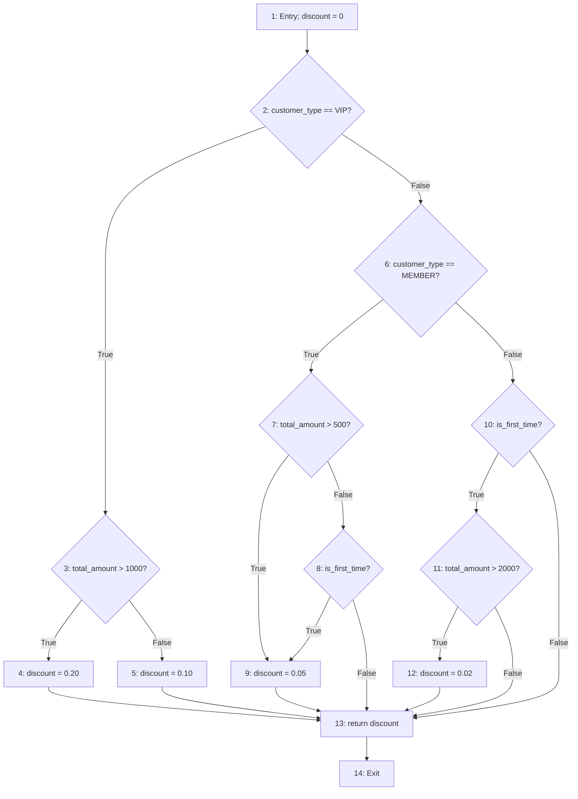

# คำตอบ Pre-Final — ENGSE225: วิวัฒนาการซอฟต์แวร์และการบำรุงรักษา

เอกสารนี้ตอบโจทย์หลัก 5 ข้อ และโจทย์เพิ่มเติมด้าน Testing, QA & Metrics อีก 5 ข้อ จาก `Software Evolution and Maintenance.md` โดยใช้กรณี Mini Inventory Legacy System ตามบทเรียนสัปดาห์ที่ 1–15 เป็นฐาน ตัวอย่างโค้ดเป็นตัวอย่างประกอบคำตอบ ไม่ใช่หลักฐานว่าได้แก้ไขหรือทดสอบระบบของโครงการจริง

## ส่วนที่ 1: โจทย์หลัก

> คำชี้แจง: จงตอบคำถามอัตนัยต่อไปนี้โดยแสดงการวิเคราะห์ทางวิศวกรรมซอฟต์แวร์ อธิบายตรรกะการแก้ปัญหา และอ้างอิงมาตรฐานสากล (ISO/IEC, Fowler's Refactoring, Clean Architecture) อย่างเป็นระบบ (ข้อละ 10 คะแนน รวม 50 คะแนน)  

### ข้อ 1: Refactoring ของ Martin Fowler

**บริบทโจทย์**

> ข้อที่ 1: การผ่าตัดโค้ดด้วยเทคนิค Refactoring ของ Martin Fowler (สัปดาห์ที่ 8)  
> ในการเข้าปรับปรุงซอฟต์แวร์คลังสินค้าดั้งเดิม (app_v1.py) เพื่อขจัดปัญหาหนี้ทางเทคนิค (Technical Debt)  

#### โจทย์ 1.1

> 1.1 จงอธิบายความหมายและขั้นตอนเชิงปฏิบัติการของเทคนิค Refactoring ต่อไปนี้ พร้อมยกตัวอย่างชิ้นส่วนโค้ด (Pseudo-code หรือ Python) สั้น ๆ ประกอบการอธิบาย:  
>
> Extract Class / Extract Function: การแตกฟังก์ชัน main() ขนาดใหญ่และกระจัดกระจายออกเป็นคลาส Product, InventoryRepository และ InventoryService  
>
> Encapsulate Field & Parameterize Object: การขจัดตัวแปรระดับโลก global x แล้วเปลี่ยนมาส่งผ่านอ็อบเจกต์ (Dependency Injection) ผ่านพารามิเตอร์แทน  
>

#### คำตอบ 1.1: Extract Function, Extract Class และการขจัด Global State

Refactoring คือการเปลี่ยนโครงสร้างภายในโดยคงพฤติกรรมที่สังเกตได้จากภายนอก เช่น ผลการคำนวณมูลค่าสต็อกและการเพิ่ม/ลดสินค้า ขั้นตอนนี้ต้องแยกจากการเพิ่ม Barcode หรือแก้บั๊ก เพราะสองกิจกรรมหลังเปลี่ยนพฤติกรรมของระบบ

**Extract Function** ย้ายชุดคำสั่งที่มีหน้าที่ชัดเจนออกจาก `main()` แล้วเรียกผ่านชื่อที่สื่อความหมาย เช่น แยกการคำนวณมูลค่าสินค้าออกจาก `input()` และ `print()` ทำให้ทดสอบตรรกะได้โดยไม่ต้องเปิดเมนู ตามแนวทาง [Extract Function ของ Fowler](https://refactoring.com/catalog/extractFunction.html)

```python
# ก่อน: ส่วนหนึ่งของ main() ใช้ข้อมูลแบบเดิม
total = 0
for item in x.values():
    total += item["q"] * item["p"]
print(total)

# หลัง: ยังใช้ schema และสูตรเดิม เพื่อคงพฤติกรรม
def calculate_total_value(inventory):
    return sum(item["q"] * item["p"] for item in inventory.values())

# main() เหลือการเรียกใช้และแสดงผล
# print(calculate_total_value(inventory))
```

**Extract Class** แยกความรับผิดชอบที่ปะปนกันเป็น 3 ส่วน ได้แก่ `Product` ดูแลข้อมูลและพฤติกรรมของสินค้า, `InventoryRepository` ดูแลการอ่าน/เขียนข้อมูล และ `InventoryService` ดูแลกรณีใช้งานและกฎธุรกิจ ส่วน `ConsoleUI` ดูแลเมนูและการสื่อสารกับผู้ใช้ ตามแนวทาง [Extract Class](https://refactoring.com/catalog/extractClass.html)

```python
from dataclasses import dataclass
from typing import Protocol

@dataclass(frozen=True)
class Product:
    product_id: str
    name: str
    quantity: int
    price: float

    def stock_value(self):
        return self.quantity * self.price

class InventoryRepository(Protocol):
    def load_all(self) -> list[Product]: ...

class InventoryService:
    def __init__(self, repository: InventoryRepository):
        self._repository = repository

    def total_value(self):
        return sum(p.stock_value() for p in self._repository.load_all())
```

ตัวอย่างนี้คงชนิดตัวเลขเดิมไว้ระหว่าง Refactoring; หากจะเปลี่ยนการคำนวณเงินเป็น `Decimal` ต้องแยกวิเคราะห์ผลกระทบและทดสอบการปัดเศษอีกงานหนึ่ง

**Encapsulate Field** จำกัดจุดอ่าน/แก้ไขข้อมูลผ่านเมธอดที่ควบคุมได้ แทนการให้ทุกฟังก์ชันแก้ `global x` โดยตรง เช่น Repository เก็บ `_products` ภายใน และคืนรายการที่ไม่เปิดให้ผู้เรียกแก้ state ภายในโดยไม่ผ่านกติกา คำนำหน้า `_` ใน Python เป็นข้อตกลงด้านการใช้งาน ไม่ใช่ระบบป้องกันการเข้าถึงโดยเด็ดขาด แนวคิดใกล้เคียงในแค็ตตาล็อก Fowler คือ [Encapsulate Variable](https://refactoring.com/catalog/encapsulateVariable.html)

**การส่ง Object ผ่านพารามิเตอร์ / Dependency Injection** ทำให้ Service ระบุ dependency อย่างชัดเจนผ่าน constructor ตัวอย่างการประกอบระบบคือ `service = InventoryService(json_repository)`; ในการทดสอบใช้ `InventoryService(fake_repository)` ได้โดยไม่เปลี่ยนตัวแปรทั่วโปรแกรม คำว่า “Parameterize Object” ในโจทย์ใช้ในความหมายนี้ และไม่ควรสับสนกับ “Introduce Parameter Object” ซึ่งหมายถึงการรวมพารามิเตอร์หลายตัวเป็น object

ลำดับปฏิบัติที่ปลอดภัยคือ (1) ล็อกพฤติกรรมเดิมด้วย characterization/regression tests (2) แยกฟังก์ชันคำนวณ (3) แยก Product (4) ย้าย I/O สู่ Repository และสร้างตัวแปลง schema เดิม (5) ส่ง Repository เข้า Service (6) ให้ UI เรียก Service และลบการใช้ `global x` เมื่อผู้เรียกทั้งหมดถูกย้ายแล้ว ทุกก้าวต้องรัน tests และทบทวนผลลัพธ์เดิม

หากใช้แนวคิด Clean Architecture อย่างเคร่งครัด Domain/Service ต้องพึ่งพา abstraction ที่ตนต้องการ ส่วน JSON Repository เป็น implementation ภายนอกที่นำมาฉีดเข้าไป การแบ่งเป็นหลายไฟล์เพียงอย่างเดียวยังไม่พิสูจน์ว่าทิศทาง dependency ถูกต้อง

#### โจทย์ 1.2

> 1.2 ตามแนวคิดของ Martin Fowler เพราะเหตุใดการทำ Refactoring จึงต้องมี "Safety Net" (เช่น ชุดทดสอบ PyTest) ควบคู่ไปด้วยเสมอ และกฎเหล็กของสภาวะการรัน Test ระหว่างผ่าตัดโค้ดคืออะไร?  

#### คำตอบ 1.2: Safety Net และกฎการรัน Test

Legacy Code มี dependency และผลข้างเคียงที่มองไม่เห็น การแยกคลาสอาจทำให้การโหลดข้อมูล การตัดสต็อก หรือการคำนวณเมนูเดิมเปลี่ยนไป Safety Net จึงต้องมีทั้งกรณีปกติ ขอบเขต และพฤติกรรมสำคัญเดิม เพื่อแจ้ง regression ได้เร็ว

กฎคือ **เริ่ม Refactoring เมื่อ tests เดิมเป็นสีเขียว เปลี่ยนทีละน้อย และกลับมาสีเขียวหลังแต่ละก้าวก่อนทำก้าวถัดไป** เมื่อ test แดง ให้หยุดตรวจหรือย้อนเฉพาะการแก้ไขล่าสุด ไม่เพิ่มฟีเจอร์กลบปัญหา และไม่ merge โค้ดที่ tests ยังไม่ผ่าน ส่วน Red ใน TDR เป็นความล้มเหลวที่ตั้งใจสร้างสำหรับพฤติกรรมใหม่ จึงเป็นคนละบริบท

Tests ผ่านทั้งหมดหมายถึงผ่านกรณีที่ออกแบบไว้ ไม่ใช่รับประกันว่าไม่มีบั๊กทุกชนิด ต้องใช้ Code Review และการทดสอบระดับระบบร่วมด้วย

อ้างอิงบทเรียน: ENGSE225 สัปดาห์ 2–3, 5–9

### ข้อ 2: Change Request และ Root Cause Analysis

**บริบทโจทย์**

> ข้อที่ 2: กระบวนการจัดการคำขอเปลี่ยนแปลงและวิวัฒนาการซอฟต์แวร์ (สัปดาห์ที่ 8, 9, 10)  

#### โจทย์ 2.1

> 2.1 เมื่อลูกค้าส่งมอบใบคำขอเปลี่ยนแปลง Change Request (CR-01: ขอเพิ่ม Barcode และ Reorder Point) และ Emergency Change Request (CR-02: ขอส่งออกรายงานสต็อกต่ำเป็นไฟล์ CSV ด่วน) จงอธิบายขั้นตอนการจัดการคำขอตามมาตรฐาน ISO/IEC 14764 / IEEE 1219 ตั้งแต่ขั้นตอนการรับคำขอ การวิเคราะห์ผลกระทบ (Impact Analysis) จนถึงการเขียนชุดทดสอบแบบ Test-Driven Refinement (TDR)  

#### คำตอบ 2.1: กระบวนการ CR-01 และ Emergency CR-02

ใช้กรอบงานบำรุงรักษาจาก ISO/IEC 14764 และ IEEE 1219 ตามฉบับที่บทเรียนอ้างอิง แล้วประยุกต์เป็นกระบวนการของทีมดังนี้

1. **รับและบันทึกคำขอ:** สร้าง CR ID, ผู้ร้องขอ, ปัญหาธุรกิจ, ขอบเขต, ความเร่งด่วน และเกณฑ์ยอมรับ หลีกเลี่ยงการเริ่มงานจากคำสั่งปากเปล่าที่ไม่มีบันทึก
2. **จำแนกและทำความต้องการให้ชัด:** CR-01 เพิ่ม Barcode/Reorder Point และ CR-02 เพิ่มรายงาน CSV เป็น Perfective Maintenance ส่วน BUG-101 ที่อ่านไฟล์เก่าแล้วแครชเป็น Corrective Maintenance ความเร่งด่วนไม่ได้เปลี่ยนประเภทของงานโดยอัตโนมัติ
3. **วิเคราะห์ผลกระทบ:** ตรวจ Domain, Service, Repository, UI, schema, การย้ายข้อมูล, tests, ความเสี่ยงและ rollback ประเมินชั่วโมงคนพร้อมส่งให้ PM
4. **อนุมัติ:** PM/CCB พิจารณาคุณค่าและผลต่อ Scope–Time–Cost บันทึก Approve/Reject/Defer และแผนที่อนุมัติแล้วก่อนเริ่ม implementation
5. **พัฒนาแบบ TDR:** เขียน failing test ที่แทน acceptance criteria → เขียนโค้ดให้ผ่าน → จัดระเบียบโค้ดโดยรักษา tests ให้เขียว ใช้ branch แยกและเชื่อม CR กับ PR
6. **สอบทานและตรวจรับ:** รัน unit, integration และ regression ของระบบเดิม ตรวจผ่าน Code Review และ CI; ทดสอบ UAT ที่เกี่ยวข้อง แล้วอัปเดต CHANGELOG, RTM และ maintenance records

| คำขอ | ผลกระทบสำคัญ | Acceptance tests ที่ต้องมี |
|---|---|---|
| CR-01 | Product เพิ่ม `barcode: str`, `reorder_point: int`; Repository อ่าน/เขียน schema ใหม่และรองรับข้อมูลเก่า; Service แจ้งเตือน; UI รับและแสดงข้อมูล | Barcode round-trip รวมเลขศูนย์นำหน้า; ค่า reorder ไม่ติดลบ; quantity ต่ำกว่า/เท่ากับ/สูงกว่าเกณฑ์; โหลดข้อมูลเก่า |
| CR-02 | เพิ่ม CsvReportExporter แยกจาก UI และ Repository; ใช้รายการ low stock จาก Service; กำหนดสิทธิ์/พาทไฟล์ | Header และข้อมูลตรงสเปก; เลือกเฉพาะ low stock; รายการว่างยังมี header; ภาษาไทย, comma/quote ในชื่อสินค้า; เขียนไฟล์ไม่สำเร็จต้องแจ้งปัญหา |

เงื่อนไขตามบทเรียนคือ `quantity <= reorder_point` ดังนั้น tests ต้องใช้ 3, 5 และ 6 เมื่อเกณฑ์เท่ากับ 5 และคาดผลเป็น True, True, False ตามลำดับ

สำหรับ CR-02 ใช้ทางอนุมัติเร่งด่วนโดยลดเวลารอประชุม แต่ยังต้องมีผลกระทบ มติและ tests บทเรียน ENGSE225 สัปดาห์ 10 ประเมินรวม **4.5 ชั่วโมงคน**: Exporter 2 ชม., UI 1 ชม., QA 1.5 ชม. หากยังพัฒนาในรอบปกติใช้ feature branch; hotfix จาก production baseline ใช้เฉพาะปัญหา production ที่ต้องปล่อยแก้ทันทีและต้องนำการแก้กลับสู่สายพัฒนาด้วย

#### โจทย์ 2.2

> 2.2 หากการนำระบบไปใช้งานจริงพบข้อบกพร่องว่า "เมื่อเปิดไฟล์ข้อมูลเก่า data.json ที่ไม่มีฟิลด์ barcode โปรแกรมเกิด KeyError และแครชทันที" จงใช้เทคนิค Root Cause Analysis (RCA) - 5 Whys วิเคราะห์หาต้นตอของปัญหานี้ และอธิบายแนวทางแก้ไขในระดับสถาปัตยกรรม (เช่น การทำ Default Fallback Mechanism ใน Repository Layer)  

#### คำตอบ 2.2: วิเคราะห์ BUG-101 ด้วย 5 Whys

| ลำดับ | คำถาม | คำตอบตามสถานการณ์ |
|---|---|---|
| Why 1 | ทำไมระบบแครช? | อ่าน `row["barcode"]` แต่ key ไม่มี จึงเกิด KeyError |
| Why 2 | ทำไม key ไม่มี? | data.json ถูกสร้างก่อน CR-01 จึงมีเพียงข้อมูลสินค้าเดิม |
| Why 3 | ทำไมข้อมูลเดิมเข้าโมเดลใหม่ไม่ได้? | Deserializer สมมุติว่าทุก record เป็น schema ใหม่ |
| Why 4 | ทำไมสมมุติเช่นนั้น? | Impact Analysis และ tests ไม่ครอบคลุมการอ่านข้อมูลเก่า |
| Why 5 | ทำไม compatibility จึงตกหล่น? | ไม่มีนโยบาย schema evolution/default/migration ที่จุดรับข้อมูล และไม่มี compatibility gate ใน DoD |

ข้อสรุปข้างต้นเป็นสมมุติฐาน RCA ตามโจทย์ ในการทำงานจริงต้องตรวจประวัติ CR, code และ test review เพื่อยืนยัน ไม่กล่าวโทษบุคคลจากการถามครบ 5 ครั้งเพียงอย่างเดียว

แก้ที่ **Repository Layer** โดยแปลงข้อมูลภายนอกให้เป็น Product ที่มีรูปแบบแน่นอนก่อนส่งเข้าสู่ Service ใช้ fallback สำหรับฟิลด์ใหม่ที่เป็น optional แต่ตรวจและแจ้งข้อผิดพลาดสำหรับฟิลด์จำเป็น ไม่ใช้ `except: pass` หรือเติมศูนย์ให้ข้อมูลเสียทุกกรณี

```python
def product_from_row(product_id, row):
    # ตัวอย่างรองรับ schema Week 10 ที่ใช้ name, qty, price
    return ProductWithReorder(
        product_id=product_id,
        name=row["name"],
        quantity=row["qty"],
        price=row["price"],
        barcode=row.get("barcode", ""),
        reorder_point=row.get("reorder_point", 5),
    )
```

`ProductWithReorder` เป็นชื่อโมเดลสมมุติที่เพิ่มฟิลด์จาก Product ในข้อ 1 ก่อนใช้งานจริงต้องตรวจชนิดข้อมูลและกฎธุรกิจด้วย `.get()` ช่วยเฉพาะ key ที่หาย ไม่แก้ค่า `null` หรือค่าผิดชนิด หากฐานข้อมูลจริงใช้ `n/q/p` หรือ `quantity` ให้ทำ adapter/migration ตาม schema นั้นอย่างชัดเจน

เขียน defect-driven test ก่อนแก้ โดยสร้าง legacy JSON ใน `tmp_path` แล้วตรวจว่าโหลดสำเร็จ ค่า barcode เป็น `""`, reorder_point เป็น 5 และ quantity/price เดิมไม่เปลี่ยน เพิ่ม tests สำหรับข้อมูลใหม่ ข้อมูลผสม และ JSON เสีย เก็บ test นี้ใน regression suite และบันทึก BUG-101 → RCA → Repository → PR → test ที่ยืนยันผล

อ้างอิงบทเรียน: ENGSE225 สัปดาห์ 8–10; [ขอบเขต ISO/IEC 14764:2006](https://www.iso.org/standard/39064.html)

### ข้อ 3: System Hardening และ Code Freeze

**บริบทโจทย์**

> ข้อที่ 3: การเสริมความมั่นคงปลอดภัยและการแช่แข็งโค้ด (สัปดาห์ที่ 11)  

#### โจทย์ 3.1

> 3.1 ในช่วงการทำ System Hardening จงอธิบายความเสี่ยงของปัญหา Data Corruption ที่เกิดจากการบันทึกไฟล์แบบดั้งเดิม (open(file, 'w')) เมื่อระบบเกิดไฟดับหรือ Crash กะทันหัน และอธิบายว่าเทคนิค Atomic File Writing (การใช้ไฟล์ชั่วคราวร่วมกับ os.replace) ช่วยแก้ปัญหานี้ให้เกิดความปลอดภัย 100% ได้อย่างไร  

#### คำตอบ 3.1: Data Corruption และ Atomic File Writing

`open(file, "w")` ล้างเนื้อหาเดิมทันที หากโปรแกรมหยุดขณะ `json.dump()` ไฟล์หลักอาจว่างหรือเป็น JSON ครึ่งหนึ่ง จึงอ่านกลับไม่ได้และสูญเสียข้อมูลที่เคยสมบูรณ์

Atomic Write เปลี่ยนลำดับเป็น (1) เขียนข้อมูลใหม่ลงไฟล์ชั่วคราวใน directory เดียวกัน (2) เขียนให้จบและปิดไฟล์ (3) ใช้ `os.replace()` แทนไฟล์หลัก ถ้าหยุดก่อน replace ไฟล์เดิมยังอยู่ ส่วนการแทนชื่อไฟล์ที่สำเร็จเป็น atomic ตามเงื่อนไขของระบบไฟล์ ทำให้ผู้อ่านไม่เห็นไฟล์หลักที่กำลังถูกเขียนครึ่งหนึ่ง

```python
import json
import os
import tempfile
from pathlib import Path

def save_json_atomically(destination, payload):
    destination = Path(destination)
    temp_name = None
    try:
        with tempfile.NamedTemporaryFile(
            mode="w", encoding="utf-8", dir=destination.parent,
            prefix=f".{destination.name}.", suffix=".tmp", delete=False,
        ) as temporary:
            temp_name = temporary.name
            json.dump(payload, temporary, ensure_ascii=False)
            temporary.flush()
            os.fsync(temporary.fileno())
        os.replace(temp_name, destination)
    finally:
        if temp_name is not None:
            Path(temp_name).unlink(missing_ok=True)
```

ตัวอย่างสมมุติว่า directory ปลายทางมีอยู่และมีสิทธิ์เขียน Error จะถูกส่งกลับให้ผู้เรียก ไม่คืนสถานะสำเร็จปลอม เอกสาร Python ระบุว่า replace อาจล้มเหลวถ้าคนละ filesystem และให้ใช้ `flush()` ก่อน `fsync()` สำหรับ buffered file ตาม [Python os documentation](https://docs.python.org/3/library/os.html#os.replace)

**ไม่ควรรับรองว่า “ปลอดภัย 100%” ในทุกเหตุการณ์** เพราะ atomicity ต่างจาก durability หลังไฟดับ หากต้องการความทนทานของ metadata บน POSIX ต้องพิจารณา fsync directory หลัง replace และทดสอบกับ filesystem เป้าหมายด้วย เทคนิคนี้ไม่ป้องกัน hardware failure, การเขียนข้อมูลผิดเชิงตรรกะ หรือ lost update จากผู้เขียนหลายคน จึงต้องมี backup ที่ตรวจสอบได้, restore drill, validation และ locking/transaction ตามรูปแบบการใช้งาน บทเรียนสัปดาห์ 14–15 เพิ่ม backup และ recovery เพื่อรองรับส่วนนี้

#### โจทย์ 3.2

> 3.2 ตามมาตรฐาน ISO/IEC/IEEE 12207 จงอธิบายความหมาย วัตถุประสงค์ และ "กฎเหล็กของการเข้าสู่สภาวะ Code Freeze" เหตุใดทีมวิศวกรซอฟต์แวร์จึงต้องสั่งห้ามเพิ่มฟีเจอร์ใหม่ (No New Features) ในสัปดาห์ที่ 11 ก่อนวันส่งมอบจริง?  

#### คำตอบ 3.2: Code Freeze

Code Freeze คือการกำหนด baseline สำหรับช่วงทำให้ระบบนิ่งก่อน release ทีมระงับการเพิ่มฟีเจอร์และการแก้ที่ไม่จำเป็น เพื่อให้ผลทดสอบและ UAT อ้างถึงซอฟต์แวร์ชุดเดียวกัน โดยประยุกต์หลักการควบคุม configuration, integration และ transition ของ ISO/IEC/IEEE 12207

กฎของโครงการในสัปดาห์ 11 คือ **No New Features**: CR-01/CR-02 ต้องรวมและผ่านเกณฑ์แล้ว; ห้ามเปิดงานใหม่หรือปรับ UI เพื่อความสวยงามในโค้งสุดท้าย อนุญาตการแก้ defect ที่จำเป็นและช่องโหว่ รวมถึงเพิ่ม tests โดยต้องมีผู้อนุมัติ วิเคราะห์ผลกระทบ เปิด PR และรัน regression ใหม่ทุกครั้ง

การ freeze ให้เวลา QA ตรวจเสถียรภาพ ลดจำนวนตัวแปรที่เปลี่ยนระหว่างทดสอบ และรักษาวันส่งมอบ การแก้เพิ่มนาทีสุดท้ายอาจกระทบ schema/CSV ที่เพิ่งตรวจผ่าน ทำให้ต้องเริ่มทดสอบใหม่ “สัปดาห์ที่ 11” และรายการข้อห้ามเป็นนโยบายรายวิชา ไม่ใช่วันที่ ISO กำหนดให้ทุกโครงการ

อ้างอิงบทเรียน: ENGSE225 สัปดาห์ 11–15; [ISO/IEC/IEEE 12207:2017](https://www.iso.org/standard/63712.html)

### ข้อ 4: UAT และ Production Baseline

**บริบทโจทย์**

> ข้อที่ 4: การตรวจรับระบบ UAT และการส่งมอบสู่ Production Baseline (สัปดาห์ที่ 12)  

#### โจทย์ 4.1

> 4.1 ในการส่งมอบซอฟต์แวร์ตามมาตรฐาน ISO/IEC/IEEE 12207 (Release Management) จงอธิบายความแตกต่างระหว่าง System Testing กับ User Acceptance Testing (UAT) และเหตุใดกระบวนการตรวจรับจึงต้องแยกแยะระหว่าง "UAT Defect" กับ "New Scope Identification" ให้เด็ดขาดจากกัน?  

#### คำตอบ 4.1: System Testing ต่างจาก UAT อย่างไร

| มิติ | System Testing | User Acceptance Testing |
|---|---|---|
| เป้าหมาย | ระบบรวมตรงข้อกำหนดทั้ง functional/NFR และทำงานร่วมกันได้ | ระบบรองรับงานธุรกิจจริงและผ่านเกณฑ์ตรวจรับที่ตกลง |
| ผู้รับผิดชอบหลัก | QA/ทีมทดสอบร่วมกับวิศวกร | ผู้ใช้หรือตัวแทนลูกค้า โดยทีมช่วยเตรียมและแก้ปัญหา |
| ตัวอย่าง | โหลดข้อมูลเก่า, validation, atomic save, CR-01/CR-02 integration, error handling | รับ Milk 10 ชิ้น → ตัดออก 6 เหลือ 4 → แจ้งเตือนที่เกณฑ์ 5 → เปิด CSV ใช้สั่งซื้อ |
| หลักฐาน | Test results, defect report, coverage และ environment | UAT scenarios, expected/actual results, ข้อยกเว้นและ sign-off |

**UAT Defect** คือผิดจาก requirement ที่อนุมัติ เช่น quantity=5 แต่ไม่เตือนที่ reorder_point=5 ต้องบันทึก defect จัด severity/priority แก้ตาม release policy และ retest ส่วน **New Scope Identification** เช่น ต้องการส่งอีเมลอัตโนมัติให้ supplier เป็นความต้องการเพิ่ม ต้องเปิด CR ลง future backlog ตาม Scope Freeze ไม่ปะปนกับ defect

การแยกนี้รักษาเกณฑ์ตรวจรับและความรับผิดชอบด้านเงิน/เวลา มิฉะนั้น “แก้บั๊ก” จะกลายเป็นการเพิ่มฟีเจอร์ไม่สิ้นสุด Defect ที่พบใน UAT ไม่ได้เป็น Critical ทุกกรณี ต้องประเมินผลต่อธุรกิจแล้วตัดสินแก้ก่อน release หรือรับข้อยกเว้นอย่างเป็นทางการ

#### โจทย์ 4.2

> 4.2 จงอธิบายหลักการตั้งชื่อเวอร์ชันตามมาตรฐาน Semantic Versioning 2.0.0 (MAJOR.MINOR.PATCH) พร้อมระบุเหตุผลว่า เพราะเหตุใดโครงการระบบคลังสินค้านี้จึงได้รับการเลื่อนระดับเวอร์ชันจาก v1.0.0-baseline ไปสู่ v2.0.0-evolution บนสาขา main ผ่านการสร้าง Annotated Git Tag?  

#### คำตอบ 4.2: Semantic Versioning และ Annotated Tag

SemVer กำหนด `MAJOR.MINOR.PATCH`: MAJOR เมื่อ public API เปลี่ยนจนเข้ากันไม่ได้, MINOR เมื่อเพิ่มความสามารถแบบ backward compatible และ PATCH เมื่อแก้บั๊กแบบ backward compatible โดยพิจารณาสัญญาการใช้งานที่ประกาศไว้ ตาม [Semantic Versioning 2.0.0](https://semver.org/)

บทเรียนใช้ `v1.0.0-baseline` เป็นหมุดของเดิม และ `v2.0.0-evolution` เป็นหมุดวิวัฒนาการหลังแยกสถาปัตยกรรมและเพิ่มโมเดล/ฟีเจอร์ อย่างไรก็ตาม **Refactoring ใหญ่ไม่ได้บังคับให้เพิ่ม MAJOR** หากสัญญาสาธารณะเดิมยังใช้ได้ การเพิ่ม Barcode/CSV ที่เข้ากันได้อาจเป็น MINOR ต้องมี breaking change ต่อ public API/สัญญาที่ประกาศจริงจึงอธิบายการเพิ่ม MAJOR ตาม SemVer ได้แน่นอน

ชื่อ tag ในโจทย์ใช้ตามกติกาวิชา แต่ `-baseline` และ `-evolution` มีความหมายเป็น prerelease เมื่อแปลตาม SemVer ส่วน `v` เป็น prefix ของชื่อ Git tag หากต้องการสื่อ release เสถียรตาม SemVer ใช้ version `2.0.0` และชื่อ tag `v2.0.0` พร้อม release title/notes บอกว่า Evolution Release

Annotated Tag เก็บผู้สร้าง วันเวลาและข้อความอธิบาย release เพื่อชี้ commit ที่ตรวจรับแล้ว ช่วยย้อนกลับและตรวจสอบหลักฐาน ตัวอย่างคำสั่ง **สำหรับอธิบาย ไม่ได้สั่งสร้าง tag ใน repository นี้**:

```bash
# หลัง UAT, CI และ PR เข้าสู่ main ผ่านแล้ว
git tag -a v2.0.0-evolution -m "Evolution baseline: CR-01, CR-02 and UAT accepted"
git show v2.0.0-evolution
```

Tag ควรถูกควบคุมไม่ให้ย้ายหรือแทนที่หลังเผยแพร่ Git ไม่ได้ทำให้ tag แก้ไม่ได้โดยตัวมันเอง และการสร้าง tag ไม่ได้สร้าง GitHub Release/sign-off อัตโนมัติ ดู [Git tag documentation](https://git-scm.com/docs/git-tag)

อ้างอิงบทเรียน: ENGSE225 สัปดาห์ 4 และ 12

### ข้อ 5: Clean Environment และ Maintenance Dossier

**บริบทโจทย์**

> ข้อที่ 5: การติดตั้งบนสภาพแวดล้อมบริสุทธิ์และการปิดแฟ้มประวัติบำรุงรักษา (สัปดาห์ที่ 13, 14, 15)  

#### โจทย์ 5.1

> 5.1 ทำไมการทดสอบติดตั้งซอฟต์แวร์บน "Clean / Fresh Environment" ในสัปดาห์ที่ 13 จึงมีความสำคัญอย่างยิ่งยวดในการแก้ปัญหา "It works on my machine"? และการทำ Smoke Testing แตกต่างจาก Post-Maintenance Full Regression Testing อย่างไร?  

#### คำตอบ 5.1: การติดตั้งใหม่และระดับการทดสอบ

เครื่องพัฒนามักมี library ที่ติดตั้งไว้ก่อน, environment variables, cache และ absolute path เฉพาะคน ทำให้โปรแกรมรันได้ทั้งที่ชุดส่งมอบยังไม่ครบ Clean/Fresh Environment พิสูจน์ว่าผู้ดูแลคนใหม่ติดตั้งจาก release artifacts และคู่มือเพียงอย่างเดียวได้

ขั้นตอนคือใช้ checkout ของ baseline ที่ตรวจรับในโฟลเดอร์ใหม่ สร้าง venv ที่ไม่รับ site-packages เดิม ติดตั้ง dependencies ที่ล็อกไว้ ตั้งค่าจาก `.env.example` ตรวจสิทธิ์และ data/export directories แล้วรัน Smoke → Full Regression พร้อมบันทึก OS, Python, version/commit, คำสั่งและผลลัพธ์ หากต้องพิสูจน์ข้อจำกัดระดับ OS ด้วย ให้ใช้เครื่องใหม่/VM/container ที่เหมาะสม เพราะ venv อย่างเดียวไม่แยกระบบปฏิบัติการทั้งหมด

| การทดสอบ | จุดประสงค์ | ตัวอย่าง |
|---|---|---|
| Smoke Testing | ตรวจเร็วว่าการติดตั้งเปิดใช้ได้และพร้อมทดสอบต่อ | เปิดเมนู, โหลดฐานข้อมูลตัวอย่าง, เรียกคำสั่งหลักได้ไม่แครช |
| Post-Maintenance Full Regression | ตรวจพฤติกรรมเดิมและใหม่ทั้งชุดหลังบำรุงรักษา | เพิ่ม/ลดสต็อก, ยอดรวม, barcode, alert ทั้ง boundary, CSV, legacy fallback และ failure cases |

Smoke ผ่านเป็นเพียงด่านแรก ไม่แทน regression การรัน regression บนเครื่องใหม่ยังช่วยจับปัญหาจากการตั้งค่าที่เครื่องเดิมซ่อนไว้

#### โจทย์ 5.2

> 5.2 ตามมาตรฐาน ISO/IEC 14764 (Clause 8.4: Maintenance Records) จงระบุองค์ประกอบสำคัญ 3 ประการที่ต้องบรรจุใน Complete System Maintenance Dossier (แฟ้มประวัติวิศวกรรมบำรุงรักษาฉบับสมบูรณ์) เพื่อให้ทีมงานรุ่นถัดไป (Next-Generation Maintenance Team) สามารถรับช่วงดูแลระบบต่อได้อย่างยั่งยืน  

#### คำตอบ 5.2: องค์ประกอบ Dossier 3 ประการ

สรุปตามแฟ้ม 3 ภาคใน ENGSE225 สัปดาห์ 14–15 โดยรวมข้อมูลสัปดาห์ 13 ด้วย:

1. **Quality/Metrics Audit:** ขอบเขตและ baseline, As-Is เทียบ As-Built, architecture/schema, วิธีวัดและผล complexity/coupling/coverage, regression/UAT, security/dependency audit และ clean install/recovery evidence ระบุ version และข้อจำกัดของผลตรวจ
2. **Traceability & Maintenance History:** CR-01/CR-02, impact analysis, มติอนุมัติ, BUG-101 และ 5 Whys, CHANGELOG, commit/PR, tests และ UAT ที่เชื่อมโยงกัน เพื่ออธิบายว่าแก้อะไร ทำไม ใครอนุมัติและพิสูจน์อย่างไร
3. **Admin/Operations & Handover Manual:** การติดตั้ง/configuration, dependency lock, schema migration, การเปิดระบบ/backup/restore/rollback, Known Issues, แนวทางเพิ่มความสามารถ, ผู้รับผิดชอบและช่องทาง escalation ส่งมอบสิทธิ์ผ่านช่องทางที่เหมาะสมโดยไม่ใส่ secrets ลงคู่มือ

ตัวเลข complexity 22→6, coverage 94% และตัวอย่าง 18 tests ที่ผ่านในสไลด์เป็น **ข้อมูลกรณีศึกษา** ไม่ใช่ผลวัด repository นี้ ห้ามนำไปอ้างเป็นหลักฐานการดำเนินงานจริงโดยไม่มีรายงานรองรับ

เรื่อง “Clause 8.4: Maintenance Records” ใช้เป็นหัวข้อที่โจทย์ระบุ แต่ไม่ยืนยันว่าเลขข้อนี้ตรงมาตรฐานทุกฉบับ เนื่องจากเอกสารมาตรฐานฉบับเต็มไม่ได้อยู่ในชุดที่ให้มา งานส่งมอบจึงอธิบายหลักการและองค์ประกอบโดยไม่สร้างคำอ้างข้อบังคับขึ้นเอง

อ้างอิงบทเรียน: ENGSE225 สัปดาห์ 13–15

## ส่วนที่ 2: โจทย์เพิ่มเติม — Software Testing, Quality Assurance & Metrics

> คำชี้แจง: ข้อสอบอัตนัย 5 ข้อ เน้นการทดสอบเชิงโครงสร้าง กระบวนการประกันคุณภาพตามมาตรฐานสากล การวัดผลเชิงปริมาณ และการทำ Automation Pipeline  

### เพิ่มเติมข้อ 1: CFG, Cyclomatic Complexity และ Test Cases

**บริบทโจทย์**

> ข้อ 1: Control Flow Testing & Cyclomatic Complexity  
>
> โจทย์: กำหนดฟังก์ชันคำนวณส่วนลดตามลอจิกดังนี้:  
>
>
> ```python
> def calculate_discount(customer_type, total_amount, is_first_time):
>     discount = 0.0
>     if customer_type == "VIP":
>         if total_amount > 1000:
>             discount = 0.20
>         else:
>             discount = 0.10
>     elif customer_type == "MEMBER":
>         if total_amount > 500 or is_first_time:
>             discount = 0.05
>     else:
>         if is_first_time and total_amount > 2000:
>             discount = 0.02
>     return discount
> ```
>
>
>

#### โจทย์ 1.1

> จงวาด Control Flow Graph (CFG) ของฟังก์ชันดังกล่าว  

#### คำตอบ 1.1

ฟังก์ชันตามโจทย์มี `or` และ `and` ซึ่ง Python ประเมินแบบ short-circuit จึงวาด CFG แยก predicate ย่อย เพื่อแสดงเส้นทางที่ถูกประเมินจริง สมมุติ input เป็นค่าปกติที่เปรียบเทียบได้ และไม่รวมเส้นทาง exception จากข้อมูลผิดชนิด



#### โจทย์ 1.2

> จงคำนวณหาค่า Cyclomatic Complexity V(G) โดยแสดงวิธีทำอย่างละเอียด (ทั้งจากสูตร E - N + 2P และ Predicate Nodes + 1)  

#### คำตอบ 1.2

**วิธีที่ 1: E − N + 2P**

- N = 14 nodes ตามหมายเลขในรูป
- E = 20 edges: `1→2, 2→3, 2→6, 3→4, 3→5, 4→13, 5→13, 6→7, 6→10, 7→9, 7→8, 8→9, 8→13, 9→13, 10→11, 10→13, 11→12, 11→13, 12→13, 13→14`
- P = 1 connected component
- V(G) = 20 − 14 + 2(1) = **8**

**วิธีที่ 2: Predicate Nodes + 1** มี decision nodes 2, 3, 6, 7, 8, 10, 11 รวม 7 จุด ดังนั้น V(G) = 7 + 1 = **8**

หากผู้สอนใช้ CFG ระดับ statement โดยรวม `A or B` และ `A and B` เป็น decision เดียว จะมี 5 predicates และ V(G)=6 (กราฟแบบนั้น N=12, E=16, P=1) ต้องใช้ granularity เดียวกันทั้งสองสูตร คำตอบหลักนี้เลือกแบบ short-circuit จึงได้ 8

#### โจทย์ 1.3

> จงออกแบบชุด Test Cases พื้นฐาน (Basis Paths) ให้ครอบคลุมทุกเส้นทางการทำงานแบบ 100% Path Coverage  

#### คำตอบ 1.3

| Test | customer_type | total_amount | is_first_time | เส้นทาง | discount |
|---|---|---:|---|---|---:|
| T1 | VIP | 1001 | False | 1–2–3–4–13–14 | 0.20 |
| T2 | VIP | 1000 | False | 1–2–3–5–13–14 | 0.10 |
| T3 | MEMBER | 501 | False | 1–2–6–7–9–13–14 | 0.05 |
| T4 | MEMBER | 500 | True | 1–2–6–7–8–9–13–14 | 0.05 |
| T5 | MEMBER | 500 | False | 1–2–6–7–8–13–14 | 0.00 |
| T6 | GENERAL | 2001 | False | 1–2–6–10–13–14 | 0.00 |
| T7 | GENERAL | 2000 | True | 1–2–6–10–11–13–14 | 0.00 |
| T8 | GENERAL | 2001 | True | 1–2–6–10–11–12–13–14 | 0.02 |

ชุดนี้เป็น basis 8 เส้นทาง และบังเอิญครอบคลุม **ทุก feasible entry-to-exit path ของกราฟนี้** เพราะไม่มี loop และมีเพียง 8 เส้นทาง จึงได้ 100% path coverage ภายใต้ขอบเขตที่กำหนด แต่โดยทั่วไป Basis Path Coverage ไม่เท่ากับ All-Path Coverage และไม่หมายถึงทดสอบทุก input ตามหลัก [NIST SP 500-235: Structured Testing](https://nvlpubs.nist.gov/nistpubs/Legacy/SP/nistspecialpublication500-235.pdf)

ควรเสริม boundary ที่ 999/1000/1001, 499/500/501 และ 1999/2000/2001 รวมถึงกฎ input validation หาก requirement กำหนดไว้

### เพิ่มเติมข้อ 2: Test Doubles และ Integration Strategy

**บริบทโจทย์**

> ข้อ 2: Integration Testing & Test Doubles Architecture  
>
> โจทย์: ในระบบที่มีสถาปัตยกรรมแบบ Microservices หรือ Three-Tier Architecture ฟังก์ชัน OrderService.checkout() ต้องเรียกใช้งาน PaymentGatewayService, InventoryService และ EmailNotificationService  

#### โจทย์ 2.1

> จงเปรียบเทียบการเลือกใช้ Test Doubles ทั้ง 3 ประเภท ได้แก่ Dummy/Stub, Mock และ Fake ในการทดสอบ Unit/Integration Test ของ OrderService ว่าควรใช้ประเภทใดกับ Service ใด พร้อมให้เหตุผลทางเทคนิค  

#### คำตอบ 2.1

| Test Double | บทบาท | ตัวอย่างกับ OrderService.checkout() |
|---|---|---|
| Dummy | เติม parameter ให้เรียกได้ แต่ test ไม่ใช้ dependency นั้นจริง | Email dependency ใน test validation ที่ checkout ต้องปฏิเสธก่อนถึงขั้นส่งอีเมล |
| Stub | คืนค่าที่กำหนด เพื่อควบคุมสถานการณ์ | PaymentGateway stub ให้ผล approved/declined/timeout ตามแต่ละเคสโดยไม่เรียกเงินจริง |
| Mock | ตรวจปฏิสัมพันธ์ เช่น จำนวนครั้งและ argument | ตรวจ Payment ถูกเรียกด้วย amount/idempotency key ถูกต้อง; Email ถูกส่งหนึ่งครั้งหลังยืนยัน order และไม่ส่งเมื่อชำระไม่สำเร็จ |
| Fake | implementation ที่ทำงานจริงแบบง่าย แต่ไม่เหมาะ production | Inventory แบบ in-memory รองรับ reserve/release/commit เพื่อทดสอบ stock state หลัง checkout/compensation |

Dummy และ Stub ต่างกัน: เมื่อ Service ต้องใช้ผลจาก dependency จริง จะใช้ Dummy แทน Stub ไม่ได้ ส่วน fake ควรผ่าน contract tests เทียบพฤติกรรมสำคัญกับระบบจริง เพื่อไม่ให้ tests ผ่านเพราะของจำลองง่ายเกินไป ตามการจำแนกใน [Mocks Aren't Stubs](https://martinfowler.com/articles/mocksArentStubs.html)

Unit tests ทดสอบ OrderService กับ doubles เหล่านี้เพื่อให้เร็วและควบคุม failure ได้ ส่วน Integration tests ต้องเชื่อม implementation จริงในขอบเขตที่ประกาศ เช่น OrderService + InventoryRepository + test database หรือ Payment adapter + provider sandbox ไม่เรียก integration กับระบบจริงทั้งหมดจาก test ที่ใช้ mocks ทุกตัว

#### โจทย์ 2.2

> จงอธิบายกลยุทธ์การทดสอบแบบ Top-Down เทียบกับ Bottom-Up Integration ในกรณีนี้ โดยระบุข้อดีและข้อจำกัดของการใช้ Drivers และ Stubs  

#### คำตอบ 2.2

**Top-Down Integration:** เริ่มที่ checkout ใช้ stub ของ Payment/Inventory/Email แล้วแทน stub ด้วย component จริงทีละส่วน ข้อดีคือทดสอบ business flow ได้เร็ว ข้อจำกัดคือ stub อาจไม่ตรง protocol/ข้อผิดพลาดจริง จึงต้องมี contract และ integration tests เพิ่ม

**Bottom-Up Integration:** ทดสอบ repository/adapters/services ชั้นล่างจริงก่อน โดยใช้ driver จำลองผู้เรียก แล้วเชื่อมขึ้นสู่ OrderService ข้อดีคือพิสูจน์ data/protocol behavior ได้เร็ว ข้อจำกัดคือได้เห็น business flow ทั้งระบบช้ากว่าและต้องดูแล driver

Driver คือผู้เรียกแทนชั้นบน; Stub คือ dependency แทนชั้นล่าง ทั้งสองลดเวลารอ component แต่ไม่พิสูจน์ระบบที่ถูกแทนไว้ ต้องมี tests ของ Payment timeout, stock insufficient, rollback reservation, duplicate request และ email failure หลังชำระสำเร็จ เพื่อไม่ให้ระบบคิดเงินซ้ำเมื่อ retry การส่งอีเมล

### เพิ่มเติมข้อ 3: Test Pyramid และ CI Quality Gates

**บริบทโจทย์**

> ข้อ 3: Automated Testing & Continuous Integration (CI/CD Pipeline)  
>
> โจทย์: บริษัทต้องการยกระดับกระบวนการส่งมอบซอฟต์แวร์ให้มีเสถียรภาพ โดยกำหนด Test Automation Pyramid เข้าสู่ระบบ CI Pipeline  

#### โจทย์ 3.1

> จงอธิบายสัดส่วนและเป้าหมายของแต่ละชั้นใน Test Pyramid (Unit Test, Integration Test, E2E/UI Test) ว่าทำไมจึงไม่ควรสร้าง E2E Test เป็นสัดส่วนหลักของระบบ (Ice-Cream Cone Anti-pattern)  

#### คำตอบ 3.1

Test Pyramid มีฐาน Unit Tests จำนวนมากเพื่อทดสอบกฎย่อยอย่างรวดเร็ว ชั้นกลาง Integration Tests ตรวจการทำงานร่วมกับ database/file/protocol และยอด E2E/UI Tests จำนวนน้อย ตรวจเส้นทางธุรกิจสำคัญผ่านระบบที่ประกอบแล้ว

ตัวอย่างสัดส่วนเพื่อเริ่มวางแผนคือ 70% Unit, 20% Integration, 10% E2E โดย **ไม่ใช่สัดส่วนบังคับของมาตรฐาน** ต้องปรับตามความเสี่ยง ระบบคลังสินค้าควรมี unit tests ของ low stock และยอดรวม, integration tests ของ JSON/CSV/legacy data และ E2E ของรับสินค้า→ตัดสต็อก→ออกรายงาน

Ice-Cream Cone Anti-pattern มี E2E มากกว่าฐานทดสอบ ทำให้ช้า แพง บอบบางต่อ UI/environment และระบุต้นเหตุยาก ความล้มเหลวหนึ่งอาจเกิดได้หลายชั้น จึงควรย้ายกฎธุรกิจไปตรวจในชั้นที่ต่ำที่สุดที่พิสูจน์เรื่องนั้นได้ และเก็บ E2E สำหรับ flow สำคัญ ตาม [The Practical Test Pyramid](https://martinfowler.com/articles/practical-test-pyramid.html)

#### โจทย์ 3.2

> จงเขียน Workflow ขั้นตอนใน CI Pipeline (เช่น Linting, SAST, Unit Test with Coverage, Integration Test, Smoke Test) พร้อมระบุ Quality Gate ที่ควรตั้งค่าเพื่อ Block ไม่ให้ Code ที่มีปัญหาผ่านการ Merge ไปยัง Branch Production  

#### คำตอบ 3.2

```mermaid
flowchart LR
    A[PR หรือ release candidate] --> B[ติดตั้ง dependency ที่ล็อกไว้]
    B --> C[Lint และ SAST]
    C --> D[Unit tests และ coverage]
    D --> E[Integration และ regression]
    E --> F[Build artifact และ dependency audit]
    F --> G[ติดตั้ง artifact ใน test environment]
    G --> H[Smoke และ E2E สำคัญ]
    H --> I[Review และตรวจ required checks]
    I --> J[อนุญาต merge ตาม branch policy]
```



| Gate | เกณฑ์ตัวอย่างของโครงการ | หลักฐาน |
|---|---|---|
| Lint | ไม่มี violation ที่ policy ห้าม | Flake8/formatter report |
| SAST | ไม่มี Medium/High ที่ยังไม่แก้หรือไม่ได้อนุมัติข้อยกเว้น | Bandit report |
| Unit/Regression | tests ที่เป็นข้อบังคับผ่านทั้งหมด; ไม่ใช้การ retry กลบ test ที่ flaky | Test execution/JUnit report |
| Coverage | ภาพรวมไม่น้อยกว่า 90% ตาม Week 11; business-critical branches ต้องมีกรณีทดสอบ | Coverage report แยก line/branch |
| Integration | JSON เก่า/ใหม่, CSV, persistence และ failure cases ผ่าน | Integration report |
| Packaging/Dependency | build/install สำเร็จ; จัดการช่องโหว่ตาม severity policy | Build และ dependency audit report |
| Smoke/E2E | เปิดระบบและ flow สำคัญของ artifact ที่จะส่งมอบผ่าน | Smoke/E2E result |
| Merge control | PR approval อย่างน้อย 1 คน, required checks ผ่านบน commit ที่จะ merge, review comments ที่เป็นข้อบังคับถูกแก้ | PR และ branch protection |

Week 14 ตั้งเป้า known CVEs=0; ต้องบันทึกฐานข้อมูลและวันที่สแกน ผลเป็นศูนย์หมายถึงไม่พบช่องโหว่ที่เครื่องมือนั้นรู้จัก ไม่ได้พิสูจน์ว่าระบบปลอดภัยทุกกรณี Coverage สูงก็ไม่แทนความถูกต้องของ assertion หรือความครบถ้วนของ requirements

Workflow ข้างต้นเป็นคำตอบเชิงออกแบบ ไม่ใช่รายงานว่าได้ติดตั้ง pipeline หรือแก้ branch protection จริง

### เพิ่มเติมข้อ 4: ISO/IEC 29110 และ V&V ของ Work Products

**บริบทโจทย์**

> ข้อ 4: Software Process Improvement & ISO/IEC 29110  
>
> โจทย์: องค์กรขนาดเล็ก (Very Small Entities - VSEs) ที่พัฒนาระบบตามมาตรฐาน ISO/IEC 29110 Basic Profile ประกอบด้วยกระบวนการ Project Management (PM) และ Software Implementation (SI)  

#### โจทย์ 4.1

> ในกระบวนการ Software Implementation (SI) กิจกรรมใดบ้างที่ทำหน้าที่เป็น Verification & Validation (V&V) โดยตรงต่อตัว Work Products  

#### คำตอบ 4.1

Basic Profile มี Project Management (PM) และ Software Implementation (SI) ตาม [ISO/IEC 29110 Basic Profile](https://www.iso.org/standard/82669.html) ตารางต่อไปเป็นการประยุกต์กิจกรรม SI ที่ใช้ในการเรียน ไม่ใช่การอ้างเลข task ของทุกฉบับ

| กิจกรรม SI | Work Product | Verification | Validation |
|---|---|---|---|
| Requirements Analysis | Software Requirements/SRS และ RTM | ตรวจความครบ สอดคล้อง ไม่กำกวมและทดสอบได้ | ทบทวนกับลูกค้าว่าตรงความต้องการและบริบทธุรกิจ |
| Architectural/Detailed Design | Architecture และ detailed design | ตรวจ design ครอบคลุม requirement และ interfaces/constraints ถูกต้อง | ใช้ walkthrough/prototype ประเมินแนวทางกับการใช้งานที่ตั้งใจ |
| Construction/Unit Testing | Code, unit tests และผลรัน | Peer review เทียบ design/coding rules; unit tests เทียบสเปก | ใช้ร่วมกับ acceptance scenarios เมื่อมีพฤติกรรมที่ต้องยืนยัน |
| Integration/Tests | Integrated software, test cases/report | ตรวจ interfaces และพฤติกรรมรวมเทียบ requirements | ตรวจ scenario ใกล้การใช้งานจริงและให้ตัวแทนผู้ใช้ประเมิน |
| Product Delivery | Software configuration, manuals, acceptance record | ตรวจชุดส่งมอบครบและเวอร์ชันตรงหลักฐาน | ลูกค้ายอมรับผลตาม acceptance criteria |

กิจกรรมต้องมีผลตรวจ รายการข้อบกพร่อง ผู้รับผิดชอบ การแก้และการตรวจซ้ำ V&V จึงตรวจ work product จริง ไม่ใช่เพียงติ๊กว่าจัดประชุมแล้ว

#### โจทย์ 4.2

> ให้นักศึกษาอธิบายแนวทางการจัดทำ Peer Review หรือ Code Review Checklist ที่สอดคล้องกับมาตรฐานนี้ เพื่อให้มั่นใจว่า Requirement ถูกส่งต่อไปยัง Implementation และ Unit Test โดยไม่ตกหล่น  

#### คำตอบ 4.2

**Peer/Code Review Checklist**

- ทุก requirement มี ID, acceptance criteria และลิงก์ RTM ที่ชี้ component/test; ไม่มี requirement ขาด implementation หรือ code เพิ่มที่ไม่มีที่มา
- Implementation ตรงกฎและ boundary เช่น low stock ใช้ `<=`; Barcode เก็บเป็น string; schema เก่าถูกแปลงที่ Repository
- Unit tests มีผลคาดหวังจาก requirement พร้อมกรณีปกติ ล้มเหลวและขอบเขต ไม่ assert เพียงว่า “ไม่แครช”
- Interface/exception contract ตรง design; domain logic ไม่ปะปน I/O; dependency ฉีดและแยกทดสอบได้
- Persistence ป้องกันไฟล์ครึ่งหนึ่งและแจ้ง failure; configuration/secrets ไม่ hardcode
- Reviewer ตรวจ code/test/doc บน revision เดียวกัน บันทึก finding พร้อมผู้แก้ แล้วตรวจซ้ำก่อน approve
- CI ผ่าน และ RTM/CHANGELOG/คู่มือถูกอัปเดตเมื่อพฤติกรรมหรือวิธีใช้งานเปลี่ยน

ตัวอย่างความเชื่อมโยงคือ `UR-LS-01 → FR-LS-01 (quantity <= reorder_point) → Product.is_low_stock() / InventoryService → TC-CR01-01..03 → UAT-SC02` ช่วยตรวจย้อนกลับได้ว่าการเตือนแต่ละกรณีมี requirement และหลักฐานรองรับ

### เพิ่มเติมข้อ 5: Quality Metrics และ SUS

**บริบทโจทย์**

> ข้อ 5: Software Quality Metrics & Usability Evaluation  
>
> โจทย์: ทีมพัฒนาได้ทำการวัดผลคุณภาพของซอฟต์แวร์ทั้งด้าน Internal Metrics และ External Metrics หลังจากการปล่อยเวอร์ชันทดสอบ  

#### โจทย์ 5.1

> จงอธิบายความแตกต่างระหว่าง Defect Density, Code Churn และ Test Case Pass Rate พร้อมวิเคราะห์ว่า หากพบสถานการณ์ "Test Case Pass Rate 98% แต่ Defect Density ในช่วง UAT ยังคงสูง" น่าจะเกิดจากสาเหตุใดในขั้นตอนการออกแบบการทดสอบ  

#### คำตอบ 5.1

**Metrics และการวิเคราะห์ Test Pass Rate 98%**

| Metric | ความหมายและสูตร | วิธีใช้ |
|---|---|---|
| Defect Density | จำนวน defects ที่ยืนยันแล้ว ÷ ขนาดซอฟต์แวร์ เช่น defects/KLOC หรือ defects/function point | เปรียบเทียบคุณภาพโดยระบุขอบเขต ช่วงเวลา severity และหน่วยเดียวกัน |
| Code Churn | จำนวนบรรทัดที่เพิ่ม/ลบ/เปลี่ยนในช่วงเวลาที่กำหนด ตามนิยามเครื่องมือ | ชี้พื้นที่เปลี่ยนบ่อยและความเสี่ยง ต้องอ่านร่วมกับขนาด/ชนิดงาน; refactoring อาจ churn สูงแต่เป็นประโยชน์ |
| Test Case Pass Rate | จำนวน test cases ที่ผ่าน ÷ จำนวนที่รันและมีผลตัดสิน ×100 | วัดผล execution ของชุดที่เลือก ต้องรายงาน failed/blocked/skipped แยก ไม่ให้ denominator ซ่อนงานที่ไม่ได้ทดสอบ |

Code Churn เป็น internal change metric; Defect Density อาจเป็น internal/external ตามจุดที่ตรวจพบ ส่วน pass rate บอกผลชุดทดสอบ ไม่ได้บอก coverage ของ requirement ทั้งหมด

ถ้า pass rate=98% แต่ defects ใน UAT สูง ให้ตรวจว่า tests เน้น happy path, assertion อ่อน, doubles ไม่เหมือนจริง, test data ไม่มี legacy schema, ขาด business workflow/roles/edge cases หรือ tests อ้าง requirement เก่า การมี tests จำนวนมากในจุดง่ายทำให้ pass rate สูงได้ ขณะที่ส่วนสำคัญไม่ถูกทดสอบ อีกทั้ง 2% ที่ไม่ผ่านอาจเป็นธุรกรรมวิกฤต จึงใช้เปอร์เซ็นต์รวมอนุมัติ release ไม่ได้

แนวแก้คือ map UAT defects กลับสู่ RTM ทำ risk-based test review เพิ่ม regression cases จาก defects ตรวจ boundary/error paths และแยกผลตามความสำคัญ ก่อนรันทดสอบใหม่

#### โจทย์ 5.2

> ในการประเมินด้านการใช้งาน (Usability) หากทีมเลือกใช้แบบประเมิน System Usability Scale (SUS) จงอธิบายหลักการคำนวณคะแนนรวม (จากสเกล 1-5 ของข้อคำถามเลขคี่และเลขคู่ ไปสู่คะแนน 0-100) และเกณฑ์การแปลผลคะแนนว่าระดับใดจึงจัดว่าอยู่ในเกณฑ์มาตรฐานที่ยอมรับได้ (Acceptable)  

#### คำตอบ 5.2

**หลักคำนวณ System Usability Scale**

SUS มาตรฐานใช้ 10 คำถาม ตอบ 1–5 โดยคำถามเลขคี่เป็นเชิงบวกและเลขคู่เป็นเชิงลบ สำหรับผู้ตอบแต่ละคน:

1. ข้อ 1, 3, 5, 7, 9: contribution = คะแนนตอบ − 1
2. ข้อ 2, 4, 6, 8, 10: contribution = 5 − คะแนนตอบ
3. รวม contribution ทั้ง 10 ข้อ ได้ 0–40 แล้วคูณ 2.5 ได้คะแนน 0–100

ตัวอย่างคำตอบ `[4,2,4,2,4,2,4,2,4,2]` ได้ contribution 3 ทุกข้อ รวม 30 จึงได้ **SUS=75** คำนวณคะแนนต่อคนก่อน แล้วรายงานค่าเฉลี่ยกลุ่มพร้อมจำนวนผู้ตอบและบริบทการทดสอบ

SUS ไม่ใช่เปอร์เซ็นต์ของงานที่ทำสำเร็จ และคะแนน 68 ที่มักใช้เป็น benchmark ไม่ใช่เกณฑ์ยอมรับสากลของทุกผลิตภัณฑ์ การแปลผล acceptability ที่ใช้กันจากงาน Bangor, Kortum และ Miller คือประมาณต่ำกว่า 50 = Not Acceptable, 50–70 = Marginal, มากกว่า 70 = Acceptable; ควรกำหนดเป้าหมายของผลิตภัณฑ์ล่วงหน้า เช่น **อย่างน้อย 70** และพิจารณาเวลา/ความสำเร็จของงานจริงร่วมด้วย ดู [Determining What Individual SUS Scores Mean (2009)](https://uxpajournal.org/wp-content/uploads/sites/7/pdf/JUS_Bangor_May2009.pdf)

## เอกสารฐานและข้อจำกัดการอ้างอิง

อ่านเอกสาร ENGSE225 ครบสัปดาห์ 1–15, ENGSE202 ครบสัปดาห์ 1–15, `work.md` และโจทย์ทั้ง 3 ไฟล์ ใช้ข้อมูลบทเรียนเป็นฐานของกรณีศึกษาและตรวจหลักการที่มีความคลาดเคลื่อนได้กับแหล่งต้นฉบับที่ลิงก์ไว้ในคำตอบ

ตอบตามฉบับมาตรฐานที่โจทย์ระบุเพื่อรักษาบริบทการเรียน ไม่อ้างว่าเป็นฉบับล่าสุด ตัวอย่าง ISO/IEC 14764:2006 มีฉบับต่อมา [ISO/IEC/IEEE 14764:2022](https://www.iso.org/standard/80710.html) และ ISO/IEC/IEEE 12207:2017 มีฉบับต่อมาตามหน้ารายการของ ISO การอ้างหลักการไม่เท่ากับการรับรอง conformity/certification ของระบบจริง
