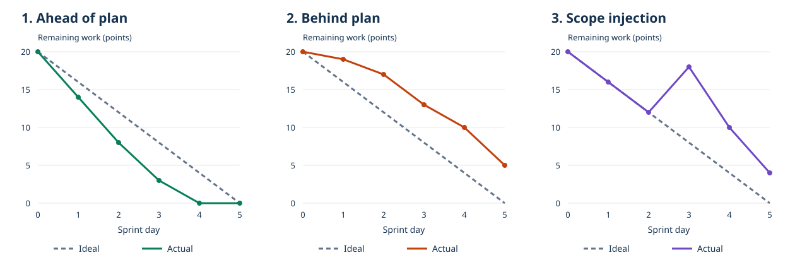
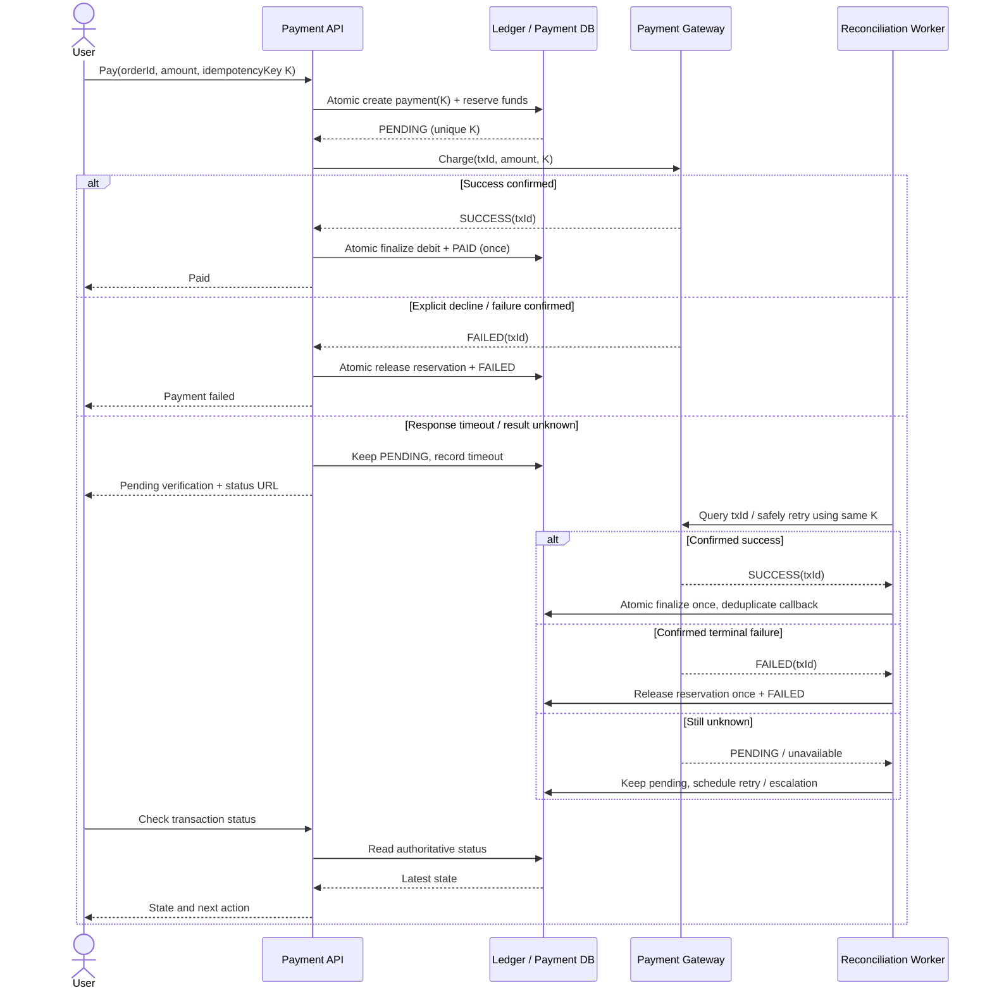
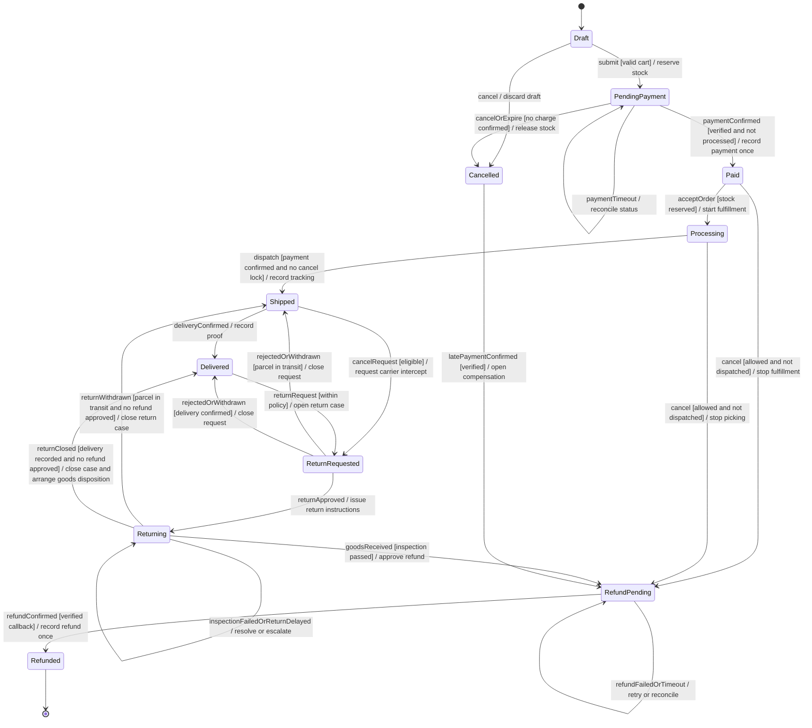

# Pre-Final พร้อมโจทย์และแนวคำตอบ — ENGSE202

รายวิชา **การจัดการโครงการซอฟต์แวร์ (Software Project Management)**

ครอบคลุมข้อสอบหลัก 5 ข้อ และข้อสอบเพิ่มเติม 5 ข้อ รวม 10 ข้อ โดยคงเลขข้อเดิมแยกเป็นส่วน A และ B แนวคำตอบเรียบเรียงจากเอกสารสัปดาห์ที่ 1–15 และโจทย์ในโฟลเดอร์ `work` ตัวเลขหรือ business rules ที่เติมเพื่อสาธิตจะระบุว่าเป็นสมมุติฐาน

**วิธีอ่าน:** แต่ละข้อมีโจทย์ต้นฉบับ แล้วตอบแยกคำถามย่อย พร้อมตัวอย่างและข้อควรระวังในการตีความ ดูรายการเอกสารทั้งหมดใน [ดัชนีเอกสารประกอบ](</home/panuwat/work/software-project-management/work/Pre-Final/Answers/README.md>)

## ส่วน A — ข้อสอบหลัก: การบริหารโครงการ Mini Inventory

## A1 — Sprint Burndown และ Blocker

### โจทย์

**ข้อที่ 1: การติดตามควบคุมโครงการแบบ Agile และการบริหาร Blocker (สัปดาห์ที่ 8)**

1.1 ในการติดตามสุขภาพของรอบการพัฒนาผ่าน Sprint Burndown Chart บน Jira จงวาดภาพและวิเคราะห์ลักษณะเส้นกราฟจริง (Actual Line) ใน 3 สภาวะต่อไปนี้:

สภาวะที่เส้น Actual ทอดตัวอยู่ใต้เส้น Ideal Line
สภาวะที่เส้น Actual ลอยสูงกว่าเส้น Ideal Line
สภาวะที่เส้น Actual เกิดอาการหักหัวพุ่งสูงขึ้นกะทันหันกลาง Sprint (Scope Injection Bump)

1.2 เมื่อสมาชิกในทีมแจ้งใน Daily Standup ว่า "ติด Blocker ไม่สามารถเขียนโค้ดต่อได้เนื่องจากรอเพื่อนส่ง Pull Request" ในฐานะ Project Manager (PM) ท่านมีขั้นตอนในการบันทึกและปลดล็อกปัญหานี้บนกระดาน Jira (เช่น การใช้ระบบ Flagging) อย่างไร?

### คำตอบ 1.1

Sprint Burndown แสดง **ปริมาณงานที่เหลือ** เทียบกับเวลา แกน X เป็นวันใน Sprint แกน Y เป็นหน่วยงาน เช่น Story Points หรือ Remaining Hours โดยต้องใช้หน่วยเดียวกันทั้งกราฟ Ideal คือแนวอ้างอิงให้ปริมาณงานลดถึงศูนย์เมื่อจบ Sprint ส่วน Actual คือปริมาณที่เหลือจริง



กราฟเป็นข้อมูลสมมุติเพื่ออธิบายโจทย์ ไม่ใช่ภาพจาก Jira ของโครงการนี้

| ลักษณะ Actual | ความหมายเบื้องต้น | สิ่งที่ PM ควรตรวจและทำ |
|---|---|---|
| อยู่ใต้ Ideal | งานเหลือน้อยกว่าแนวแผน อาจทำเสร็จเร็ว | ตรวจ DoD, งานถูกตัดออกหรือประมาณเผื่อมากเกินไปหรือไม่ รักษาคุณภาพก่อนรับงานเพิ่ม |
| อยู่เหนือ Ideal | งานเหลือมากกว่าแนวแผน เสี่ยงส่งไม่ทัน | ตรวจ blocker, PR ค้าง, estimate ต่ำ และ dependency; ช่วยปลดล็อกและปรับ forecast |
| พุ่งขึ้นกลาง Sprint | ปริมาณงานเพิ่มจาก scope injection หรือ re-estimation | ตรวจ issue history/CR และความจุทีม บันทึกเหตุผลแล้วเจรจา scope/cost/release plan |

เส้น Actual ที่แบนหลายวันอาจเกิดจากงานยังไม่ Done หรือไม่ได้อัปเดต remaining estimate จึงต้องดูบอร์ดและหลักฐานจริง ไม่สรุปว่าไม่มีใครทำงานจากกราฟอย่างเดียว ถ้าใช้ Story Points การลดงานมักเกิดเมื่อ issue ผ่าน Done; ถ้าใช้ Remaining Hours จะขึ้นกับการตั้งค่าและการอัปเดตเวลาคงเหลือ การ Log Work มากขึ้นไม่ได้แปลว่า earned value เพิ่มโดยอัตโนมัติ

### คำตอบ 1.2

เมื่อ developer รอ PR ให้ PM ช่วยทีมจัดการดังนี้:

1. เปิด issue ที่ติดขัด บันทึกว่า “รอ PR ของงานใด เพื่อใช้ interface/โค้ดส่วนไหน” พร้อมลิงก์ issue/PR ผู้รับผิดชอบและเวลาเริ่มรอ
2. **Add Flag / Flagged as impediment** ให้เห็นบนบอร์ด และเชื่อม dependency แบบ `is blocked by` กับงานต้นเหตุ เพิ่ม comment ระบุผู้ช่วยและสิ่งที่ต้องทำ
3. บันทึกใน impediment log แล้วแยกการคุยแก้รายละเอียดหลัง Daily Standup เพื่อไม่ให้ประชุมยืด
4. ติดต่อเจ้าของ PR/Tech Lead ตรวจว่าติดส่งโค้ด review, CI หรือ conflict จัด reviewer ช่วย pair review หรือแบ่ง PR ให้เล็กขึ้น หากทำงานต่อด้วย interface/stub ได้ให้ตกลงสัญญาร่วมกันก่อน
5. กำหนด owner และเวลาติดตาม เช่นตอบกลับภายในวันนี้ หากกระทบ Sprint Goal ให้ร่วมทีมและ Product Owner ปรับลำดับงาน พร้อมอัปเดตความเสี่ยง/forecast
6. เมื่อ dependency พร้อม ให้ผู้ทำงานยืนยันว่าทำต่อได้ ใส่หลักฐานปลดล็อก ลบ Flag และอัปเดต remaining estimate จากความจริง งานจะ Done เมื่อผ่าน DoD เท่านั้น

ใน Scrum บทบาทขจัด impediment เกี่ยวข้องกับ Scrum Master และทีมที่จัดการตนเอง โจทย์นี้มอบบทบาทดังกล่าวให้ PM ตามโครงสร้างรายวิชา PM จึงควรอำนวยความสะดวก ไม่สั่งข้าม quality gate เพื่อให้กราฟลด

อิง ENGSE202 สัปดาห์ 3, 6, 8

## A2 — EVM และ Sprint Review/Retrospective

### โจทย์

**ข้อที่ 2: การประเมินผลต่างประสิทธิภาพ (EVM) และพิธีกรรม Agile (สัปดาห์ที่ 9)**

2.1 โครงการหนึ่งตั้งเป้าหมายใน Sprint 1 ไว้ที่ Planned Value (PV) = 4,000 บาท เมื่อสิ้นสุด Sprint พบว่าทีมทำงานเสร็จสมบูรณ์ผ่าน DoD คิดเป็นมูลค่าเนื้องาน (EV) = 3,000 บาท แต่มีการบันทึก Log Time ค่าแรงจริง (AC) = 4,200 บาท:

จงคำนวณหาค่า Schedule Variance (SV) และ Cost Variance (CV) พร้อมตีความสถานะทางการบริหาร
จงเสนอแนวทางแก้ไขทางการเงินว่า PM ต้องนำเงินจากส่วนใดมาชดเชยผลต่างที่ติดลบนี้

2.2 จงเปรียบเทียบความแตกต่างระหว่างพิธีกรรม Sprint Review กับ Sprint Retrospective และอธิบายว่าการใช้เทคนิค Mad / Sad / Glad หรือ Start / Stop / Continue ช่วยให้ทีมสร้าง Actionable Items ไปปรับปรุงการทำงานใน Sprint ถัดไปได้อย่างไร?

### คำตอบ 2.1

กำหนด PV = 4,000 บาท, EV = 3,000 บาท, AC = 4,200 บาท โดย EV คิดจากงบของงานที่ผ่าน DoD ไม่ใช่เงินที่จ่ายไปจริง

```text
SV = EV − PV = 3,000 − 4,000 = −1,000 บาท
CV = EV − AC = 3,000 − 4,200 = −1,200 บาท
```

- **SV = −1,000 บาท:** มูลค่างานที่เสร็จต่ำกว่าแผน ณ จุดวัด 1,000 บาท จึงตามหลังแผนในเชิง earned value ไม่ได้แปลว่าช้า 1,000 วันหรือแปลงเป็นจำนวนวันได้ตรง ๆ
- **CV = −1,200 บาท:** ใช้เงินจริง 4,200 บาทเพื่อได้เนื้องานที่มีงบรองรับ 3,000 บาท จึงเกินต้นทุนของงานที่ทำได้ 1,200 บาท

ตรวจเสริมได้ว่า `SPI = 3,000/4,000 = 0.75` และ `CPI = 3,000/4,200 ≈ 0.7143` จ่าย 1 บาทได้มูลค่างานตามงบประมาณ 0.714 บาท ไม่ควรใช้ `AC − PV = 200` มาแทน CV เพราะเป็นการเทียบเงินที่ใช้กับแผนโดยยังไม่คำนึงถึงงานที่เสร็จ

**คำตอบตามบริบทรายวิชา:** นำเงิน **1,200 บาทจาก Contingency Reserve** มารองรับต้นทุนเกิน หากเกิดจากความเสี่ยงที่ระบุไว้และอยู่ในอำนาจอนุมัติของ PM พร้อมบันทึกสาเหตุ ผู้อนุมัติ ยอดใช้และยอดคงเหลือ ถ้าเกินวงเงินหรือเป็นเหตุที่อยู่นอกแผน ต้องให้ Sponsor พิจารณา Management Reserve/งบเพิ่ม หรือปรับขอบเขตตาม change control

การเบิกสำรองเป็นการจัดหาเงินรองรับ **ไม่ได้ลบ CV ที่เกิดขึ้นแล้ว** PM ต้องแก้สาเหตุ เช่น conflict และ PR รอนาน พร้อมประเมินงานที่ยังไม่เสร็จและต้นทุนจนจบใหม่ ห้ามเพิ่ม EV หรือแก้ baseline ย้อนหลังเพื่อทำให้ผลงานดูดี แนวคิดการวัดและการสำรองอ้างอิง [PMI: EVM และ risk reserves](https://www.pmi.org/learning/library/integration-earned-value-risk-management-6227)

### คำตอบ 2.2

| ประเด็น | Sprint Review | Sprint Retrospective |
|---|---|---|
| สิ่งที่ตรวจ | Increment และผลลัพธ์ของ Sprint เทียบเป้าหมาย/บริบทธุรกิจ | คน วิธีทำงาน เครื่องมือ และคุณภาพของกระบวนการ |
| ผู้มีส่วนร่วม | Scrum Team และผู้มีส่วนได้ส่วนเสียที่เกี่ยวข้อง | Scrum Team |
| ตัวอย่าง | ทดลองคลังสินค้าและพิจารณาว่าฟีเจอร์ Barcode ตอบโจทย์หรือไม่ | วิเคราะห์ว่าทำไม PR ค้างจนงานไม่จบ |
| ผลลัพธ์ | ข้อมูลสะท้อนกลับและการปรับ Product Backlog | แผนปรับปรุงที่ลงมือทำได้ใน Sprint ถัดไป |

Review เป็นการร่วมตรวจและปรับทิศทาง ไม่ใช่เพียง demo หรือด่านรออนุญาต release ทุกครั้ง ส่วน Retrospective มุ่งเพิ่มคุณภาพและประสิทธิผลโดยไม่กล่าวโทษบุคคล ตาม [Scrum Guide](https://scrumguides.org/scrum-guide.html)

**Mad/Sad/Glad** ใช้เก็บสิ่งที่หงุดหงิด เสียดาย และได้ผลดี แล้วจัดกลุ่มหาสาเหตุ **Start/Stop/Continue** ใช้เปลี่ยนผลสะท้อนเป็นสิ่งที่จะเริ่ม หยุด และทำต่อ จากนั้นเลือกเรื่องสำคัญ 1–2 เรื่อง ทำเป็น action ที่มี owner, due date และเกณฑ์วัด

ตัวอย่าง: “PR รอเฉลี่ย 30 ชั่วโมง” → **Start** reviewer rotation; **Stop** เปิด PR ใหญ่สะสมปลาย Sprint; **Continue** แจ้ง blocker ทุกวัน → สร้าง Jira action ให้ Tech Lead จัด reviewer ภายในวันแรกของ Sprint 2 ตั้งเป้าตอบรับ review ภายใน 12 ชั่วโมงทำงาน และวัด median review waiting time ใน Retro ถัดไป

อิง ENGSE202 สัปดาห์ 5–7, 9

## A3 — Scope Creep, Iron Triangle และ CCB

### โจทย์

**ข้อที่ 3: การควบคุมการเปลี่ยนแปลงขอบเขต และคณะกรรมการ CCB (สัปดาห์ที่ 10)**

3.1 Scope Creep คืออะไร และส่งผลร้ายต่อโครงการซอฟต์แวร์อย่างไร? จงอธิบายการรักษาสมดุลของ Project Management Iron Triangle (Scope, Time, Cost) เมื่อลูกค้ายื่นคำขอเปลี่ยนแปลงฉุกเฉิน (CR-02) เข้ามากลางคัน
3.2 จงอธิบายบทบาท หน้าที่ และองค์ประกอบของ Change Control Board (CCB) พร้อมอธิบายคำตัดสิน 3 รูปแบบ (Approve, Reject, Defer) หาก CCB มีมติว่า "Approve ให้ทำฟังก์ชันส่งออก CSV ทันที" PM จะต้องดำเนินการปรับปรุงเอกสารงบประมาณ (Contingency Reserve Utilization Log) และปรับแผนงานบน Jira อย่างไร?

### คำตอบ 3.1

**Scope Creep** คือขอบเขตที่ขยายโดยไม่ผ่านการควบคุมและไม่จัดเวลา/งบ/ทรัพยากรรองรับ เช่น developer รับทำ CSV ตามข้อความส่วนตัวทั้งที่ยังมีงาน Barcode เต็ม Sprint ส่งผลให้ overtime, defect, schedule delay และงบเกิน ส่วนการเพิ่มขอบเขตที่ผ่านการวิเคราะห์และอนุมัติอย่างมีแผนคือ controlled change

เมื่อมี CR-02 ให้ใช้ **Scope–Time–Cost** ประเมินทางเลือก โดยรักษา quality/DoD ที่ตกลงไว้:

| ทางเลือก | วิธีรักษาสมดุล |
|---|---|
| เพิ่ม CSV และคงวันส่ง | ตรวจ capacity; จัดคน/งบเพิ่มเมื่อช่วยได้จริง หรือแลกงานสำคัญน้อยออก |
| เพิ่ม CSV แต่คงกำลังคน | เจรจาปรับวันส่งมอบ release หรือวางใน Sprint ถัดไป |
| วันส่งและงบคงที่ | ลด/เลื่อน scope ที่มูลค่าต่ำกว่าโดยได้รับความเห็นชอบ |
| ประโยชน์ยังไม่คุ้มความเสี่ยง | Defer/Reject โดยเสนอวิธีชั่วคราวให้ธุรกิจ |

ในบทเรียน CSV ใช้ 4.5 man-hours ประมาณ 1,350 บาทที่อัตราเฉลี่ย 300 บาท/ชม. PM ควรชี้ให้ลูกค้าเห็นทั้งคุณค่าป้องกัน stockout และผลกระทบต่องานเดิม การเพิ่มคนไม่ได้ทำให้เร็วขึ้นเป็นสัดส่วนทันที เพราะมีเวลาประสานงานและ dependency

**หมายเหตุ Scrum:** สไลด์เสนอปรับวันสิ้นสุด Sprint ได้ แต่ Scrum ใช้ timebox คงที่ จึงควรเจรจา scope กับ Product Owner ภายใน Sprint Goal หรือปรับแผน release/Sprint ถัดไป ไม่ขยาย Sprint เพื่อซ่อนงานที่ล่าช้า หากใช้วิธี hybrid ต้องระบุว่าเป็นข้อตกลงโครงการต่างจาก Scrum แบบเคร่งครัด

### คำตอบ 3.2

CCB คือกลุ่มที่ได้รับอำนาจพิจารณาผลกระทบและตัดสินคำขอเปลี่ยนแปลง องค์ประกอบของกรณีศึกษาได้แก่ Sponsor/ลูกค้า, ตัวแทนผู้ใช้, PM และ Tech Lead อาจเชิญ QA/ฝ่ายการเงินตามผลกระทบ โดยกำหนดสิทธิ์ตัดสินและวงเงินไว้ชัดเจน

- **Approve:** ทำตามขอบเขต งบ เวลา และเงื่อนไขที่อนุมัติ
- **Reject:** ไม่ทำ พร้อมบันทึกเหตุผล เช่น ไม่คุ้มค่าหรือความเสี่ยงสูง
- **Defer:** ยังไม่ทำรอบนี้ กำหนด backlog/เงื่อนไขและเวลาทบทวนใหม่

เมื่ออนุมัติ CSV ทันที PM ต้องบันทึก CCB minutes และปรับรายการงาน/งบที่เกี่ยวข้อง เก็บ baseline เดิมและเวอร์ชันที่แก้เพื่อให้ตรวจสอบได้ ตัวอย่าง **แยกกรณีตาม Week 10**:

| รายการ | จำนวนเงิน (บาท) | หลักฐาน |
|---|---:|---|
| เงินสำรองก่อน CR-02 | 2,025 | ยอดตั้งต้นสมมุติของกรณี Week 10 |
| CR-02: 4.5 ชม. × 300 | −1,350 | CR/มติ CCB/งานที่อนุมัติ |
| คงเหลือ | **675** | 2,025 − 1,350 |

Contingency Reserve Utilization Log ควรมีวันที่ CR ID เหตุผล ผู้อนุมัติ ผู้รับผิดชอบ ยอดอนุมัติ ยอดใช้จริง และยอดคงเหลือ แยก **วงเงินที่กันไว้** ออกจาก **ค่าใช้จ่ายจริงที่เกิดแล้ว** เพื่อไม่บันทึกเป็น AC ก่อนมีต้นทุนจริง

บน Jira ให้สร้าง `[CR-02] Export Low Stock Products to CSV` ผูก CR/CCB minutes, acceptance criteria และ PR แตก subtasks exporter/UI/test รวม 4.5 ชั่วโมง มอบหมายตาม RACI ตั้ง estimate และ dependency จัดลำดับร่วมทีม ตรวจ capacity แล้วนำเข้า Sprint ตามที่ตกลง อัปเดต remaining estimate/forecast และใส่เหตุผลของ scope bump ติดตาม work log/DoD จนเสร็จ

**อย่ารวมตัวเลขข้ามตัวอย่างโดยไม่กระทบยอด:** หากก่อนหน้านี้เบิก 1,200 บาทตาม A2 จากเงินก้อนเดียวกันไปแล้ว ยอดก่อน CR-02 จะเป็น 825 บาท และหลังต้องใช้ 1,350 บาทจะขาด **525 บาท** ไม่ใช่เหลือ 675 ต้องหางบอนุมัติเพิ่ม/ปรับแผน บทเรียนต่างสัปดาห์เป็นตัวอย่างประกอบที่ยอดไม่ต่อกันทั้งหมด

อีกจุดคือหากคิดตามบทบาทใน ENGSE225 Week 10 และอัตรา Week 5 จะได้ `2×400 + 1×300 + 1.5×250 = 1,475 บาท` ต่างจาก 1,350 ที่ใช้อัตราเฉลี่ย จึงต้องระบุฐานค่าแรงที่เลือกใช้ให้ตรงกันก่อนขออนุมัติ

อิง ENGSE202 สัปดาห์ 5, 9–10 และ ENGSE225 สัปดาห์ 10

## A4 — CFD, Little’s Law, Burnup และ Scope Freeze

### โจทย์

**ข้อที่ 4: การวิเคราะห์กระแสงานขั้นสูง (CFD, Burnup) และ Scope Freeze (สัปดาห์ที่ 11)**

4.1 ในการวิเคราะห์กระแสการทำงานผ่าน Cumulative Flow Diagram (CFD) บน Jira จุดอุดตันคอขวด (Bottleneck) จะสังเกตเห็นได้อย่างไรบนแผนภูมิ? และการนำกฎของลิตเติล (Little's Law:  Lead Time = WIP /Throughput ) มาใช้โดยการกำหนด WIP Limits ในช่อง Code Review ช่วยลดระยะเวลาการส่งมอบงานได้อย่างไร?
4.2 จงอธิบายความเหนือกว่าของ Burnup Chart เมื่อเปรียบเทียบกับ Burndown Chart ในโครงการที่มีการเปลี่ยนแปลงขอบเขตงานบ่อยครั้ง และเหตุใด PM จึงต้องเจรจาทำข้อตกลง Scope Freeze Agreement กับลูกค้าในสัปดาห์ที่ 11 ก่อนวันส่งมอบจริง?

### คำตอบ 4.1

CFD แสดงจำนวนงานสะสมแยกตามสถานะ โดย **ความหนาในแนวตั้งของแถบสี ณ เวลาเดียวกันคือจำนวนงานในสถานะนั้น** หากแถบ Code Review หนาขึ้นต่อเนื่อง ขณะที่งาน Done เพิ่มช้า แสดงว่ามีงานเข้าคิว review มากกว่าที่ออก เป็นสัญญาณคอขวดที่ควรตรวจสอบ reviewer capacity, PR size และ CI ที่ค้าง

Little’s Law ใช้ค่าเฉลี่ยในระบบที่นิยามขอบเขตเดียวกันและมีการไหลค่อนข้างเสถียร:

```text
Average Lead Time = Average WIP / Average Throughput
หน่วย: วัน = งาน / (งานต่อวัน)
```

ตัวอย่างสมมุติ คิวตั้งแต่รอ review จนผ่าน review มี WIP เฉลี่ย 6 ใบ และ throughput 2 ใบ/วัน จึงใช้เวลาในขอบเขตนั้นเฉลี่ย 3 วัน หากลด WIP เฉลี่ยเหลือ 3 ใบโดยรักษา throughput 2 ใบ/วัน จะเหลือ 1.5 วัน ตัวเลขนี้เป็นเวลาในขั้น review; จะเรียก lead time ทั้งระบบได้เมื่อ WIP และ throughput ครอบคลุมระบบตั้งแต่จุดรับงานจนส่งมอบเดียวกัน

ตั้ง **WIP Limit = 3** ใน Code Review ตามบทเรียน เมื่อเต็มให้หยุดดึงงานใหม่และช่วยตรวจ/แก้ PR ที่ค้าง แบ่ง PR ให้เล็ก จัด reviewer และปลด blocker พร้อมติดตามอายุงาน ไม่ย้ายการ์ดไปคอลัมน์อื่นเพื่อหลบ limit การจำกัด WIP ช่วยลดการรอเมื่อจัดการคอขวดจริง ไม่ได้รับประกันว่า throughput คงเดิมหรือ lead time ลดทันทีในทุกสถานการณ์

### คำตอบ 4.2

| ประเด็น | Burndown | Burnup |
|---|---|---|
| สิ่งที่แสดง | งานคงเหลือ | งานที่เสร็จสะสมและขอบเขตทั้งหมด |
| เมื่อ scope เพิ่ม | remaining work สูงขึ้น อาจดูคล้ายทีมทำช้า | เส้น Total Scope สูงขึ้น แยกจากเส้น Completed ชัด |
| ประโยชน์หลัก | ดูระยะห่างจากงานคงเหลือศูนย์ใน Sprint | สื่อสารทั้งความคืบหน้าและขอบเขตที่เปลี่ยน |

ตัวอย่างตาม Week 11: scope เดิม 20 points + CR-01 5 points + CR-02 4 points = **29 points** หากเสร็จ 27 points จะได้ `27/29 ×100 ≈ 93.1%` และเหลือ 2 points ใน Burnup ผู้ใช้เห็นได้ว่าทีมส่งมอบเพิ่มจริงแม้เป้าหมายขยับขึ้น

**Scope Freeze Agreement** ตรึงสิ่งที่จะตรวจรับใน release นี้ เพื่อให้ทีมมีเวลาทำ hardening, UAT, คู่มือและส่งมอบ โดยระบุ:

- รายการ scope/CR และเวอร์ชัน baseline ที่ตกลง พร้อม out-of-scope
- วันเริ่ม freeze วันตรวจรับ และ acceptance criteria
- ผู้อนุมัติข้อยกเว้นและขั้นตอนประเมินผลกระทบ
- วิธีแยก defect ของ scope เดิมจากความต้องการใหม่ และที่เก็บ future backlog

PM ควรอธิบายจาก Burnup/DoD ว่าทำสิ่งใดครบแล้ว สิ่งใดยังเสี่ยง แล้วขอข้อตกลงร่วมกันใน Week 11 ขณะที่ Code Freeze คุม **การเปลี่ยนโค้ด** Scope Freeze คุม **ความต้องการที่ตกลงส่งมอบ** ทั้งสองช่วยให้ผล UAT และ release อ้างอิงระบบชุดเดียวกัน

อิง ENGSE202 สัปดาห์ 11 และ ENGSE225 สัปดาห์ 11–12

## A5 — CPI/SPI, การปิดโครงการ และ Maintenance ROI

### โจทย์

**ข้อที่ 5: การประเมินดัชนี KPIs, ความคุ้มค่า ROI และการปิดโครงการ (สัปดาห์ที่ 12, 13, 14, 15)**

5.1 ในการประเมินผลสัมฤทธิ์โครงการขั้นสุดท้ายผ่าน Project KPI Scorecard จงอธิบายความหมายและสูตรคำนวณของดัชนีชี้วัดประสิทธิภาพเชิงลึกทั้ง 2 ตัว ได้แก่:

Cost Performance Index (CPI = EV / AC): บ่งบอกประสิทธิภาพใด และหากคำนวณได้ CPI = 0.96 มีความหมายทางการเงินอย่างไร?
Schedule Performance Index (SPI = EV / PV): บ่งบอกประสิทธิภาพใด และหากคำนวณได้ SPI = 1.00 มีความหมายด้านเวลาอย่างไร?

5.2 ตามมาตรฐาน PMBOK Guide (Close Project or Phase) จงอธิบายความแตกต่างระหว่างกระบวนการ Administrative Closure (การจัดเก็บสินทรัพย์ OPAs และการบันทึก Lessons Learned) กับ Financial & Procurement Closure (การกระทบยอดสัญญาเครื่องมือและการปิดบัญชีเงินสำรอง) พร้อมอธิบายแนวทางการคำนวณผลตอบแทนความคุ้มค่า Maintenance ROI ของโครงการ

### คำตอบ 5.1

**CPI = EV / AC** วัดประสิทธิภาพต้นทุน: CPI >1 ได้มูลค่างานมากกว่าต้นทุนที่จ่าย, =1 เท่าต้นทุนตามงบ, <1 ใช้เงินเกินมูลค่างานที่ทำได้

เมื่อ **CPI = 0.96** จ่าย 1 บาทได้มูลค่างานตามงบ 0.96 บาท หากถือว่า 0.96 เป็นค่าตรง จะมี `(1/0.96 −1)×100 ≈ 4.17%` ของต้นทุนที่เกินเมื่อเทียบกับ EV ส่วน `(1−0.96)×100 = 4%` เป็นช่องว่างเมื่อเทียบกับ AC ต้องระบุตัวหาร ไม่ใช้สองเปอร์เซ็นต์แทนกัน

ตัวอย่างสไลด์ Week 12 ใช้ EV = 15,525 และ AC = 16,100 จึงได้ **CPI ≈ 0.9643** ปัดเป็น 0.96 และต้นทุนเกิน `575/15,525 ×100 ≈ 3.70%` ความต่างเกิดจากการปัดเศษ

**SPI = EV / PV** วัดมูลค่างานที่ทำเสร็จเทียบกับที่ควรเสร็จ ณ วันรายงาน: >1 นำแผน, =1 เท่าแผน, <1 ตามหลังแผน

เมื่อ **SPI = 1.00** แปลว่า EV เท่ากับ PV ณ จุดวัด แต่ไม่ได้ยืนยันว่างานทุกกิจกรรมหรือ critical path ตรงเวลา หากประเมินตอนจบโครงการหลังวันที่วางแผนไว้ SPI แบบดั้งเดิมอาจกลับเป็น 1 แม้ส่งช้าจริง จึงต้องดูวันที่ milestone/actual finish และประวัติกำหนดการด้วย

### คำตอบ 5.2: การปิดโครงการสองด้าน

| มิติ | Administrative Closure | Financial & Procurement Closure |
|---|---|---|
| เป้าหมาย | ยืนยันการส่งมอบครบและเก็บความรู้ให้สืบทอด | ปิดต้นทุน หนี้สิน สัญญาและยอดสำรองอย่างตรวจสอบได้ |
| งานสำคัญ | ตรวจ Charter/WBS/DoD/UAT, รับ sign-off, ส่งมอบคู่มือ, จัดเก็บ OPAs, Lessons Learned และมอบหมายทีมดูแลต่อ | กระทบยอด work log×rate/ใบเสร็จ/ภาระค้างจ่าย, ปิดสัญญา SaaS/Cloud, จัดการเงินสำรอง |
| ตัวอย่าง | เก็บ WBS/RACI/CR/CI templates และข้อเรียนรู้เรื่อง legacy schema | ตรวจค่าเครื่องมือจริง ยกเลิกบริการทดสอบที่ไม่ใช้ และส่งคืนเงินที่เหลือตามบัญชีจริง |

เก็บ Lessons Learned ให้มีสถานการณ์ รากเหตุ ผลกระทบ วิธีแก้ และข้อเสนอแนะ เช่น “PR ใหญ่ทำให้ review ค้าง → แบ่ง PR เล็กและตั้ง reviewer rotation” แล้วจัดเก็บใน OPAs เพื่อปรับแผนงานรุ่นถัดไป งานที่เลื่อนไปเวอร์ชันหน้าให้โอนพร้อม owner อย่างชัดเจน ห้ามทำเครื่องหมาย Done ทั้งหมดเพื่อปิดบอร์ดทั้งที่ยังไม่ทำ

หลังส่งมอบให้ยืนยันผู้รับผิดชอบ operational support และสิทธิ์เข้าถึงก่อนปลดทีมเก่า เก็บสำเนาหลักฐานแล้วจึง archive กระดาน ปิดทรัพยากรชั่วคราวตามแผน โดย production ที่ยังใช้อยู่ต้องมีผู้รับช่วงดูแล

ชื่อกระบวนการ **Close Project or Phase** สัมพันธ์กับกรอบกระบวนการของ PMBOK รุ่นก่อนหน้า เช่นรุ่นที่ 6 ส่วนรุ่นที่ 7 จัดเนื้อหาเป็นหลักการและ performance domains; ใช้ร่วมกันได้ตามบริบทโจทย์ แต่ไม่ควรกล่าวว่ารุ่นที่ 7 มีโครงสร้าง knowledge areas/process groups แบบเดิมทุกประการ

### คำตอบ 5.2: Maintenance ROI

กำหนดช่วงประเมิน เช่น 1 ปี แล้วคำนวณผลประโยชน์ที่วัดเป็นเงินได้ หักต้นทุนที่เกี่ยวข้องโดยไม่ซ้ำรายการ:

```text
Maintenance ROI (%) = (Benefits − Investment Cost) / Investment Cost ×100
```

ใช้สมมุติฐานกรณีศึกษาสัปดาห์ 14:

| รายการ | วิธีคำนวณ | บาท |
|---|---|---:|
| เงินลงทุนบำรุงรักษา | AC ตามตัวอย่าง | 16,100 |
| ประหยัดเวลาแก้บั๊ก | (10−2) ชม./เดือน ×12 ×150 บาท/ชม. | 14,400 |
| ผลประโยชน์จากลดสินค้าขาดสต็อก | สมมุติผลประโยชน์ที่ใช้ในสไลด์ | 12,000 |
| Benefits ปีแรก | 14,400 +12,000 | 26,400 |
| ผลประโยชน์สุทธิ | 26,400−16,100 | 10,300 |

`ROI = 10,300/16,100 ×100 ≈ 63.98%` หรือ **64.0% เมื่อปัดทศนิยมหนึ่งตำแหน่ง** ค่า 63.9% ในสไลด์ตรงกับการตัดทศนิยม ไม่ใช่การปัดตามปกติ หากผลประโยชน์เกิดสม่ำเสมอและไม่มีต้นทุนเพิ่ม ระยะคืนทุนประมาณ `16,100/(26,400/12) ≈ 7.32 เดือน`

ในงานจริง ยอดขายที่รักษาไว้ 12,000 บาทต้องแปลงเป็นกำไรส่วนเพิ่ม/ประโยชน์สุทธิหลังต้นทุนที่เกี่ยวข้อง ไม่ถือว่ารายรับทั้งหมดเป็นกำไร และต้องรวมค่าเดินระบบเพิ่ม ไม่คิดประโยชน์ซ้ำ การคาดการณ์ปีแรกยังไม่ใช่ผลตอบแทนที่เกิดขึ้นจริงแล้ว ต้องติดตาม benefits realization หลังส่งมอบ

**หมายเหตุการกระทบยอดสไลด์:** ตาราง `2,025−1,350−575 =100` ถูกในเชิงเลขคณิตเฉพาะรายการนั้น แต่ Week 7 ระบุ baseline 15,525 ว่ารวมสำรองแล้ว ขณะที่ Week 12 ใช้ AC 16,100 จึงสูงกว่า baseline 575 บาท การกล่าวว่า “ยังอยู่ในงบรวมเพราะหักสำรองอีก” เสี่ยงนับเงินสำรองซ้ำ และยังไม่รวมการเบิก 1,200 ของตัวอย่าง Week 9 ต้องตรวจ ledger/มติเปลี่ยนงบจริงก่อนสรุปเงินคงเหลือ ดูหลักความสัมพันธ์ระหว่างสำรองและ baseline ใน [PMI: Risk Contingency Reserve](https://www.pmi.org/learning/library/model-risk-contingency-reserve-9310)

อิง ENGSE202 สัปดาห์ 12–15

## ส่วน B — ข้อสอบเพิ่มเติม: Requirements & System Analysis

## B1 — NFR สู่ Architecture และ Payment Timeout

### โจทย์

**ข้อ 1: การเปลี่ยนผ่านความต้องการสู่สถาปัตยกรรม (Non-Functional Requirements to Architecture)**

โจทย์: กำหนด Use Case: "ผู้ใช้ทำธุรกรรมชำระเงินผ่าน Mobile Banking ในช่วงเทศกาลส่งเสริมการขาย" โดยมี Non-Functional Requirements (NFR) ดังนี้

Response Time สำหรับการตัดยอดเงินต้องไม่เกิน 2 วินาที
Availability ของระบบต้องอยู่ที่ 99.95% ตลอด 24/7
ต้องรองรับ Peak Concurrency สูงสุด 5,000 Transactions Per Second (TPS)
คำถาม:

จงอธิบายแนวทางการแปลง NFR ทั้ง 3 ข้อให้เป็นข้อกำหนดทางเทคนิค (Architectural Tactics / Technical Constraints) อย่างเป็นรูปธรรม
ให้ออกแบบ Interaction Overview Diagram หรือ Sequence Diagram แสดงการจัดการเมื่อระบบปลายทาง (Payment Gateway) เกิด Timeout เพื่อรักษาความคงสมบูรณ์ของข้อมูล (Data Consistency)

### คำตอบ: แปลง NFR เป็นข้อกำหนดทางเทคนิค

ต้องทำให้คำว่าเร็ว พร้อมใช้ และรับโหลดได้ มีขอบเขตและวิธีวัดชัด ก่อนเลือกเทคโนโลยี:

| NFR | Architectural Tactics / Constraints ที่เสนอ | วิธีพิสูจน์ |
|---|---|---|
| ตัดยอดไม่เกิน 2 วินาที | กำหนดจุดเริ่ม–จบ latency; แบ่ง time budget เช่น gateway ≤1.2s, ledger ≤0.3s, network/บริการอื่น ≤0.5s; ลด query และ lock contention; ย้าย email/analytics ออกจาก synchronous path | load test ที่ target TPS และข้อมูล/เครือข่ายใกล้จริง เก็บ latency distribution และจำนวนเกิน 2s |
| Availability 99.95% ตลอด 24/7 | stateless app หลาย instance/availability zones, health check/failover, ฐานข้อมูล replication, rolling deploy, monitoring, backup/recovery | นิยาม SLI และช่วงวัด รวม planned downtime ตามข้อตกลง ทดสอบ failover และวัด uptime จริง |
| 5,000 TPS | กำหนดเป็น throughput เป้าหมาย ใช้ horizontal scaling, load balancing, connection pool, indexing, partitioning เมื่อจำเป็น และ admission control/backpressure | sustained-load/peak/soak test; วัด completed TPS พร้อม latency/error rate และทรัพยากร |

สำหรับ 30 วัน เวลาไม่พร้อมใช้สูงสุดตามนิยามแบบเวลา = `30×24×60×(1−0.9995) = 21.6 นาที` ต้องตกลงด้วยว่าธุรกรรมสำเร็จเป็น SLI หรือวัดเพียง endpoint ตอบสนอง เพราะ gateway ล่มแต่ API ตอบ “pending” ไม่ได้ทำให้ธุรกรรมสำเร็จตาม NFR โดยอัตโนมัติ

**TPS ไม่ใช่ concurrency:** TPS คือจำนวนธุรกรรมต่อวินาที ส่วน concurrency คือจำนวนธุรกรรมที่กำลังประมวลผลพร้อมกัน เช่นถ้า throughput 5,000 TPS และเวลาเฉลี่ย 2s ภายใต้เงื่อนไข steady state จะมี in-flight เฉลี่ยประมาณ 10,000 รายการ โจทย์ใช้ “Peak Concurrency ... TPS” จึงต้องแยกหน่วยให้ถูก

ถ้า “ไม่เกิน 2s” หมายถึง hard limit ทุกธุรกรรม จะไม่ควรเปลี่ยนเป็น p95/p99 เอง ต้องรายงาน timeout เป็นกรณีไม่บรรลุการตัดยอด และให้เจ้าของ requirement เห็นชอบเส้นทาง pending/error ถ้า gateway ไม่อาจรับประกันเวลาได้ การตอบรับคำขอภายใน 2s ไม่เท่ากับตัดยอดเสร็จภายใน 2s

### คำตอบ: Sequence Diagram เมื่อ Timeout

**สมมุติฐานการออกแบบ:** ระบบมี ledger ของตนและปลายทางรองรับ transaction ID/idempotency key ให้บันทึกสถานะ PENDING และจองวงเงินก่อนส่งออก การจองและสถานะทำใน local DB transaction; ไม่เปิด DB transaction ค้างรอ network และไม่สมมุติว่ามี distributed ACID ครอบทั้งสองระบบ



หลักรักษา consistency คือ **timeout หมายถึงยังไม่ทราบผล ไม่ใช่ยืนยันว่าล้มเหลว** ห้ามส่งซ้ำด้วย key ใหม่หรือตัด/คืนเงินแบบเดาจาก timeout ใช้ unique constraint/conditional update กับ transition เพื่อให้ webhook และ worker ที่แข่งกันไม่ลงบัญชีซ้ำ ตรวจลายเซ็น callback และยอด/สกุลเงิน แล้วมี reconciliation จนจบหรือส่งต่อเจ้าหน้าที่

ใช้ outbox หรือคิวงานที่บันทึกอย่างทนทานเพื่อไม่ให้การตามผลหายเมื่อ process ล่ม หากต้องชดเชยให้ใช้ void/refund ตามสถานะ gateway และบันทึกเป็นธุรกรรมใหม่ที่ตรวจสอบได้ กลยุทธ์ retry ด้วย key เดิมมีตัวอย่างใน [Stripe: Idempotency](https://stripe.com/blog/idempotency) ทั้งนี้ต้องยึดสัญญาและช่วงเก็บ key ของ gateway ที่เลือกจริง

อิงโจทย์เพิ่มเติม B1; แนวคิด reliability และ impact analysis เชื่อมกับ ENGSE225 สัปดาห์ 11, 14

## B2 — RTM และผลกระทบจาก Biometric + TOTP

### โจทย์

**ข้อ 2: Requirement Traceability Matrix (RTM) & Impact Analysis**

โจทย์: ในระหว่างสัปดาห์สุดท้ายของการพัฒนา Sprint ผู้มีส่วนได้ส่วนเสีย (Stakeholder) ขอยื่น Change Request (CR) เพื่อแก้ไขกระบวนการยืนยันตัวตน จากการใช้ OTP ผ่าน SMS เป็นการยืนยันด้วย Biometric + TOTP App
คำถาม:

จงเขียนตาราง Requirement Traceability Matrix (RTM) จำลองที่เชื่อมโยงระหว่าง User Requirement, Functional Requirement, Test Cases และ System Component ที่ได้รับผลกระทบ
จงประเมิน Impact Analysis ทั้งในมิติของ Scope, Schedule, Cost และ Technical Debt หากจำเป็นต้องอนุมัติ CR นี้ทันที

### คำตอบ: RTM จำลอง

**สมมุติฐาน:** ผู้ใช้ต้องผ่านทั้ง device-bound authentication ที่ใช้ biometric ปลดล็อก credential บนอุปกรณ์ และ TOTP ที่ตรวจฝั่ง server มี enrollment/recovery flow ที่ตกลงไว้ ไม่ส่ง raw fingerprint/ภาพใบหน้ามาเก็บใน server เพียง boolean “biometric ผ่าน” จาก client ไม่พอเป็นหลักฐานยืนยันตัวตนฝั่ง server

| User Requirement | Functional Requirement | Test Cases และผลคาดหวัง | System Components |
|---|---|---|---|
| UR-AUTH-01 เข้าระบบด้วยวิธีใหม่อย่างปลอดภัย | FR-AUTH-01 ลงทะเบียน credential บนอุปกรณ์และพิสูจน์ challenge ด้วย credential ที่ผูกบัญชี | TC01 enrollment สำเร็จหลังพิสูจน์บัญชีเดิม; TC02 challenge/ลายเซ็นผิดต้องปฏิเสธ | Mobile App, OS biometric/keystore, Auth API, credential store |
| UR-AUTH-01 | FR-AUTH-02 ลงทะเบียน TOTP secret และยืนยันรหัสก่อนเปิดใช้ | TC03 setup แล้วรหัสถูกจึง active; TC04 ยังไม่ยืนยันต้องไม่ปิดวิธีเดิมจนผู้ใช้ย้ายสำเร็จ | Enrollment Service, protected secret storage, TOTP verifier |
| UR-AUTH-01 | FR-AUTH-03 ออก session หลังสองขั้นผ่านในธุรกรรม authentication เดียวกัน | TC05 ผ่านทั้งคู่จึง login; TC06 biometric fail/TOTP ถูกต้องยังไม่ออก session; TC07 biometric ผ่าน/TOTP ผิดต้องปฏิเสธ | Auth orchestrator, session/token service |
| UR-AUTH-02 ป้องกัน replay/brute force | FR-AUTH-04 กำหนด time window, ปฏิเสธ TOTP ที่ใช้สำเร็จซ้ำ และจำกัดความถี่ | TC08 expired/replayed code ต้อง fail; TC09 clock skew ตาม window ที่อนุมัติ; TC10 เกิน rate limit ต้องถูกจำกัด | TOTP verifier, rate limiter, time source, used-step store |
| UR-AUTH-03 ย้ายจาก SMS โดยไม่สูญเสียการเข้าถึง | FR-AUTH-05 migration, device change/revocation และ recovery ที่ปลอดภัย | TC11 เครื่องหายใช้ recovery ที่ยืนยันตัวตน; TC12 revoke เครื่องเก่าแล้วเข้าไม่ได้; TC13 rollback ไม่เปิดช่อง bypass | Account/Recovery Service, migration jobs, support workflow |
| UR-AUTH-04 ตรวจสอบเหตุผิดปกติย้อนหลัง | FR-AUTH-06 audit การลงทะเบียน/เข้าสู่ระบบ/เปลี่ยนอุปกรณ์โดยไม่ log secret | TC14 มี event/เวลา/ผลครบ; TC15 log ไม่มี seed/TOTP/raw biometric | Audit log, monitoring, security review |

แต่ละรายการต้องมี owner, version/status และเชื่อม CR → design → PR/commit → test execution/UAT เพิ่มเมื่อพัฒนาจริง การป้องกันรับ OTP ที่เคยใช้สำเร็จอีกใน time step เดิมสอดคล้องกับ [RFC 6238](https://www.rfc-editor.org/info/rfc6238/)

### คำตอบ: Impact Analysis

| มิติ | ผลกระทบหากอนุมัติทันทีปลาย Sprint | วิธีควบคุม |
|---|---|---|
| Scope | ไม่ใช่แค่เปลี่ยนหน้ากรอก OTP ต้องมี enrollment, device binding, revoke, recovery, migration, accessibility และ audit | ปรับ SRS/RTM/DoD และกำหนด MVP ที่ปลอดภัยชัดเจน |
| Schedule | กระทบเส้นทาง login หลัก ต้องทดสอบอุปกรณ์/OS, failure paths และ regression อาจทำ Sprint Goal ไม่สำเร็จ | tech spike ประเมินเร็ว จากนั้น scope swap หรือวาง release ใหม่; ไม่ตัด security testing |
| Cost | เพิ่มเวลา mobile/backend/QA/security, test devices, secure storage และงานช่วยผู้ใช้ย้ายระบบ | ประเมิน bottom-up และค่า support; หักค่า SMS ที่ประหยัดได้เมื่อมีข้อมูลจริง |
| Technical Debt | เร่งทำอาจ hardcode flow ผูกกับอุปกรณ์เดียว มี SMS fallback ที่ข้ามการยืนยัน หรือไม่มี test/migration | แยก Auth interfaces, feature flag ที่ควบคุมได้, review/contract tests และบันทึก debt พร้อม owner/กำหนดแก้ |

ตัวอย่างประมาณการ **สมมุติ ไม่ใช่ตัวเลขจากโจทย์**: mobile 16 ชม.×300 + backend 20 ชม.×400 + QA 16 ชม.×250 + security review 4 ชม.×400 = **18,400 บาท** ยังไม่รวมเครื่องมือและความเสี่ยง ใช้เป็นรูปแบบนำเสนอ CCB ไม่ใช่หลักฐานว่าทำได้ภายใน 56 ชั่วโมงปฏิทิน เพราะงานอาจมี dependency

หากจำเป็นต้องอนุมัติทันที ต้องอนุมัติทั้งขอบเขตและแผนส่งมอบที่ปรับแล้ว เลือก staged rollout พร้อม monitor/rollback และนโยบาย recovery ที่ไม่ลดระดับความปลอดภัยโดยพลการ เปรียบเทียบความเสี่ยงของการทำทันทีกับการเลื่อนด้วยหลักฐาน ไม่ถือว่าคำว่า biometric ทำให้ปลอดภัยโดยอัตโนมัติ

อิงโจทย์เพิ่มเติม B2 และการทำ WBS/Cost/CCB ใน ENGSE202 สัปดาห์ 2, 5, 10

## B3 — Requirement Conflict และการเจรจา Checkout

### โจทย์

**ข้อ 3: การจัดการความขัดแย้งของความต้องการ (Requirement Conflict & Prioritization)**

โจทย์: ระบบบริหารจัดการคำสั่งซื้อของธุรกิจแบบ Omni-channel มีความขัดแย้งระหว่างฝ่ายการตลาด (ต้องการบันทึกข้อมูลและ Checkout ให้ไวที่สุดโดยไม่ต้องบังคับกรอกข้อมูลส่วนบุคคล) กับฝ่ายบัญชีและการเงิน (ต้องการบังคับกรอกเลขประจำตัวผู้เสียภาษีและที่อยู่ตามทะเบียนบ้านทันทีก่อนสร้าง Order)
คำถาม:

ให้นำเสนอเทคนิคการทำ Requirement Prioritization (เช่น MoSCoW หรือ Kano Model) พร้อมระบุเกณฑ์การตัดสินใจ
จงเขียนแนวทางการประนีประนอม (Negotiation Resolution) เพื่อออกแบบ Business Flow ใหม่ที่ตอบโจทย์คุณค่าทางธุรกิจของทั้งสองฝ่าย

### คำตอบ: Prioritization ด้วย MoSCoW

เริ่มจากแยก **ผลประโยชน์** ของแต่ละฝ่าย: การตลาดต้องการลด abandonment และเพิ่ม conversion ส่วนบัญชีต้องการข้อมูลถูกต้องพอสำหรับเอกสารและการกระทบยอด จากนั้นใช้เกณฑ์ร่วมคือความจำเป็นทางธุรกิจ/ข้อกำหนดที่ยืนยันแล้ว, ผลกระทบต่อ conversion, ความถูกต้องข้อมูล, ความเสี่ยง และต้นทุนพัฒนา

**สมมุติฐานของ flow ตัวอย่าง:** องค์กรอนุญาตให้สร้าง order ปกติโดยยังไม่ต้องมีข้อมูลสำหรับเอกสารภาษีเต็มรูป แต่ต้องเก็บครบก่อนออกเอกสารชนิดนั้น ต้องให้ผู้รับผิดชอบนโยบายยืนยันสมมุติฐานนี้ก่อนใช้งานจริง โจทย์ไม่ได้ให้ข้อมูลพอจะตัดสินข้อกฎหมายหรือประเภทเอกสารภาษี

| ระดับ | Requirement ที่เสนอ | เหตุผล |
|---|---|---|
| Must | ยอด order/payment ถูกต้อง; มีข้อมูลขั้นต่ำจัดส่ง/ติดต่อ; ข้อมูลสำหรับเอกสารภาษีครบก่อนออกเอกสารที่ร้องขอ | รักษาธุรกิจหลักและคุณภาพข้อมูล |
| Should | guest checkout และแยกข้อมูลภาษีจากข้อมูลสั่งซื้อ | ลดขั้นตอนที่ไม่จำเป็นสำหรับผู้ซื้อทั่วไป |
| Could | เติมข้อมูลที่ผู้ใช้ยินยอมบันทึกไว้/คัดลอกที่อยู่จัดส่งไปที่อยู่ออกเอกสารเมื่อผู้ใช้ยืนยัน | เพิ่มความสะดวกหลัง flow หลักพร้อม |
| Won’t this release | บังคับสมาชิกหรือเก็บข้อมูลการตลาดเสริมก่อน checkout | ยังไม่จำเป็นต่อธุรกรรมและเพิ่ม friction |

ระดับ Must ต้องมีเหตุผล ไม่ใช่ทุกฝ่ายประกาศว่าของตนสำคัญที่สุด ข้อจำกัดที่ตรวจยืนยันแล้วว่าเป็นข้อบังคับไม่ควรถูกลดระดับเพียงเพราะได้คะแนน conversion ต่ำ

### คำตอบ: Business Flow ที่ประนีประนอม

1. ผู้ซื้อเลือกสินค้าและ checkout แบบ guest ได้ โดยกรอกเฉพาะข้อมูลจำเป็นต่อช่องทางรับสินค้า/ติดต่อ
2. แสดงตัวเลือก “ต้องการเอกสารภาษีแบบเต็มรูป” ให้ชัด ผู้ที่เลือกจึงกรอกชื่อ/เลขผู้เสียภาษี/ที่อยู่ออกเอกสารตามชนิดลูกค้าและนโยบายที่ยืนยันแล้ว
3. ตรวจรูปแบบและความครบในจุดที่กรอก บอกข้อผิดพลาดเฉพาะช่อง ไม่ให้กรอกข้อมูลเดิมซ้ำโดยไม่จำเป็น
4. สร้าง Order พร้อมแยก `order_status` กับ `invoice_status` เช่น NotRequested/PendingDetails/Ready/Issued โดยไม่ทำให้ข้อมูลบัญชีไม่ครบถูกมองว่าเป็นสินค้าที่ส่งมอบแล้ว
5. ออกเอกสารที่ร้องขอเมื่อข้อมูลครบและผ่านการตรวจ หากอนุญาตให้กรอกภายหลัง ให้กำหนด deadline และช่องทางแก้ข้อมูลก่อนออกเอกสารชัดเจน
6. ให้สองฝ่ายรับรอง acceptance criteria แล้วทดลอง prototype/UAT โดยวัด checkout completion time, abandonment, อัตราข้อมูลผิด และภาระแก้ไขเอกสาร

หากฝ่ายนโยบายยืนยันว่าลูกค้าบางกลุ่มต้องให้ข้อมูลก่อนสร้าง Order ให้แยก customer/document type ตั้งแต่ต้นและบังคับเฉพาะ flow ที่เกี่ยวข้อง พร้อม prefill/validation ช่วยลดเวลา ไม่หลบข้อกำหนดด้วยการเปลี่ยนชื่อสถานะอย่างเดียว และไม่สมมุติว่าที่อยู่จัดส่งตรงกับที่อยู่สำหรับเอกสารเสมอ

ผลเจรจาที่ต้องบันทึกคือ flow ที่อนุมัติ ชนิดข้อมูลที่จำเป็น จุดเวลาที่ต้องครบ ผู้เป็นเจ้าของกฎ และวิธีวัดผล เพื่อให้ทั้งฝ่ายตลาดและบัญชีตรวจรับด้วยหลักเดียวกัน

อิงโจทย์เพิ่มเติม B3 และการเจรจา/บริหารผู้มีส่วนได้ส่วนเสียใน ENGSE202 สัปดาห์ 8, 10–11

## B4 — Requirement Verification/Validation และการเขียน SRS

### โจทย์

**ข้อ 4: Requirement Validation and Verification (V&V)**

โจทย์: เมื่อจัดทำเอกสาร Software Requirement Specification (SRS) ตามมาตรฐาน IEEE 830 หรือ ISO/IEC/IEEE 29148 เสร็จสิ้น
คำถาม:

จงอธิบายความแตกต่างเชิงปฏิบัติระหว่าง Requirement Verification และ Requirement Validation พร้อมยกตัวอย่างกิจกรรมที่ทีมต้องทำในแต่ละมิติ
หากนำเกณฑ์คุณภาพ 3 ด้าน ได้แก่ Unambiguous (ไม่กำกวม), Verifiable (ตรวจสอบ/ทดสอบได้) และ Traceable (ติดตามได้) จงชี้ข้อบกพร่องของประโยค Requirement นี้ และเขียนปรับปรุงใหม่ให้ถูกต้องตามหลักการ:
"ระบบต้องประมวลผลการคำนวณภาษีและออกใบเสร็จได้อย่างรวดเร็วและเป็นมิตรกับผู้ใช้งาน"

### คำตอบ: Verification เทียบ Validation

| ประเด็น | Requirement Verification | Requirement Validation |
|---|---|---|
| คำถาม | เราเขียน requirement ถูกหลัก ครบและสอดคล้องหรือไม่? | requirement นี้เป็นสิ่งที่ผู้ใช้/ธุรกิจต้องการจริงหรือไม่? |
| กิจกรรม | review SRS, ตรวจความกำกวม/ขัดแย้ง/testability/RTM และ feasibility | workshop กับผู้ใช้, walkthrough scenario, prototype, ตรวจ acceptance criteria กับงานจริง |
| ตัวอย่าง | ตรวจว่าระบุเวลาตอบสนอง หน่วย input/output และ REQ ID แล้ว | ให้แคชเชียร์ลองขั้นตอนออกใบเสร็จว่าสอดคล้องงานหน้าร้าน |
| ผลลัพธ์ | SRS ที่ผ่านการตรวจและข้อบกพร่องถูกแก้ | ความต้องการ/เกณฑ์ตรวจรับที่ผู้มีอำนาจยืนยัน |

Verification ไม่ได้จำกัดเฉพาะ static และ validation ไม่ได้จำกัดเฉพาะขั้นท้ายโครงการ ควรตรวจตั้งแต่ requirement เพื่อลดการสร้างระบบที่ถูกทางเทคนิคแต่ไม่ตอบโจทย์ธุรกิจ

### คำตอบ: วิเคราะห์ประโยคเดิม

“ระบบต้องประมวลผลการคำนวณภาษีและออกใบเสร็จได้อย่างรวดเร็วและเป็นมิตรกับผู้ใช้งาน” มีปัญหาดังนี้:

- **Unambiguous:** “รวดเร็ว/เป็นมิตร” ไม่มีนิยาม และไม่ระบุประเภทภาษี ฐานคำนวณ การปัดเศษ ผู้ใช้หรือรูปแบบใบเสร็จ
- **Verifiable:** ไม่มีเวลาเป้าหมาย ปริมาณโหลด สภาพแวดล้อม จำนวนขั้นตอน หรือเกณฑ์ความสำเร็จให้สร้าง test
- **Traceable:** ประโยคไม่มี ID/แหล่งที่มา/owner และยังไม่เชื่อม requirement ระดับผู้ใช้ กฎธุรกิจและ test case ต้องทำ traceability ในเอกสารร่วม ไม่ใช่แค่เติมคำในประโยค

### คำตอบ: ตัวอย่างปรับปรุง

**ค่าต่อไปนี้เป็นเกณฑ์สมมุติเพื่อสาธิต ต้องให้ผู้มีส่วนได้ส่วนเสียอนุมัติ ไม่ใช่กฎภาษีจริงที่โจทย์กำหนด**

| ID | Requirement ที่ปรับปรุง | วิธีตรวจรับ/การติดตาม |
|---|---|---|
| FR-TAX-01 | เมื่อยืนยันคำสั่งซื้อ ระบบต้องคำนวณภาษีจากยอดสุทธิหลังส่วนลดและอัตราตามประเภทสินค้า/วันที่มีผลในตาราง BR-TAX-01 โดยใช้ Decimal และวิธีปัดเศษ half-up เป็น 2 ตำแหน่งตามกฎที่อนุมัติ | TC-TAX-01..04 ตรวจไม่มีส่วนลด/มีส่วนลด/รายการยกเว้น/ขอบเขตปัดเศษ; trace UR-ACC-01 → BR-TAX-01 → TaxService |
| FR-REC-01 | หลังชำระเงินสำเร็จ ระบบต้องสร้างใบเสร็จดิจิทัลหนึ่งรายการต่อธุรกรรม มีเลขอ้างอิงไม่ซ้ำ วันเวลา รายการสินค้า ยอดสุทธิ ภาษี และยอดรวม และการส่งคำขอซ้ำด้วย transaction ID เดิมต้องไม่สร้างซ้ำ | TC-REC-01 ข้อมูลครบ; TC-REC-02 duplicate request; trace UR-ACC-01 → ReceiptService |
| NFR-PERF-01 | บน PERF-ENV-01 หลัง warm-up 5 นาที ให้ทดสอบต่อเนื่อง 30 นาทีด้วย 100 virtual users แบบ closed-loop และ think time 1s/รอบ ใช้คำสั่งซื้อไม่เกิน 50 รายการต่อ order ตามชุดข้อมูลที่ระบุ คำขอที่ถูกต้องต้องสำเร็จอย่างน้อย 99.9% และอย่างน้อย 95% ของคำขอที่สำเร็จต้องแสดงใบเสร็จภายใน 2s วัดจากระบบรับยืนยัน payment ถึง receipt พร้อมแสดง | TC-PERF-01 รายงานจำนวนคำขอทั้งหมด/สำเร็จ/error/timeout, throughput และ latency; trace UR-CASHIER-01 |
| NFR-USE-01 | ใน usability test ผู้ใช้บทบาทแคชเชียร์ที่ไม่เคยใช้ระบบ 10 คน หลังอ่านคำแนะนำเดียวกัน ต้องมีอย่างน้อย 9 คนออกใบเสร็จจาก order ที่ชำระแล้วได้ภายใน 60s โดยไม่รับความช่วยเหลือ | TC-USE-01 observer บันทึกเวลา/สำเร็จ/ข้อผิดพลาด; trace UR-CASHIER-01 |

BR-TAX-01 ต้องเป็นกฎที่แนบจริงพร้อม version/ตัวอย่าง expected result; PERF-ENV-01 ต้องบอกรุ่นเครื่อง/ซอฟต์แวร์ ปริมาณข้อมูล network profile และสัดส่วนงานให้ทำซ้ำได้ การตั้งชื่อเอกสารลอย ๆ ยังไม่ทำให้ requirement สมบูรณ์ เกณฑ์ความสำเร็จ 99.9% ในตัวอย่างนี้เป็น error budget สำหรับการทดสอบครั้งนั้น ไม่ใช่ค่า availability ของ B1 และต้องนับ error/timeout ของคำขอที่ถูกต้องในตัวหาร ไม่ตัดทิ้งเพื่อทำให้ latency ดูดี

เพิ่ม owner เช่น Product Owner/ตัวแทนบัญชี สถานะ approved และ version ให้ทุก requirement แล้วทบทวนกับผู้ใช้เพื่อทำ validation อีกครั้ง

อิงโจทย์เพิ่มเติม B4 และ V&V/traceability ใน ENGSE225 สัปดาห์ 4, 14–15

## B5 — Order State Machine และการยกเลิกหลัง Shipped

### โจทย์

**ข้อ 5: Formal Modeling & State Transition Specification**

โจทย์: ระบบจัดการสถานะคำสั่งซื้อ (Order Lifecycle Management) มีเงื่อนไขการเปลี่ยนสถานะซับซ้อน ได้แก่ Draft, Pending Payment, Paid, Processing, Shipped, Delivered, Cancelled, Refunded
คำถาม:

จงเขียน State Machine Diagram (UML) แสดง State, Transitions, Events และ Guard Conditions ที่ครอบคลุมทุกกรณี รวมถึงกรณีการยกเลิกสินค้าและการขอเงินคืน
จงระบุเงื่อนไข Exception Handling สำหรับกรณีที่สินค้าส่งออกจากคลังแล้ว (Shipped) แต่ผู้ใช้งานต้องการกดยกเลิกคำสั่งซื้อ ว่าระบบต้องจัดลำดับขั้นตอนทางธุรกิจและจัดการสถานะอย่างไร

### คำตอบ: กำหนดสมมุติฐานและ State Machine

**สมมุติฐานของแบบจำลอง:** คำสั่งซื้อชำระเต็มจำนวนและจัดส่งครั้งเดียว ยกเลิกก่อนส่งได้ตามนโยบาย คืนเงินเต็มจำนวนหลังยืนยันการยกเลิก/รับคืนสินค้าแล้ว ไม่ครอบคลุม partial shipment/refund ซึ่งต้องแยก line-item/payment state เพิ่ม

ใช้ครบ 8 สถานะจากโจทย์ และเพิ่ม **ReturnRequested, Returning, RefundPending** เพื่อไม่แสดงว่าเงินคืนแล้วขณะยังดำเนินการ สถานะบนลูกศรใช้ `event [guard] / action` (เงื่อนไขในแผนภาพเขียนเป็นคำอ่านเพื่อให้สั้น):



`PendingPayment` ในรูปหมายถึง `Pending Payment` ตามโจทย์ ยอดเงินต้องมี payment state แยกประกอบ Order state โดยเฉพาะ timeout/late callback และใช้ประวัติ parcel delivery แยกจาก return state เพื่อไม่สูญเสียข้อมูลว่าพัสดุเคยส่งถึงแล้ว

### คำตอบ: ตาราง Events/Guards ที่สำคัญ

| สถานะ/เหตุการณ์ | Guard | การดำเนินการและสถานะถัดไป |
|---|---|---|
| Draft → submit | cart, ราคาที่ตกลง และข้อมูลจำเป็นถูกต้อง | reserve stock แล้ว Pending Payment; หากไม่ผ่านคง Draft พร้อม error |
| Pending Payment → paymentConfirmed | ตรวจ transaction/order/amount/currency และยังไม่ processed | บันทึก paid แบบ atomic และเปลี่ยน Paid |
| Pending Payment → cancel/expire | ยืนยันว่าไม่มีการ charge สำเร็จ | ยกเลิกและคืน stock reservation; ถ้าผล payment ยัง unknown ต้อง reconcile ก่อน |
| Paid/Processing → cancel | นโยบายอนุญาตและยังไม่ dispatch | ล็อกหยุด fulfillment, คืน inventory ตามของจริง และเข้า RefundPending |
| Processing → dispatch | มี payment สำเร็จ สินค้าพร้อม และไม่มี cancel lock | บันทึก tracking และเปลี่ยน Shipped |
| Shipped → cancelRequest | ผู้ใช้มีสิทธิ์และเข้าเงื่อนไข return/intercept | เข้า ReturnRequested; ไม่ย้อนเป็น Cancelled ทันที |
| Delivered → returnRequest | อยู่ในช่วงและเงื่อนไขคืนสินค้า | เปิด ReturnRequested; หากไม่ผ่านคง Delivered และแจ้งเหตุผล |
| Returning → goodsReceived | รับของและตรวจรับผ่าน | คืนสินค้าเข้าสต็อกขายได้เมื่อสภาพผ่าน; เข้า RefundPending |
| Returning → returnWithdrawn/returnClosed | ยังไม่อนุมัติ refund และนโยบายอนุญาตให้ปิดเคส | กลับ Shipped หากยังขนส่งอยู่ หรือ Delivered หากมีหลักฐานส่งถึงแล้ว; หากของอยู่ที่คลังต้องตกลงวิธีจัดการ/ส่งคืนผู้ซื้อก่อนปิดเคส |
| RefundPending → refundConfirmed | gateway ยืนยัน refund ถูก transaction และยอดถูกต้อง | บันทึกครั้งเดียวแล้ว Refunded |
| สถานะใด ๆ → duplicate/invalid event | event ซ้ำ หรือ transition ไม่อนุญาต | ไม่ทำผลข้างเคียงซ้ำ; ปฏิเสธอย่างมีเหตุผลและเก็บ audit |

### คำตอบ: Exception Handling เมื่อ Shipped แล้วขอยกเลิก

1. ตรวจสิทธิ์เจ้าของ order และอ่านสถานะล่าสุดแบบควบคุม concurrency อย่าเชื่อสถานะค้างบนหน้าจอ
2. หาก carrier รับของแล้ว แสดงว่าเป็นคำขอหยุดจัดส่ง/คืนสินค้า เปิด return case และเก็บ tracking เดิม การกด “ยกเลิก” ไม่ทำให้ shipment หาย
3. ติดต่อ/ประสาน carrier intercept ถ้าทำได้ให้ส่งของกลับ ถ้าทำไม่ได้ให้ดำเนินขั้นตอนคืนหลังผู้ซื้อรับตามนโยบาย เก็บการอัปเดต parcel แม้ order อยู่ ReturnRequested/Returning
4. เมื่อรับของคืน ให้ตรวจจำนวน/สภาพ หากมีข้อพิพาทหรือยังไม่ได้รับของตามกำหนดคง Returning และมอบหมายเจ้าหน้าที่พร้อมวันติดตาม ห้ามคืน stock เป็นสินค้าขายได้ก่อนตรวจรับ หากปฏิเสธการคืนหลังตรวจสอบ ให้บันทึกมติและตกลงวิธีจัดการสินค้าที่คลัง/การส่งกลับผู้ซื้อก่อนปิดเคสตามนโยบาย
5. เมื่ออนุมัติคืนเงิน ให้เข้า RefundPending เรียก refund ด้วย idempotency key แล้วรอหลักฐานสำเร็จก่อนเปลี่ยน Refunded ถ้า timeout ให้ reconcile ไม่ส่ง refund ใหม่แบบเสี่ยงซ้ำ
6. บันทึกผู้ดำเนินการ เหตุผล เวลา ยอดเงิน และแจ้งผู้ใช้ทุกขั้นตอน หาก return ถูกปฏิเสธ/ผู้ใช้ถอนคำขอ ให้กลับสถานะตามข้อเท็จจริงของการส่งของ

**กรณีแข่งขันที่ต้องรองรับ:** cancel กับ dispatch ต้องใช้ version/lock/conditional update เดียวกันให้สำเร็จได้เพียงทางเดียว ถ้า dispatch ชนะให้เข้ากระบวนการ return; ถ้า cancel ชนะห้ามส่งของ ส่วน payment สำเร็จช้าหลัง order Cancelled ต้องเปิด compensation/refund และแจ้งผู้ใช้ ไม่ทำให้ order กลับไปส่งสินค้าโดยอัตโนมัติ

สถานะ `Cancelled` ในแบบนี้หมายถึงยกเลิกการปฏิบัติตาม order ที่ยังไม่จ่าย ส่วน order ที่เคยจ่ายใช้ RefundPending → Refunded พร้อมเก็บเหตุผล cancelled/returned ในประวัติ เพื่อไม่ทำให้สถานะการคืนเงินคลุมเครือ

อิงโจทย์เพิ่มเติม B5; เชื่อมกับ impact analysis, validation และ exception handling ใน ENGSE225 สัปดาห์ 10–11
