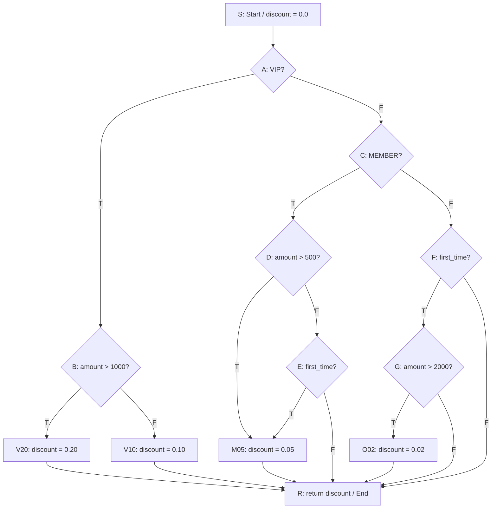
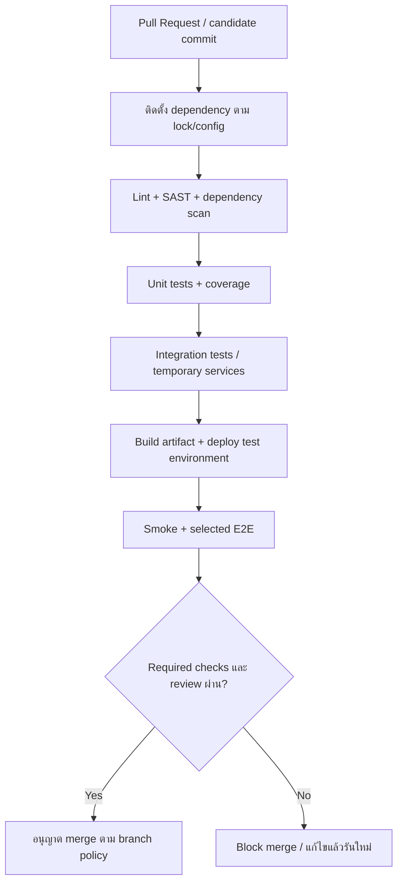

# Pre-Final พร้อมโจทย์และแนวคำตอบ — ENGSE225

รายวิชา **วิวัฒนาการซอฟต์แวร์และการบำรุงรักษา (Software Evolution and Maintenance)**

ครอบคลุมข้อสอบหลัก 5 ข้อ และข้อสอบเพิ่มเติม 5 ข้อ รวม 10 ข้อ โดยคงเลขข้อเดิมแยกเป็นส่วน A และ B แนวคำตอบเรียบเรียงจากเอกสารสัปดาห์ที่ 1–15 และโจทย์ในโฟลเดอร์ `work` ตัวอย่างโค้ดและแบบออกแบบในเฉลยเป็นตัวอย่างประกอบคำตอบ ไม่ใช่รายงานผลทดสอบระบบจริง

**วิธีอ่าน:** แต่ละข้อมีโจทย์ต้นฉบับ ตามด้วยคำตอบแยกตามคำถามย่อย ส่วนที่โจทย์ใช้ถ้อยคำคลาดเคลื่อนจะมีหมายเหตุทางวิชาการกำกับ ดูรายการเอกสารทั้งหมดใน [ดัชนีเอกสารประกอบ](</home/panuwat/work/software-project-management/work/Pre-Final/Answers/README.md>)

## ส่วน A — ข้อสอบหลัก: Mini Inventory Legacy System

## A1 — Refactoring และ Safety Net

### โจทย์

**ข้อที่ 1: การผ่าตัดโค้ดด้วยเทคนิค Refactoring ของ Martin Fowler (สัปดาห์ที่ 8)**

ในการเข้าปรับปรุงซอฟต์แวร์คลังสินค้าดั้งเดิม (app_v1.py) เพื่อขจัดปัญหาหนี้ทางเทคนิค (Technical Debt)
1.1 จงอธิบายความหมายและขั้นตอนเชิงปฏิบัติการของเทคนิค Refactoring ต่อไปนี้ พร้อมยกตัวอย่างชิ้นส่วนโค้ด (Pseudo-code หรือ Python) สั้น ๆ ประกอบการอธิบาย:

Extract Class / Extract Function: การแตกฟังก์ชัน main() ขนาดใหญ่และกระจัดกระจายออกเป็นคลาส Product, InventoryRepository และ InventoryService

Encapsulate Field & Parameterize Object: การขจัดตัวแปรระดับโลก global x แล้วเปลี่ยนมาส่งผ่านอ็อบเจกต์ (Dependency Injection) ผ่านพารามิเตอร์แทน 

1.2 ตามแนวคิดของ Martin Fowler เพราะเหตุใดการทำ Refactoring จึงต้องมี "Safety Net" (เช่น ชุดทดสอบ PyTest) ควบคู่ไปด้วยเสมอ และกฎเหล็กของสภาวะการรัน Test ระหว่างผ่าตัดโค้ดคืออะไร?

### คำตอบ 1.1

**Refactoring คือการเปลี่ยนโครงสร้างภายในโดยรักษาพฤติกรรมที่สังเกตได้จากภายนอก** จึงต้องแยกจากการแก้บั๊กหรือเพิ่มฟีเจอร์ใหม่ ขั้นตอนเริ่มจากรันทดสอบพฤติกรรมเดิม ระบุหน้าที่ที่ปะปนกัน แยกทีละส่วน และทดสอบซ้ำหลังแต่ละการเปลี่ยนแปลง

**Extract Function:** ย้ายชุดคำสั่งที่ทำงานหนึ่งอย่างออกเป็นฟังก์ชัน ตั้งชื่อให้สื่อความหมาย ระบุ input/output และแทนที่โค้ดเดิมด้วยการเรียกฟังก์ชัน เช่น แยกการคำนวณมูลค่าคลังออกจาก `main()`

```python
# ก่อนแยก: โค้ดส่วนนี้อยู่ใน main() และพึ่งตัวแปร global x
total = sum(item["q"] * item["p"] for item in x.values())
print(total)

# หลังแยก: ยังรับโครงสร้างข้อมูลเดิมและได้ผลลัพธ์เดิม
def calculate_total_inventory_value(items):
    return sum(item["q"] * item["p"] for item in items.values())

# main() รับผิดชอบแสดงผล แล้วส่งข้อมูลเข้าฟังก์ชันอย่างชัดเจน
print(calculate_total_inventory_value(x))
```

**Extract Class:** แยกข้อมูลและพฤติกรรมที่เกี่ยวข้องกันเป็นคลาสตามหน้าที่ ดังนี้

| คลาส | ความรับผิดชอบ | สิ่งที่ไม่ควรปะปน |
|---|---|---|
| `Product` | ข้อมูลสินค้าและกฎที่ผูกกับสินค้า เช่น มูลค่าสินค้า | การเปิดไฟล์หรือรับ input |
| `InventoryRepository` | โหลด บันทึก และแปลงข้อมูลระหว่าง JSON กับวัตถุ | การพิมพ์เมนู |
| `InventoryService` | ประสานงานตามกฎธุรกิจ เช่น รวมมูลค่าคลัง | รายละเอียด JSON และหน้าจอ |
| `ConsoleUI` | รับคำสั่งและแสดงผล | การคำนวณธุรกิจซ้ำกับ Service |

**Encapsulate Field:** ย้าย state จาก `global x` มาอยู่ในวัตถุ และเข้าถึงผ่านเมธอดที่ควบคุมการเปลี่ยนแปลงได้ **การส่งอ็อบเจกต์ผ่านพารามิเตอร์/Dependency Injection:** ให้ผู้ประกอบระบบสร้าง Repository แล้วส่งเข้า Service ทำให้เห็น dependency และเปลี่ยนเป็นตัวจำลองในการทดสอบได้

```python
from dataclasses import dataclass

@dataclass(frozen=True)
class Product:
    product_id: str
    name: str
    quantity: int
    price: float

    def stock_value(self):
        return self.quantity * self.price

class InventoryRepository:
    # ตัวอย่างแบบ in-memory เพื่อแสดง encapsulation
    # implementation ที่ใช้จริงสามารถโหลด/บันทึก JSON หลัง interface นี้
    def __init__(self, products=()):
        self._products = {p.product_id: p for p in products}

    def load_all(self):
        return tuple(self._products.values())

class InventoryService:
    def __init__(self, repository):
        self._repository = repository

    def total_value(self):
        return sum(p.stock_value() for p in self._repository.load_all())

repository = InventoryRepository([Product("P01", "Pen", 3, 10.0)])
service = InventoryService(repository)
assert service.total_value() == 30.0
```

การคืน tuple และใช้ Product ที่แก้ไขตรง ๆ ไม่ได้ช่วยลดการแอบเปลี่ยน state จากภายนอก ในระบบเต็มให้เพิ่มเมธอดแก้สต็อกผ่านกฎธุรกิจ ทั้งนี้อย่าเปลี่ยนกฎธุรกิจใหม่ระหว่าง refactoring โดยไม่ได้อนุมัติ

คำว่า **Parameterize Object** ในโจทย์อธิบายในความหมายของการส่ง dependency เป็น object; การรวมพารามิเตอร์หลายตัวเป็นวัตถุ (*Introduce Parameter Object*) และ Dependency Injection เป็นคนละแนวคิดที่นำมาใช้ร่วมกันได้

### คำตอบ 1.2

Safety Net คือชุดทดสอบที่ล็อกพฤติกรรมสำคัญเดิม เช่น การเพิ่ม/ลดสต็อก การคำนวณมูลค่า และการอ่านไฟล์ ช่วยตรวจพบ regression ทันทีเมื่อการย้ายโค้ดทำให้ผลลัพธ์เปลี่ยน

1. เริ่มจาก baseline ที่ทดสอบผ่าน หากระบบเก่าไม่มี test ให้เขียน characterization tests สำหรับพฤติกรรมที่จะรักษาก่อน
2. ปรับโครงสร้างทีละจุด แล้วรัน test ที่เกี่ยวข้องทันที
3. หาก test แดง ให้หยุดแก้ส่วนอื่น ตรวจแก้หรือย้อนเฉพาะการเปลี่ยนแปลงล่าสุดจนกลับมาเขียว
4. รัน regression suite และผ่าน review/CI ก่อน merge ห้ามลบ assertion หรือข้าม test เพื่อให้ผ่าน

**กฎเหล็ก:** ช่วง refactoring ต้องรักษาสถานะเขียวหลังแต่ละก้าว ส่วน RED ที่ตั้งใจสร้างใน TDR/TDD เป็นขั้นตอนทดสอบพฤติกรรมใหม่ ไม่ใช่ข้อยกเว้นให้ merge โค้ดที่พัง และ test ผ่าน 100% หมายถึงผ่านชุดที่มีอยู่ ไม่ได้พิสูจน์ว่าซอฟต์แวร์ไม่มีบั๊กทุกชนิด

อิงบทเรียน ENGSE225 สัปดาห์ 3–9

## A2 — Change Request, TDR และ Root Cause Analysis

### โจทย์

**ข้อที่ 2: กระบวนการจัดการคำขอเปลี่ยนแปลงและวิวัฒนาการซอฟต์แวร์ (สัปดาห์ที่ 8, 9, 10)**

2.1 เมื่อลูกค้าส่งมอบใบคำขอเปลี่ยนแปลง Change Request (CR-01: ขอเพิ่ม Barcode และ Reorder Point) และ Emergency Change Request (CR-02: ขอส่งออกรายงานสต็อกต่ำเป็นไฟล์ CSV ด่วน) จงอธิบายขั้นตอนการจัดการคำขอตามมาตรฐาน ISO/IEC 14764 / IEEE 1219 ตั้งแต่ขั้นตอนการรับคำขอ การวิเคราะห์ผลกระทบ (Impact Analysis) จนถึงการเขียนชุดทดสอบแบบ Test-Driven Refinement (TDR)
2.2 หากการนำระบบไปใช้งานจริงพบข้อบกพร่องว่า "เมื่อเปิดไฟล์ข้อมูลเก่า data.json ที่ไม่มีฟิลด์ barcode โปรแกรมเกิด KeyError และแครชทันที" จงใช้เทคนิค Root Cause Analysis (RCA) - 5 Whys วิเคราะห์หาต้นตอของปัญหานี้ และอธิบายแนวทางแก้ไขในระดับสถาปัตยกรรม (เช่น การทำ Default Fallback Mechanism ใน Repository Layer)

### คำตอบ 2.1

ประยุกต์กรอบ maintenance ใน ISO/IEC 14764 / IEEE 1219 เป็นกระบวนการที่ตรวจย้อนกลับได้ดังนี้

1. **รับและบันทึกคำขอ:** กำหนด CR ID ผู้ร้องขอ เหตุผลธุรกิจ ลำดับความสำคัญ เกณฑ์ยอมรับ และความเร่งด่วน CR-01 คือเพิ่ม Barcode/Reorder Point; CR-02 คือส่งออกสินค้าสต็อกต่ำเป็น CSV ทั้งคู่เป็นการเพิ่มความสามารถแบบ perfective maintenance ส่วนการแก้ KeyError เป็น corrective maintenance
2. **วิเคราะห์ผลกระทบ:** ระบุโมดูล ข้อมูลเก่า interface การทดสอบ เอกสาร deployment และความเสี่ยง พร้อมประมาณ man-hours/ต้นทุนส่งให้ PM
3. **พิจารณาอนุมัติ:** PM/CCB ตัดสิน Approve, Reject หรือ Defer แล้วบันทึกขอบเขตและงบที่อนุมัติ คำว่า emergency ทำให้การพิจารณาเร็วขึ้น แต่ไม่ยกเลิกการควบคุมและการทดสอบ
4. **ออกแบบและเตรียมงาน:** แยก branch ผูก CR กับ issue และ test กำหนด schema/default เพื่อรองรับข้อมูลเก่า และเตรียมแผนย้อนกลับ
5. **พัฒนาแบบ TDR:** เขียน test ตาม acceptance criteria ให้ล้มเหลวเพราะยังไม่มีความสามารถนั้น (RED) เขียนโค้ดให้ผ่าน (GREEN) แล้วจัดโครงสร้างโดย test ยังคงผ่าน (REFACTOR)
6. **ตรวจและส่งมอบ:** review, unit/integration/regression, ตรวจรับตาม CR และอนุมัติ release จากนั้นปรับ changelog, RTM และ maintenance records

| CR | ผลกระทบหลัก | ตัวอย่างชุดทดสอบ |
|---|---|---|
| CR-01 | `Product` เพิ่ม barcode/reorder_point; Repository แปลง JSON; Service กรองสินค้า; UI รับและแสดงข้อมูล | barcode เป็น string รักษาเลขศูนย์นำหน้า; อ่านไฟล์เก่า; quantity ต่ำกว่า/เท่ากับ/สูงกว่าเกณฑ์ |
| CR-02 | `CsvReportExporter` รับผลจาก Service และสร้าง CSV; UI เพิ่มคำสั่ง export | header/จำนวนแถว/ข้อมูลตรงกัน; ไม่มีสินค้าสต็อกต่ำ; ชื่อไทย/เครื่องหมาย comma; permission error |

ตัวอย่าง TDR สำหรับขอบเขตของ Reorder Point ตามสัปดาห์ 9 โดยใช้ `Product` รุ่น CR-01 ต่อไปนี้แทนรุ่นเดิมใน A1:

```python
from dataclasses import dataclass
import pytest

@dataclass(frozen=True)
class Product:
    product_id: str
    name: str
    quantity: int
    price: float
    barcode: str = ""
    reorder_point: int = 5

    def stock_value(self):
        return self.quantity * self.price

    def is_low_stock(self):
        return self.quantity <= self.reorder_point

@pytest.mark.parametrize("quantity, expected", [(3, True), (5, True), (6, False)])
def test_low_stock_boundary(quantity, expected):
    product = Product("P01", "Pen", quantity, 10.0,
                      barcode="00123", reorder_point=5)
    assert product.is_low_stock() is expected
```

สำหรับ CR-02 บทเรียนสัปดาห์ 10 ประเมิน 2 + 1 + 1.5 = **4.5 man-hours** สำหรับ exporter, UI และ test ตามลำดับ ต้องแยกงานรายงานออกจาก Repository ที่ดูแลข้อมูลหลัก

### คำตอบ 2.2

| ลำดับ | คำถาม Why | คำตอบจากสถานการณ์ |
|---|---|---|
| 1 | ทำไมโปรแกรมล่ม? | อ่าน `row["barcode"]` แล้วพบ `KeyError` |
| 2 | ทำไมไม่มีคีย์? | `data.json` ถูกสร้างด้วย schema รุ่นเก่าก่อนมี Barcode |
| 3 | ทำไมข้อมูลเก่าเข้าโมเดลใหม่ไม่ได้? | deserializer บังคับฟิลด์ใหม่ทุกครั้ง ไม่มี migration/default |
| 4 | ทำไมไม่ได้ออกแบบ fallback? | ทีมสมมุติว่าข้อมูลทุกชุดเป็นรุ่นใหม่ และทดสอบเฉพาะข้อมูลใหม่ |
| 5 | ทำไมสมมุติฐานนี้ไม่ถูกตรวจพบ? | กระบวนการเปลี่ยน schema ขาดข้อกำหนด backward compatibility และ test fixture จากข้อมูลเก่า |

ข้อ 4–5 เป็นสมมุติฐาน RCA ที่ต้องยืนยันกับประวัติ PR/test ในงานจริง ไม่ควรสรุปว่าเป็นความผิดของบุคคลจากอาการเพียงอย่างเดียว

แก้ที่ **Repository/serialization boundary** ให้แปลง schema เก่าเป็น Domain Model มาตรฐานก่อนส่งไป Service:

```python
def product_from_row(product_id, row):
    # สมมุติ legacy schema ในกรณีนี้ใช้ name, qty, price
    return Product(
        product_id=product_id,
        name=row["name"],
        quantity=row["qty"],
        price=row["price"],
        barcode=row.get("barcode", ""),
        reorder_point=row.get("reorder_point", 5),
    )
```

ค่าเริ่มต้น `""` และ `5` ตรงกับบทเรียน ควรตรวจชนิดข้อมูลและค่าติดลบด้วย: `dict.get` จัดการคีย์ที่หาย แต่ไม่แก้ค่า `null` หรือชนิดผิด หากข้อมูลเก่ามีคีย์ `n/q/p` ต้องมี adapter สำหรับ schema นั้นเพิ่มอย่างชัดเจน ห้ามใช้ `except: pass` แล้วโหลดคลังว่างมาบันทึกทับข้อมูลเสีย

ก่อนแก้ให้สร้างไฟล์ JSON รุ่นเก่าใน `tmp_path` เพื่อทำให้บั๊กเกิดซ้ำ หลังแก้ตรวจว่าโหลดจำนวนสินค้า/ราคาเดิมครบ เติม default ถูกต้อง และบันทึกแล้วโหลดกลับได้ จากนั้นเก็บ test ไว้ใน regression suite

อิงบทเรียน ENGSE225 สัปดาห์ 2, 8–10

## A3 — Atomic File Writing และ Code Freeze

### โจทย์

**ข้อที่ 3: การเสริมความมั่นคงปลอดภัยและการแช่แข็งโค้ด (สัปดาห์ที่ 11)**

3.1 ในช่วงการทำ System Hardening จงอธิบายความเสี่ยงของปัญหา Data Corruption ที่เกิดจากการบันทึกไฟล์แบบดั้งเดิม (open(file, 'w')) เมื่อระบบเกิดไฟดับหรือ Crash กะทันหัน และอธิบายว่าเทคนิค Atomic File Writing (การใช้ไฟล์ชั่วคราวร่วมกับ os.replace) ช่วยแก้ปัญหานี้ให้เกิดความปลอดภัย 100% ได้อย่างไร
3.2 ตามมาตรฐาน ISO/IEC/IEEE 12207 จงอธิบายความหมาย วัตถุประสงค์ และ "กฎเหล็กของการเข้าสู่สภาวะ Code Freeze" เหตุใดทีมวิศวกรซอฟต์แวร์จึงต้องสั่งห้ามเพิ่มฟีเจอร์ใหม่ (No New Features) ในสัปดาห์ที่ 11 ก่อนวันส่งมอบจริง?

### คำตอบ 3.1

`open(file, "w")` ล้างเนื้อหาเดิมทันที หากโปรแกรมล่มระหว่างเขียน JSON ไฟล์อาจว่างหรือมีข้อมูลเพียงบางส่วน จึงโหลดกลับไม่ได้ และข้อมูลเดิมสูญหาย

Atomic File Writing เปลี่ยนเป็น **เขียนไฟล์ใหม่ให้เสร็จก่อน แล้วสลับชื่อไฟล์ปลายทางครั้งเดียว**:

1. สร้าง temporary file ใน directory เดียวกับไฟล์จริงเพื่อให้อยู่ filesystem เดียวกัน
2. serialize ข้อมูลลงไฟล์ชั่วคราวจนจบ ตรวจ error และ flush buffer
3. ใช้ `os.fsync()` กับไฟล์เพื่อขอให้ระบบผลักข้อมูลลง storage
4. ปิดไฟล์แล้วใช้ `os.replace(temp, target)` แทนไฟล์จริงแบบ atomic เมื่อ platform/filesystem รองรับ
5. บน POSIX ที่รองรับ ให้ fsync directory เพื่อเพิ่มความทนทานของการเปลี่ยนชื่อเมื่อไฟดับ และจัดการไฟล์ชั่วคราวเมื่อผิดพลาด

```python
import json
import os
import tempfile
from pathlib import Path

def atomic_save_json(target, data):
    target = Path(target)
    temporary = None
    try:
        with tempfile.NamedTemporaryFile(
            mode="w", encoding="utf-8", dir=target.parent,
            prefix=target.name + ".", suffix=".tmp", delete=False,
        ) as stream:
            temporary = Path(stream.name)
            json.dump(data, stream, ensure_ascii=False, allow_nan=False)
            stream.flush()
            os.fsync(stream.fileno())
        os.replace(temporary, target)
        temporary = None
        # สำหรับ POSIX เพิ่ม directory fsync ตาม filesystem ที่ใช้งาน
        if os.name == "posix":
            descriptor = os.open(target.parent, os.O_RDONLY)
            try:
                os.fsync(descriptor)
            finally:
                os.close(descriptor)
    finally:
        if temporary is not None:
            temporary.unlink(missing_ok=True)
```

ตัวอย่างสมมุติว่า directory มีอยู่แล้วและมีผู้เขียนรายเดียว หากล้มเหลวก่อน replace ไฟล์จริงเดิมยังอยู่ หาก replace สำเร็จ ผู้อ่านใหม่จะเปิดพบไฟล์ใหม่ครบชุด แทนการเห็นไฟล์ที่เขียนค้าง หาก directory fsync ล้มเหลวหลัง replace การเปลี่ยนไฟล์เกิดขึ้นแล้ว ต้องรายงานสถานะความทนทานที่ยังไม่ยืนยัน ไม่กล่าวว่าข้อมูลเดิมยังอยู่แน่นอน

**ข้อแก้ไขถ้อยคำในโจทย์:** ไม่สามารถรับรอง “ปลอดภัย 100%” จากทุกเหตุการณ์ได้ Atomicity ต่างจาก durability และยังไม่ป้องกัน disk เสีย ข้อมูลที่เขียนผิดตั้งแต่ต้น หรือ lost update จากผู้เขียนพร้อมกัน ต้องใช้ backup/recovery, validation และ locking/transaction เพิ่มตามความเสี่ยง เอกสาร Python ระบุข้อจำกัดเรื่อง filesystem และ atomic rename ไว้ใน [os.replace](https://docs.python.org/3/library/os.html#os.replace)

### คำตอบ 3.2

**Code Freeze** คือการตรึงชุดโค้ดที่จะส่งมอบและจำกัดประเภทการแก้ไข เพื่อให้ release candidate มีเสถียรภาพและผลทดสอบยังอ้างอิงได้ เป็นนโยบายโครงการที่สนับสนุนการควบคุม configuration, integration และ transition ตามกรอบ ISO/IEC/IEEE 12207 ไม่ใช่ข้อกำหนดสากลว่าทุกโครงการต้อง freeze ในสัปดาห์ 11

กฎของโครงการนี้คือ:

- ฟีเจอร์ที่อนุมัติใน CR-01/CR-02 ต้องรวมและผ่านเกณฑ์ก่อน freeze
- **No New Features:** ไม่เพิ่มฟีเจอร์หรือปรับ UI ตามใจ ไม่ทำ refactoring ใหญ่ที่เพิ่มความเสี่ยงในช่วงตรวจรับ
- อนุญาตการแก้ defect วิกฤต/security และเพิ่ม test ภายใต้ผู้อนุมัติที่กำหนด ทุก patch ผ่าน PR, CI และ regression
- บันทึก commit/release candidate ที่ตรวจรับ หากแก้โค้ดต้องประเมินและรันทดสอบที่ได้รับผลกระทบซ้ำ
- คำขอใหม่เก็บใน future backlog; หากจำเป็นจริงต้องผ่าน exception/change control และปรับแผนตรวจรับอย่างเป็นทางการ

เหตุผลคือการเพิ่มฟีเจอร์นาทีสุดท้ายขยายพื้นที่เสี่ยงของ regression ทำให้ UAT ต้องเริ่มตรวจส่วนเกี่ยวข้องใหม่ รวมถึงคู่มือและแพ็กเกจอาจไม่ตรงกับโค้ด การ freeze จึงกันเวลาให้ hardening และ UAT ในสัปดาห์ 12

อิงบทเรียน ENGSE225 สัปดาห์ 11, 14

## A4 — UAT และ Production Baseline

### โจทย์

**ข้อที่ 4: การตรวจรับระบบ UAT และการส่งมอบสู่ Production Baseline (สัปดาห์ที่ 12)**

4.1 ในการส่งมอบซอฟต์แวร์ตามมาตรฐาน ISO/IEC/IEEE 12207 (Release Management) จงอธิบายความแตกต่างระหว่าง System Testing กับ User Acceptance Testing (UAT) และเหตุใดกระบวนการตรวจรับจึงต้องแยกแยะระหว่าง "UAT Defect" กับ "New Scope Identification" ให้เด็ดขาดจากกัน?
4.2 จงอธิบายหลักการตั้งชื่อเวอร์ชันตามมาตรฐาน Semantic Versioning 2.0.0 (MAJOR.MINOR.PATCH) พร้อมระบุเหตุผลว่า เพราะเหตุใดโครงการระบบคลังสินค้านี้จึงได้รับการเลื่อนระดับเวอร์ชันจาก v1.0.0-baseline ไปสู่ v2.0.0-evolution บนสาขา main ผ่านการสร้าง Annotated Git Tag?

### คำตอบ 4.1

| ประเด็น | System Testing | User Acceptance Testing |
|---|---|---|
| เป้าหมาย | ตรวจระบบรวมตาม functional/non-functional specification | ยืนยันว่ารองรับงานธุรกิจและเกณฑ์ตรวจรับ |
| ผู้รับผิดชอบหลัก | QA/ทีมทดสอบเชิงเทคนิค | ผู้ใช้หรือตัวแทนธุรกิจ โดยทีมช่วยเตรียมระบบ |
| ตัวอย่าง | ทดสอบอ่าน JSON เก่า ตัดสต็อก ข้อมูล CSV และ failure handling | เจ้าหน้าที่รับสินค้า ขายจนสต็อกต่ำ และใช้ CSV สั่งซื้อจริง |
| หลักฐาน | test cases, execution logs, defect reports | UAT scenarios, ผลตรวจ และผู้มีอำนาจลงนามยอมรับ |

System Testing ไม่เท่ากับ Unit Test และไม่จำเป็นต้องเป็นอัตโนมัติทั้งหมด ส่วน UAT ต้องเทียบกับ acceptance criteria ที่ตกลงไว้ ไม่ใช่ความพอใจลอย ๆ

แยกข้อค้นพบระหว่างตรวจรับดังนี้:

- **UAT Defect:** ไม่ตรงความต้องการที่ตกลงแล้ว เช่น `quantity == reorder_point` ไม่แจ้งเตือน หรือ CSV ไม่มี Barcode ให้บันทึก severity/priority แก้ตามเกณฑ์ release และทดสอบซ้ำ
- **New Scope:** ความสามารถที่ไม่เคยตกลง เช่น ส่งอีเมลให้ supplier อัตโนมัติ ให้เปิด CR/future backlog แล้วประเมินต้นทุนและเวลาใหม่

การแยกนี้ป้องกันงานเพิ่มถูกนับเป็นบั๊กจน scope บาน และป้องกันทีมอ้างว่าเป็นงานใหม่เพื่อหลีกเลี่ยงแก้สิ่งที่เคยรับปากไว้ ต้องยึด SRS/CR/RTM ที่อนุมัติเป็นหลัก

### คำตอบ 4.2

Semantic Versioning ใช้ `MAJOR.MINOR.PATCH` โดยอิง **public API/สัญญาการใช้งานที่ประกาศ**:

- MAJOR: เปลี่ยนแบบไม่ compatible กับสัญญาเดิม
- MINOR: เพิ่มความสามารถโดยยัง backward compatible
- PATCH: แก้บั๊กแบบ backward compatible

ในเรื่องเล่าของรายวิชา `v1.0.0-baseline` คือฐานระบบเก่า และ `v2.0.0-evolution` คือ milestone หลังเปลี่ยนเป็น Product/Repository/Service เพิ่ม Barcode, Reorder Alert และ CSV ผ่าน UAT แล้ว

**ความแม่นยำตาม SemVer:** การเปลี่ยนสถาปัตยกรรมภายในขนาดใหญ่เพียงอย่างเดียวไม่ได้บังคับให้เพิ่ม MAJOR ต้องพิสูจน์ว่า public API หรือสัญญาที่ประกาศเปลี่ยนแบบ incompatible หากเปลี่ยนภายในและยัง compatible ฟีเจอร์ใหม่อาจเหมาะกับ MINOR นอกจากนี้ `-baseline` และ `-evolution` มีความหมายเป็น pre-release identifier ตามไวยากรณ์ SemVer; ถ้าต้องการประกาศ stable release จริงอาจใช้ `2.0.0` แล้วใส่คำว่า evolution ในชื่อ release แทน ดู [SemVer 2.0.0](https://semver.org/)

ขั้นตอนส่งมอบของกรณีศึกษาคือได้ UAT sign-off, ผ่าน regression และ PR review จากนั้น merge เข้า `main` แล้วสร้าง annotated tag บน commit ที่ตรวจรับแล้ว ตัวอย่างคำสั่งสำหรับเขียนตอบ:

```bash
git tag -a v2.0.0-evolution -m "Accepted inventory evolution release"
```

Annotated tag เก็บผู้สร้าง วันเวลา ข้อความ และอ้างอิง commit จึงใช้ตามรอย release และ checkout เพื่อตรวจสอบย้อนหลังได้ ควรป้องกันการย้าย/ลบ tag ที่เผยแพร่แล้ว การสร้าง tag ไม่ได้สร้าง GitHub Release พร้อม release notes โดยอัตโนมัติเสมอไป และ tag อ้างอิง commit ไม่ได้ผูกติดกับชื่อ branch ถาวร

อิงบทเรียน ENGSE225 สัปดาห์ 3–4, 12

## A5 — Clean Environment และ Maintenance Dossier

### โจทย์

**ข้อที่ 5: การติดตั้งบนสภาพแวดล้อมบริสุทธิ์และการปิดแฟ้มประวัติบำรุงรักษา (สัปดาห์ที่ 13, 14, 15)**

5.1 ทำไมการทดสอบติดตั้งซอฟต์แวร์บน "Clean / Fresh Environment" ในสัปดาห์ที่ 13 จึงมีความสำคัญอย่างยิ่งยวดในการแก้ปัญหา "It works on my machine"? และการทำ Smoke Testing แตกต่างจาก Post-Maintenance Full Regression Testing อย่างไร?
5.2 ตามมาตรฐาน ISO/IEC 14764 (Clause 8.4: Maintenance Records) จงระบุองค์ประกอบสำคัญ 3 ประการที่ต้องบรรจุใน Complete System Maintenance Dossier (แฟ้มประวัติวิศวกรรมบำรุงรักษาฉบับสมบูรณ์) เพื่อให้ทีมงานรุ่นถัดไป (Next-Generation Maintenance Team) สามารถรับช่วงดูแลระบบต่อได้อย่างยั่งยืน

### คำตอบ 5.1

การติดตั้งบน Clean/Fresh Environment พิสูจน์ว่าคนอื่นติดตั้งได้จากชิ้นงานที่ส่งมอบ โดยไม่อาศัย package, cache, absolute path หรือ environment variable ที่มีเฉพาะเครื่องผู้พัฒนา

กระบวนการคือใช้เครื่อง/VM/container ที่สะอาดหรืออย่างน้อย virtual environment ใหม่ นำโค้ดจาก release tag ที่ระบุ ติดตั้ง dependency จากรายการเวอร์ชันที่กำหนด ตั้งค่าตาม `.env.example` ตรวจสิทธิ์/path และรัน smoke ตามด้วย regression พร้อมบันทึก OS/Python/package versions, commit/tag, คำสั่งและผลลัพธ์ การใช้ venv เพียงอย่างเดียวยังไม่แยก OS/system libraries จึงอาจต้องทดสอบเพิ่มใน target environment จริง

| ประเด็น | Smoke Testing | Post-Maintenance Full Regression Testing |
|---|---|---|
| จุดประสงค์ | ตรวจว่า build พร้อมให้ทดสอบต่อหรือไม่ | ตรวจว่าการบำรุงรักษาไม่ทำพฤติกรรมที่ต้องรักษาเสีย |
| ขอบเขต | กว้างแต่ตื้น เลือกเส้นทางสำคัญไม่กี่รายการ | ครบ regression suite ที่กำหนด ทั้งเดิม ใหม่ ขอบเขต และข้อผิดพลาด |
| ตัวอย่าง | โปรแกรมเปิดได้ โหลดคลังได้ คำสั่งหลักเรียกได้ | คำนวณยอด ตัดสต็อก default schema, Barcode, alert boundary, CSV, atomic-write failure |
| เมื่อไม่ผ่าน | แก้ปัญหาติดตั้ง/พื้นฐานก่อนเดินหน้าทดสอบ | เปิด defect แก้และทดสอบซ้ำก่อนส่งมอบ |

Smoke ผ่านจึงยังไม่แทน full regression และ regression ผ่านก็ไม่แทน UAT

### คำตอบ 5.2

ตามโครงสร้าง **Complete Dossier ในบทเรียนสัปดาห์ 14–15** แบ่งเป็น 3 องค์ประกอบสำคัญ:

1. **Quality Audit / Metrics Audit:** หลักฐานคุณภาพ As-Is เทียบ As-Built เช่น complexity, coupling, coverage, test results, security scan และผล recovery drill ระบุเครื่องมือ รุ่นซอฟต์แวร์ เงื่อนไขและวันที่วัด ตัวเลข 22 → 6 และ coverage 94% ในสไลด์เป็นตัวอย่างของกรณีศึกษา ไม่ใช่ค่าที่วัดจาก repository นี้
2. **Traceability และประวัติการเปลี่ยนแปลง:** เชื่อม CR/defect → requirement → module/commit/PR → test/UAT → release พร้อม impact analysis, RCA และ changelog ทำให้ทีมใหม่รู้ทั้ง “แก้อะไร” และ “ทำไม”
3. **Admin/Operations & Handover Manual:** สถาปัตยกรรม As-Built/schema, setup/dependency/configuration, backup/restore/rollback, migration, known issues, ผู้รับผิดชอบและ escalation รวมถึงวิธีตรวจว่ากู้คืนสำเร็จ

ตัวอย่าง traceability: `BUG-101 → legacy JSON compatibility → InventoryRepository.load_all → PR/commit ที่แก้จริง → test_missing_barcode → release tag ที่ส่งมอบ` ต้องใช้รหัสหลักฐานจริงเมื่อจัดแฟ้ม ไม่คัดลอก commit hash ตัวอย่างจากสไลด์

ทั้งสามส่วนทำให้ทีมถัดไปประเมินความเสี่ยง หาส่วนที่เกี่ยวข้อง ติดตั้ง ทดสอบ และกู้ระบบต่อได้ โดยไม่ต้องเดาเจตนาทีมเดิม

**ข้อแก้ไขการอ้างมาตรฐานในโจทย์:** สารบัญ ISO/IEC 14764:2006 ซึ่งบทเรียนใช้อ้างอิง **ไม่มีหัวข้อ “8.4: Maintenance Records”** โดยระบุกระบวนการ Modification Implementation ในข้อ 5.3 และ Maintenance Review/Acceptance ในข้อ 5.4 ดู [สารบัญมาตรฐานฉบับ 2006 ที่เผยแพร่โดย SIST](https://preview.sist.si/sist-preview/39064/a132a6efa20e47d69ede63804b88a170/ISO-IEC-14764-2006.pdf) ดังนั้นสามภาคข้างต้นเป็นรูปแบบ Dossier ของรายวิชา ไม่ควรอ้างว่าเป็นรายการสามภาคที่มาตรฐานบังคับไว้ในข้อ 8.4

อิงบทเรียน ENGSE225 สัปดาห์ 13–15

## ส่วน B — ข้อสอบเพิ่มเติม: Testing, Quality Assurance & Metrics

## B1 — CFG, Cyclomatic Complexity และ Test Cases

### โจทย์

**ข้อ 1: Control Flow Testing & Cyclomatic Complexity**

โจทย์: กำหนดฟังก์ชันคำนวณส่วนลดตามลอจิกดังนี้:

```python
def calculate_discount(customer_type, total_amount, is_first_time):
    discount = 0.0
    if customer_type == "VIP":
        if total_amount > 1000:
            discount = 0.20
        else:
            discount = 0.10
    elif customer_type == "MEMBER":
        if total_amount > 500 or is_first_time:
            discount = 0.05
    else:
        if is_first_time and total_amount > 2000:
            discount = 0.02
    return discount
```

คำถาม:

จงวาด Control Flow Graph (CFG) ของฟังก์ชันดังกล่าว
จงคำนวณหาค่า Cyclomatic Complexity V(G) โดยแสดงวิธีทำอย่างละเอียด (ทั้งจากสูตร E - N + 2P และ Predicate Nodes + 1)
จงออกแบบชุด Test Cases พื้นฐาน (Basis Paths) ให้ครอบคลุมทุกเส้นทางการทำงานแบบ 100% Path Coverage

### คำตอบ: Control Flow Graph

กำหนด input เป็น string, จำนวนเงินที่เปรียบเทียบได้ และ boolean โดยนับเส้นทางทำงานปกติ ไม่รวม exception จากชนิดข้อมูลผิด Python ประเมิน `or` และ `and` แบบ short-circuit จึงแยกเงื่อนไขย่อยใน CFG ดังนี้



### คำตอบ: วิธีคำนวณ V(G)

นับ **N = 13 nodes** ได้แก่ S, A, B, C, D, E, F, G, V20, V10, M05, O02, R และ **E = 19 edges** ดังนี้:

`S→A; A→B; A→C; B→V20; B→V10; V20→R; V10→R; C→D; C→F; D→M05; D→E; E→M05; E→R; M05→R; F→G; F→R; G→O02; G→R; O02→R`

มี connected component **P = 1** ดังนั้น

```text
V(G) = E − N + 2P = 19 − 13 + 2(1) = 8
Predicate nodes = A, B, C, D, E, F, G = 7
V(G) = Predicate nodes + 1 = 7 + 1 = 8
```

หากผู้สอนใช้ **CFG ระดับ statement ที่รวมเงื่อนไข compound เป็น node เดียว** จะมี predicate 5 จุด (if/elif) ได้ V(G) = 6 โดยกราฟแบบนั้นมี N = 11, E = 15, P = 1 → 15 − 11 + 2 = 6 ต้องระบุระดับการนับให้ชัดและใช้สูตรทั้งสองกับกราฟเดียวกัน คำตอบหลักที่นี่ใช้ short-circuit ตามการประเมินจริงของ Python

### คำตอบ: Basis Paths และ Full Path Coverage

| TC | customer_type | total_amount | is_first_time | เส้นทาง | discount |
|---|---|---:|---|---|---:|
| T1 | VIP | 1001 | False | S-A-B-V20-R | 0.20 |
| T2 | VIP | 1000 | False | S-A-B-V10-R | 0.10 |
| T3 | MEMBER | 501 | False | S-A-C-D-M05-R | 0.05 |
| T4 | MEMBER | 500 | True | S-A-C-D-E-M05-R | 0.05 |
| T5 | MEMBER | 500 | False | S-A-C-D-E-R | 0.00 |
| T6 | GENERAL | 2001 | False | S-A-C-F-R | 0.00 |
| T7 | GENERAL | 2001 | True | S-A-C-F-G-O02-R | 0.02 |
| T8 | GENERAL | 2000 | True | S-A-C-F-G-R | 0.00 |

T3 ไม่ประเมิน `is_first_time` หลัง `or` เพราะเงื่อนไขแรกเป็นจริง ส่วน T6 ไม่ประเมินยอดเงินหลัง `and` เพราะเงื่อนไขแรกเป็นเท็จ ทั้งแปดเส้นทางเป็นอิสระตาม CFG นี้ และครอบคลุมเส้นทางทำงานปกติที่เป็นไปได้ทั้งหมด: VIP 2 + MEMBER 3 + GENERAL 3 = **8 เส้นทาง**

**ข้อควรเข้าใจ:** โดยทั่วไป Basis Path Coverage ไม่เท่ากับ 100% All-Path Coverage เพราะกราฟที่มีการแตกแขนงต่อกันหรือ loop อาจมีเส้นทางมากกว่า V(G) มาก แต่ฟังก์ชันนี้ไม่มี loop และมีเส้นทางครบ 8 ตามกราฟที่แสดง จึงทำครบได้ด้วย 8 เคสนี้ ไม่ได้หมายถึงทดสอบค่าป้อนเข้าทุกค่าที่เป็นไปได้ แนวคิด basis path อ้างอิง [NIST SP 500-235](https://nvlpubs.nist.gov/nistpubs/Legacy/SP/nistspecialpublication500-235.pdf)

```python
import pytest

@pytest.mark.parametrize("kind, amount, first, expected", [
    ("VIP", 1001, False, 0.20),
    ("VIP", 1000, False, 0.10),
    ("MEMBER", 501, False, 0.05),
    ("MEMBER", 500, True, 0.05),
    ("MEMBER", 500, False, 0.00),
    ("GENERAL", 2001, False, 0.00),
    ("GENERAL", 2001, True, 0.02),
    ("GENERAL", 2000, True, 0.00),
])
def test_discount_paths(kind, amount, first, expected):
    assert calculate_discount(kind, amount, first) == pytest.approx(expected)
```

อิงโจทย์เพิ่มเติม B1 และแนวคิด code metrics ใน ENGSE225 สัปดาห์ 6–7

## B2 — Test Doubles และ Integration Strategy

### โจทย์

**ข้อ 2: Integration Testing & Test Doubles Architecture**

โจทย์: ในระบบที่มีสถาปัตยกรรมแบบ Microservices หรือ Three-Tier Architecture ฟังก์ชัน OrderService.checkout() ต้องเรียกใช้งาน PaymentGatewayService, InventoryService และ EmailNotificationService
คำถาม:

จงเปรียบเทียบการเลือกใช้ Test Doubles ทั้ง 3 ประเภท ได้แก่ Dummy/Stub, Mock และ Fake ในการทดสอบ Unit/Integration Test ของ OrderService ว่าควรใช้ประเภทใดกับ Service ใด พร้อมให้เหตุผลทางเทคนิค
จงอธิบายกลยุทธ์การทดสอบแบบ Top-Down เทียบกับ Bottom-Up Integration ในกรณีนี้ โดยระบุข้อดีและข้อจำกัดของการใช้ Drivers และ Stubs

### คำตอบ: การเลือก Test Doubles

Test double คือวัตถุทดแทน collaborator จริงเพื่อควบคุมการทดสอบ คำว่า Dummy กับ Stub ในโจทย์ต้องแยกความหมายกัน ตาม [Fowler: Test Double](https://martinfowler.com/bliki/TestDouble.html)

| ประเภท | หน้าที่ | ตัวอย่างใน checkout |
|---|---|---|
| Dummy | เติม parameter แต่ไม่ถูกใช้ในเส้นทางนั้น | ส่ง notifier ที่ไม่ควรถูกเรียกเมื่อ validation ปฏิเสธคำสั่งซื้อ |
| Stub | คืนผลที่กำหนดล่วงหน้า | PaymentGateway คืน approved/declined หรือโยน timeout เพื่อทดสอบแต่ละผลลัพธ์ |
| Mock | ตรวจความคาดหวังของการเรียก | ตรวจ EmailNotification ว่าส่งหนึ่งครั้งหลังสำเร็จ และไม่ส่งเมื่อจ่ายเงินไม่สำเร็จ |
| Fake | ทำงานได้แบบง่าย มี state แต่ไม่เหมาะ production | Inventory แบบ in-memory ที่จำลอง reserve/release และสต็อกไม่พอ |

ตัวอย่างชุดทดสอบ **ที่เสนอ**:

- จ่ายสำเร็จ: stub payment เป็น success, fake inventory มีสินค้า ตรวจ order สำเร็จและ stock ถูกจอง/ตัดครั้งเดียว จากนั้นตรวจ mock email
- จ่ายถูกปฏิเสธ: ตรวจ release reservation, ไม่ยืนยัน paid และไม่ส่งอีเมลสำเร็จ
- Gateway timeout: เก็บสถานะรอยืนยัน ไม่หักซ้ำเมื่อ retry และไม่แจ้งผู้ใช้ว่าชำระแล้วโดยไม่มีหลักฐาน
- Email ล้มเหลวหลังชำระ: ไม่ย้อนการชำระเงินอัตโนมัติเพียงเพราะส่งอีเมลไม่ได้ ให้ retry notification แยกต่างหาก

สามารถใช้ mock payment เมื่อสนใจจำนวนครั้ง/ยอดเงิน/idempotency key หรือใช้ stub inventory สำหรับเงื่อนไขคงที่ได้ การเลือกขึ้นกับสิ่งที่ test ต้องพิสูจน์ ไม่มีข้อบังคับว่า service หนึ่งใช้ double ได้ชนิดเดียว

Unit test ที่แทนทุก dependency **ยังไม่พิสูจน์ integration จริง** ต้องมี integration/contract tests กับ payment sandbox, database/Inventory implementation จริงในสภาพแวดล้อมทดสอบ และ email adapter ด้วย เพื่อจับ schema, authentication และ serialization ที่ doubles อาจจำลองไม่ตรง

### คำตอบ: Top-Down เทียบ Bottom-Up

| กลยุทธ์ | วิธีทำ | ข้อดี | ข้อจำกัด |
|---|---|---|---|
| Top-Down | เริ่มที่ OrderService.checkout แล้วใช้ stub แทนชั้นล่าง ค่อยแทนด้วยของจริง | ตรวจ orchestration และ business flow ได้เร็ว | ต้องสร้าง stubs; อาจไม่พบข้อผิดพลาดของ adapter/protocol จนเชื่อมของจริง |
| Bottom-Up | ทดสอบ Payment/Inventory/Email adapter และชั้นข้อมูลก่อน ใช้ driver เรียกแทน OrderService แล้วค่อยรวม | ตรวจ interface และโครงสร้างพื้นฐานเร็ว | ต้องมี drivers; ภาพรวม user flow เห็นช้ากว่า |

**Driver** เรียก component ที่ต้องการทดสอบและตรวจผลแทน caller ชั้นบน ส่วน **Stub** ตอบกลับแทน dependency ชั้นล่าง ทั้งสองต้องรักษาสัญญา interface ให้ตรงกับของจริง สำหรับระบบนี้ใช้ผสมได้: unit test orchestration แบบ top-down พร้อม integration test adapters แบบ bottom-up แล้วปิดด้วย checkout flow สำคัญแบบ end-to-end

อิงโจทย์เพิ่มเติม B2 และ ENGSE225 สัปดาห์ 6, 9, 11

## B3 — Test Pyramid และ CI Quality Gates

### โจทย์

**ข้อ 3: Automated Testing & Continuous Integration (CI/CD Pipeline)**

โจทย์: บริษัทต้องการยกระดับกระบวนการส่งมอบซอฟต์แวร์ให้มีเสถียรภาพ โดยกำหนด Test Automation Pyramid เข้าสู่ระบบ CI Pipeline
คำถาม:

จงอธิบายสัดส่วนและเป้าหมายของแต่ละชั้นใน Test Pyramid (Unit Test, Integration Test, E2E/UI Test) ว่าทำไมจึงไม่ควรสร้าง E2E Test เป็นสัดส่วนหลักของระบบ (Ice-Cream Cone Anti-pattern)
จงเขียน Workflow ขั้นตอนใน CI Pipeline (เช่น Linting, SAST, Unit Test with Coverage, Integration Test, Smoke Test) พร้อมระบุ Quality Gate ที่ควรตั้งค่าเพื่อ Block ไม่ให้ Code ที่มีปัญหาผ่านการ Merge ไปยัง Branch Production

### คำตอบ: Test Pyramid

| ชั้น | สัดส่วนตัวอย่างสำหรับเริ่มวางแผน | เป้าหมาย |
|---|---:|---|
| Unit | 70% | ตรวจ logic เล็ก ๆ อย่างรวดเร็ว เช่น discount และ reorder boundary |
| Integration | 20% | ตรวจสัญญาการเชื่อมต่อ เช่น Service–Repository และ JSON/CSV |
| E2E/UI | 10% | ตรวจเส้นทางผู้ใช้ที่สำคัญ เช่น รับสินค้า → ตัดสต็อก → export |

ตัวเลข **70/20/10 เป็นตัวอย่าง ไม่ใช่อัตราบังคับตามมาตรฐาน** ให้ปรับตามความเสี่ยงและสถาปัตยกรรม หลักคือมี test ชั้นล่างที่เร็วและระบุสาเหตุง่ายจำนวนมาก และเลือก E2E ให้ครอบคลุมเรื่องสำคัญ ดู [The Practical Test Pyramid](https://martinfowler.com/articles/practical-test-pyramid.html)

ถ้าส่วนใหญ่เป็น E2E จะเป็น Ice-Cream Cone: รันช้า พึ่งหลายระบบ เกิด flaky tests ง่าย และเมื่อเสียจะหาต้นเหตุยาก ทำให้ feedback ช้าและทีมเริ่มไม่เชื่อ CI แต่ก็ไม่ควรลบ E2E หมดเพราะ unit tests อย่างเดียวไม่เห็นปัญหาการต่อระบบ

### คำตอบ: Workflow และ Quality Gate



| ด่าน | เกณฑ์ที่เสนอสำหรับกรณีศึกษา | การบังคับใช้ |
|---|---|---|
| Lint | ไม่เหลือ error ตามกฎที่ทีมตกลง | คำสั่งคืน exit code ไม่เป็นศูนย์เมื่อผิด |
| SAST/dependencies | ไม่มีประเด็น Medium/High ที่ยังไม่ได้แก้ตามเกณฑ์รายวิชา; ช่องโหว่ที่พบต้อง triage | บันทึกรายงานและตั้ง required check |
| Unit/regression | test ที่กำหนดผ่านทั้งหมด | failed/error ทำ pipeline ไม่ผ่าน |
| Coverage | ภาพรวม ≥90% ตาม Week 11 และดู branch coverage/critical paths ประกอบ | ตั้ง coverage fail-under จริง ไม่ใช่แสดงรายงานเฉย ๆ |
| Integration | schema เก่า/ใหม่และ contract สำคัญผ่าน | ใช้ test data แยก ปิด/ล้างหลังทดสอบ |
| Smoke/E2E | build ติดตั้งได้ และเส้นทางสำคัญผ่าน | ทดสอบ artifact เดียวกับที่เตรียมส่งมอบ |
| PR | ผู้ตรวจอย่างน้อย 1 คนและประเด็น review ถูกแก้ | Branch protection ทั้ง develop/main ตาม workflow |

ต้องกำหนด checks เป็น **required บน branch เป้าหมายจริง** ป้องกัน push ตรง/bypass โดยไม่ได้รับอนุมัติ และทดสอบ commit ที่จะ merge จริงหลัง target branch เปลี่ยน ไม่ใช้ผลเขียวเก่าของคนละ commit โดยไม่ตรวจอีกครั้ง Test ถูก skip หรือ coverage สูงจาก test ที่ไม่มี assertion ไม่ใช่หลักฐานคุณภาพที่เพียงพอ ส่วน CD ไป production ยังต้องผ่าน release/UAT policy ของโครงการ

อิง ENGSE225 สัปดาห์ 3, 6–7, 11–14 และโจทย์เพิ่มเติม B3

## B4 — ISO/IEC 29110 และการทวนสอบ Work Products

### โจทย์

**ข้อ 4: Software Process Improvement & ISO/IEC 29110**

โจทย์: องค์กรขนาดเล็ก (Very Small Entities - VSEs) ที่พัฒนาระบบตามมาตรฐาน ISO/IEC 29110 Basic Profile ประกอบด้วยกระบวนการ Project Management (PM) และ Software Implementation (SI)
คำถาม:

ในกระบวนการ Software Implementation (SI) กิจกรรมใดบ้างที่ทำหน้าที่เป็น Verification & Validation (V&V) โดยตรงต่อตัว Work Products
ให้นักศึกษาอธิบายแนวทางการจัดทำ Peer Review หรือ Code Review Checklist ที่สอดคล้องกับมาตรฐานนี้ เพื่อให้มั่นใจว่า Requirement ถูกส่งต่อไปยัง Implementation และ Unit Test โดยไม่ตกหล่น

### คำตอบ: กิจกรรม V&V ใน Software Implementation

Basic Profile แยก Project Management (PM) และ Software Implementation (SI) ตามขอบเขตของ [ISO/IEC 29110-4-1](https://www.iso.org/standard/67223.html) ส่วน [คู่มือ Basic Profile: ISO/IEC TR 29110-5-1-2:2011](https://preview.sist.si/sist-preview/51153/360ee03ad5a8419d9db50a2d0a8a8349/ISO-IEC-TR-29110-5-1-2-2011.pdf) อธิบายการใส่ verification, validation และ testing ใน workflow ของ SI การประยุกต์ V&V ต้องผูกกับ work product และหลักฐาน ไม่ใช่ตรวจโค้ดอย่างเดียว

| กิจกรรม SI | Work Product | การทำ V&V ที่ควรมี |
|---|---|---|
| Requirements Analysis | Requirements Specification | Verify ความครบ/สอดคล้อง/ทดสอบได้ และ validate กับลูกค้าว่าตรงความต้องการ |
| Architectural and Detailed Design | Software Design | ตรวจว่า design ครอบคลุม requirements และ interface สอดคล้อง พร้อม traceability |
| Software Construction | Software Components และ Unit Tests | review code เทียบ design/coding rules และทดสอบ component ตามข้อกำหนด |
| Software Integration and Tests | Integrated Software, Test Cases/Procedures, Test Report | ตรวจความครบของ test ก่อนรัน แล้ว integration/system test เทียบ requirements; บันทึก defect และ retest |
| Product Delivery | Software Configuration/ชุดส่งมอบ | ตรวจความครบของโค้ด คู่มือ/config และหลักฐานยอมรับตามเกณฑ์ส่งมอบ |

Requirements validation กับลูกค้าเป็นการยืนยันความต้องการโดยตรง ส่วน design review, code review และ test-product review เป็น verification; การทดสอบว่าระบบรองรับงานจริงช่วย validation ต้องบันทึกผล ผู้ตรวจ defect และการปิดประเด็น งาน initiation เป็นการเตรียมแผน/สภาพแวดล้อม ไม่ใช่สิ่งทดแทน V&V เหล่านี้

ตารางนี้เป็นแนวทางประยุกต์สำหรับตอบโจทย์ ไม่ได้อ้างว่าทุกกิจกรรมเป็นชื่อข้อกำหนดแบบคำต่อคำหรือมีเลข task เดียวกันในมาตรฐานทุกฉบับ

### คำตอบ: Peer/Code Review Checklist

1. Requirement มี ID, version, owner และ acceptance criteria ชัดหรือไม่?
2. แต่ละ requirement เชื่อมกับ design/component และ test case ได้ทั้งไปและกลับหรือไม่?
3. โค้ดทำตามกฎที่อนุมัติครบ รวมเงื่อนไขขอบเขตและกรณีล้มเหลวหรือไม่?
4. แยก UI/business logic/data access ตาม design และไม่เพิ่ม global state ที่ควบคุมไม่ได้หรือไม่?
5. input validation, error handling และการรักษาข้อมูลเก่าครบหรือไม่?
6. unit tests มี expected result ที่ได้จาก requirement ไม่คัดลอกตรรกะผิดจาก implementation หรือไม่?
7. integration/regression tests ครอบคลุมส่วนที่ได้รับผลกระทบ และ CI ผ่านบนรุ่นที่จะรวมจริงหรือไม่?
8. คู่มือ/changelog/RTM ปรับตามการเปลี่ยนแปลงแล้วหรือไม่ และ review findings ถูกแก้พร้อมผู้ตรวจยืนยันหรือยัง?

ตัวอย่าง traceability ที่เสนอ:

| Requirement | Design/Component | Implementation | Test/Expected |
|---|---|---|---|
| FR-LOW-01: เตือนเมื่อ qty ≤ threshold | Product + InventoryService | is_low_stock/get_low_stock_alerts | qty 4,5,6 กับ threshold 5 → True,True,False |
| FR-LEG-01: โหลดข้อมูลเก่าได้ | Repository/schema adapter | default barcode/reorder_point | JSON ไม่มีสองฟิลด์ → barcode ว่าง, threshold 5, ค่าเดิมครบ |
| FR-CSV-01: ส่งออกสินค้าสต็อกต่ำ | CsvReportExporter | export_low_stock_products | header ถูกต้องและไม่มีสินค้าที่ stock ปกติ |

ผู้ตรวจต้องดูรายการ requirement ที่ยังไม่มี test และ test ที่ไม่มี requirement รองรับด้วย เก็บผล review เช่น Pass/Fail/N/A พร้อมเหตุผลและ issue ปิดงาน เพื่อป้องกันการติ๊ก checklist โดยไม่ตรวจหลักฐาน

อิงโจทย์เพิ่มเติม B4; เชื่อมกับ V&V, review และ traceability ใน ENGSE225 สัปดาห์ 4, 9, 14–15

## B5 — Quality Metrics และ SUS

### โจทย์

**ข้อ 5: Software Quality Metrics & Usability Evaluation**

โจทย์: ทีมพัฒนาได้ทำการวัดผลคุณภาพของซอฟต์แวร์ทั้งด้าน Internal Metrics และ External Metrics หลังจากการปล่อยเวอร์ชันทดสอบ
คำถาม:

จงอธิบายความแตกต่างระหว่าง Defect Density, Code Churn และ Test Case Pass Rate พร้อมวิเคราะห์ว่า หากพบสถานการณ์ "Test Case Pass Rate 98% แต่ Defect Density ในช่วง UAT ยังคงสูง" น่าจะเกิดจากสาเหตุใดในขั้นตอนการออกแบบการทดสอบ
ในการประเมินด้านการใช้งาน (Usability) หากทีมเลือกใช้แบบประเมิน System Usability Scale (SUS) จงอธิบายหลักการคำนวณคะแนนรวม (จากสเกล 1-5 ของข้อคำถามเลขคี่และเลขคู่ ไปสู่คะแนน 0-100) และเกณฑ์การแปลผลคะแนนว่าระดับใดจึงจัดว่าอยู่ในเกณฑ์มาตรฐานที่ยอมรับได้ (Acceptable)

### คำตอบ: Metrics และกรณี Pass Rate สูงแต่ Defect Density สูง

| Metric | ความหมายและสูตรตัวอย่าง | การตีความ |
|---|---|---|
| Defect Density | จำนวน defect ที่ยืนยัน ÷ ขนาดซอฟต์แวร์ เช่น defects/KLOC | ต้องระบุรุ่น ช่วงเวลา ระดับความรุนแรง และตัวหาร เช่น 12 defects / 4 KLOC = 3 defects/KLOC |
| Code Churn | ปริมาณบรรทัดที่เพิ่ม/ลบ/แก้ในช่วงเวลาหนึ่ง ตามนิยามเครื่องมือ | บ่งชี้บริเวณที่เปลี่ยนบ่อย ใช้เลือกจุด review/test; สูงไม่ได้แปลว่าคุณภาพต่ำเสมอ |
| Test Case Pass Rate | จำนวน test ที่ผ่าน ÷ จำนวน test ที่ execute ×100 | แสดงผลของชุดทดสอบที่รัน; รายงาน skipped/blocked/not-run แยกเพื่อไม่ซ่อนช่องว่าง |

ตัวอย่าง Pass Rate = 98/100 = 98% ไม่เท่ากับ requirement coverage 98% หรือไม่มีบั๊ก 98% ส่วน code churn เป็น internal/change metric; defect density จะสะท้อนข้อมูลภายในหรือภายนอกขึ้นกับช่วงที่พบ defect ไม่ควรจัดประเภทโดยชื่อ metric อย่างเดียว

หาก UAT ยังพบ defect มาก ทั้งที่ pass rate สูง สาเหตุที่เป็นไปได้คือ test มีแต่ happy path, ไม่ทดสอบ boundary/error/legacy data, requirements ตกหล่นใน RTM, expected result ผิด, mocks ไม่ตรงกับระบบจริง หรือสภาพแวดล้อมและพฤติกรรมผู้ใช้ต่างจากที่ทดสอบ นอกจากนี้ test ที่ล้มเพียง 2% อาจเป็นกรณีวิกฤตทั้งหมดก็ได้

วิธีแก้คือวิเคราะห์ defect ที่หลุดแต่ละตัวกลับไปหา requirement และ test gap สร้าง regression test ที่ทำให้บั๊กเกิดซ้ำ เพิ่ม boundary/negative/integration/UAT scenarios ตามความเสี่ยง และทบทวน test oracle ใช้ coverage, escaped defects และ severity ร่วมกับ pass rate โดยไม่เพิ่ม test ซ้ำเพื่อทำเปอร์เซ็นต์ให้ดูดี

### คำตอบ: System Usability Scale (SUS)

SUS แบบมาตรฐานมี 10 ข้อ ให้คะแนน 1–5 โดยข้อคี่เป็นข้อความทางบวกและข้อคู่เป็นข้อความทางลบ แปลงคะแนนของผู้ตอบแต่ละคนดังนี้:

```text
ข้อคี่ 1,3,5,7,9: contribution = คำตอบ − 1
ข้อคู่ 2,4,6,8,10: contribution = 5 − คำตอบ
SUS = ผลรวม contribution ทั้ง 10 ข้อ × 2.5
ช่วงคะแนน = 0–100
```

ตัวอย่างคำตอบ `[4,2,4,2,4,2,4,2,4,2]` ทุกข้อได้ contribution 3 จึงได้ `30 × 2.5 = 75` จากนั้นเฉลี่ยคะแนนรายคนเพื่อสรุปกลุ่ม และรายงานจำนวนผู้ตอบ/ความกระจายด้วย

ในการแปลผลนิยมใช้ค่าเฉลี่ยอ้างอิงประมาณ **68** เพื่อเทียบกับกลุ่มข้อมูลเดิม ตามการทบทวนของ [Brooke (2013)](https://uxpajournal.org/wp-content/uploads/sites/7/pdf/JUS_Brooke_February_2013.pdf) และเกณฑ์ acceptability โดยประมาณ **มากกว่า 70 = acceptable, 50–70 = marginal, ต่ำกว่า 50 = not acceptable** ทั้งนี้ต้องระบุเกณฑ์ที่ใช้; 68 เป็นค่าเฉลี่ยอ้างอิง ไม่ใช่เส้นผ่านมาตรฐานสากลตายตัว คะแนน 75 จึงอยู่ในช่วงยอมรับได้ตามแนวนี้ และ **75 คะแนนไม่ได้แปลว่าผู้ใช้สำเร็จ 75%** ดูงานวิจัย [Bangor, Kortum & Miller (2009)](https://uxpajournal.org/wp-content/uploads/sites/7/pdf/JUS_Bangor_May2009.pdf)

SUS วัดการรับรู้ความง่ายในการใช้ ควรใช้ร่วมกับ task success rate, เวลาทำงาน และข้อผิดพลาดที่สังเกตได้ เพื่อไม่ให้ความพึงพอใจสูงกลบปัญหาทางธุรกิจจริง

อิงโจทย์เพิ่มเติม B5 และแนวทาง metrics/evaluation ใน ENGSE225 สัปดาห์ 5–7, 13–15
