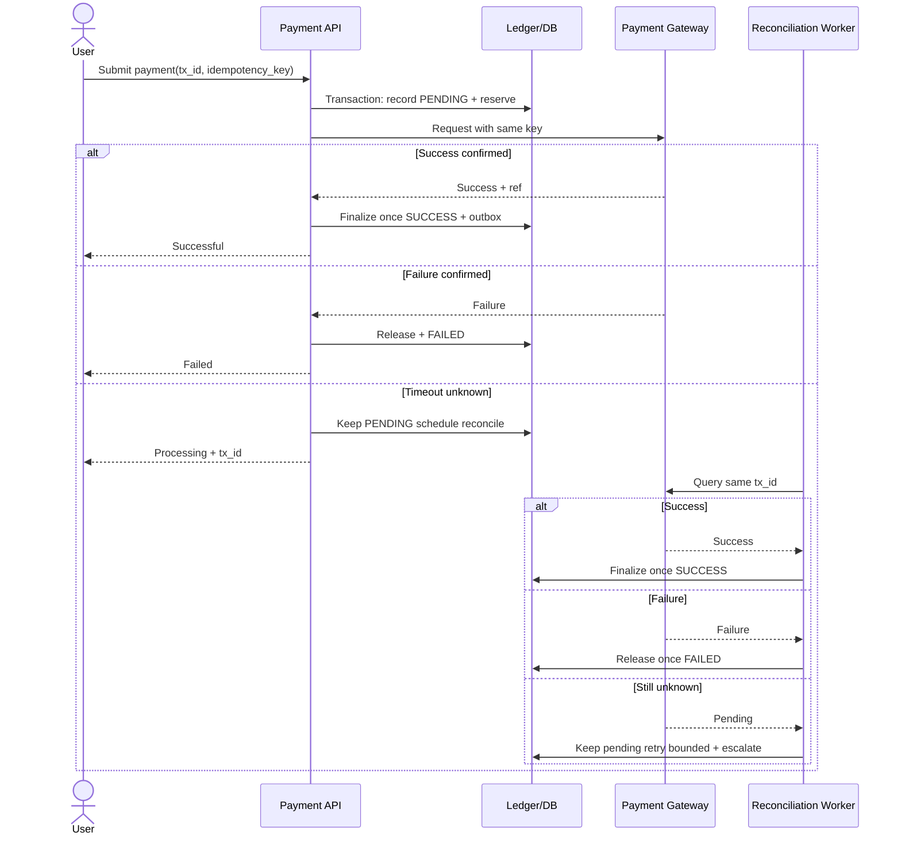
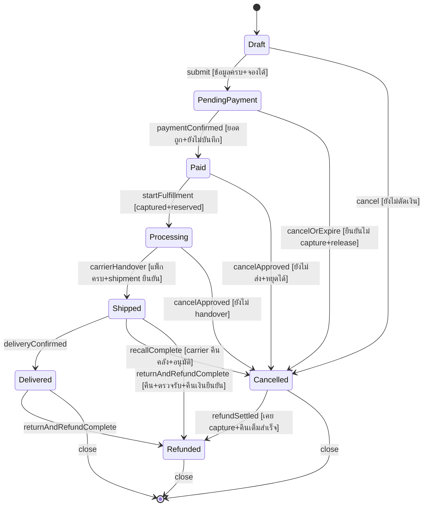

# ENGSE202: การจัดการโครงการซอฟต์แวร์ — เฉลยรวมฉบับถูกต้อง (Pre-Final)

> ครอบคลุมข้อสอบหลัก 5 ข้อ + เสริม 5 ข้อ จาก `Software Project Management.md`
> วิธีอ่าน: แต่ละข้อมีโจทย์ต้นฉบับ แล้วตอบแยกข้อย่อย ตัวเลขสมมุติเพื่อสาธิตจะระบุชัด ไม่ใช่ผลดำเนินงานจริงของ repo นี้

## ส่วน A — ข้อสอบหลัก

### A1 — Sprint Burndown และ Blocker (สัปดาห์ 8)

**โจทย์ 1.1:** วาดและวิเคราะห์ Actual Line 3 สภาวะ: ใต้ Ideal / เหนือ Ideal / พุ่งขึ้นกลาง Sprint (Scope Injection Bump)

**คำตอบ:**

Burndown แสดง **งานที่เหลือ (แกน Y)** เทียบ **เวลา (แกน X)** ต้องใช้หน่วยเดียวกันทั้งกราฟ (Story Points หรือ Remaining Hours) Ideal คือแนวอ้างอิงลดถึง 0 วันจบ Sprint Actual คือค่าจริง

ข้อมูลสมมุติ Sprint 5 วัน (ไม่ใช่ข้อมูล Jira จริง):

| วัน | Ideal | Actual ใต้ Ideal | Actual เหนือ Ideal | Actual Scope Bump |
|---:|---:|---:|---:|---:|
| 0 | 20 | 20 | 20 | 20 |
| 1 | 16 | 14 | 19 | 16 |
| 2 | 12 | 9 | 16 | 12 ก่อนเพิ่ม / 16 หลังเพิ่ม |
| 3 | 8 | 5 | 12 | 12 |
| 4 | 4 | 2 | 7 | 7 |
| 5 | 0 | 0 | 3 | 2 |

| ลักษณะ | ความหมาย | สิ่งที่ PM ตรวจ |
|---|---|---|
| ใต้ Ideal | เหลือน้อยกว่าแผน อาจเสร็จเร็ว | ตรวจ DoD ว่าครบไหม มีตัดงานโดยไม่บันทึกไหม ประมาณเผื่อเกินไปไหม อย่าดึงงานเพิ่มอัตโนมัติ ให้ช่วย review/QA ก่อน |
| เหนือ Ideal | เหลือมากกว่าแผน เสี่ยงไม่จบ | ตรวจ blocker, PR ค้าง, งานใหญ่เกิน, estimate ต่ำ, dependency ช่วยปลดล็อกและปรับ forecast อยู่เหนือเส้นวันเดียวไม่เท่ากับล้มเหลวเพราะงานอาจ Done เป็นก้อน |
| พุ่งขึ้นกลาง Sprint | งานเพิ่ม/re-estimate | ดู issue history/CR log เช่น CR-02 +4.5h บันทึกมติและผลกระทบ แยกให้ชัดว่า scope เพิ่ม ไม่ใช่ทีมช้าอย่างเดียว เส้นแบนหลายวันอาจแปลว่าไม่ได้อัปเดต estimate ไม่ใช่ไม่มีใครทำงาน |

หมายเหตุ Jira: ถ้ากราฟนับ story points การ Log Work ไม่ทำให้กราฟลดเอง ต้องดู setting ว่านับ remaining estimate หรือ issue completion `logged hours` ใช้หาต้นทุนจริง `remaining` ใช้ดูงานเหลือ คนละสิ่งกัน

**โจทย์ 1.2:** ทีมแจ้ง Daily Standup ว่า “ติด Blocker รอเพื่อนส่ง PR” PM บันทึก/ปลดล็อกบน Jira อย่างไร (เช่น Flagging)?

**คำตอบ:**

1. รับข้อมูลใน Standup ว่าการ์ดใดรอ PR ใด ตั้งแต่เมื่อไร กระทบ Sprint Goal อย่างไร แยกคุยรายละเอียดหลัง Standup ไม่ยืดประชุม
2. เปิด issue ที่ติดขัด **Add Flag / Flagged as impediment** ใส่ comment + link `is blocked by` ไปงานต้นทาง ระบุ PR link ผู้ช่วยได้ วันเริ่ม blocked
3. ลง Impediment Log มอบ owner และเวลาติดตาม เช่น Tech Lead triage ภายในครึ่งวันทำการ
4. วินิจฉัย: PR ยังไม่เปิด / CI แดง / reviewer ไม่ว่าง / interface ไม่ตรง ถ้า CI แดงช่วยเจ้าของแก้ ถ้ารอคนตรวจจัด reviewer สำรอง/pair review ถ้ารอ interface ใช้ contract/stub ชั่วคราวสำหรับส่วนที่แยกได้
5. ให้ทีมช่วย review/QA ลดงานค้าง หรือหยิบงานไม่พึ่ง PR ตาม WIP limit โดยไม่ bypass test/approve โดยไม่ตรวจ
6. เมื่อ dependency พร้อมจริงให้คนทำงานยืนยันว่าต่อได้ จึง remove flag บันทึกเวลาปลดล็อก อัปเดต remaining estimate ถ้ายังไม่ทันให้ PM/PO เจรจาจัดลำดับใหม่ งาน Done เมื่อผ่าน DoD เท่านั้น

ใน Scrum คนขจัด impediment คือ Scrum Master + Developers จัดการตนเอง โจทย์มอบบทบาทนี้ให้ PM ตามโครงสร้างวิชา PM จึงอำนวยความสะดวก ไม่สั่งข้าม quality gate

อิง ENGSE202 สัปดาห์ 3, 6, 8

### A2 — EVM และ Sprint Review/Retrospective (สัปดาห์ 9)

**โจทย์ 2.1:** PV=4,000 EV=3,000 (ผ่าน DoD) AC=4,200 จงหา SV/CV ตีความ และเสนอว่าเอาเงินส่วนใดชดเชย

**คำตอบ:**

```
SV = EV - PV = 3,000 - 4,000 = -1,000 บาท
CV = EV - AC = 3,000 - 4,200 = -1,200 บาท
SPI = 3,000/4,000 = 0.75
CPI = 3,000/4,200 ≈ 0.7143
```

* **SV=-1,000:** มูลค่างานเสร็จต่ำกว่าแผน 1,000 บาท ตามหลังแผนเชิง earned value แปลงเป็นวันล่าช้าตรงๆ ไม่ได้ ต้องดู schedule/dependency
* **CV=-1,200:** ใช้เงิน 4,200 เพื่อได้เนื้องานงบ 3,000 เกินต้นทุน 1,200 บาท จ่าย 1 บาทได้มูลค่างาน 0.714 บาท
* ห้ามใช้ `AC-PV=200` แทน CV เพราะยังไม่นับงานที่เสร็จ

**การเงินตามบริบทวิชา:** เบิก **1,200 บาทจาก Contingency Reserve** ถ้าเป็นความเสี่ยงที่ระบุไว้และอยู่ในอำนาจอนุมัติ บันทึกสาเหตุ ผู้อนุมัติ ยอดใช้/คงเหลือ ถ้าเกินวงเงินหรือนอกแผนให้ Sponsor/CCB พิจารณา Management Reserve (ความเสี่ยงไม่คาดหมาย อำนาจผู้บริหาร) / งบเพิ่ม / ปรับขอบเขต การเบิกไม่ลบ CV ที่เกิดแล้ว ต้องแก้สาเหตุ (conflict/PR รอ) และ forecast งานที่เหลือใหม่ ห้ามเพิ่ม EV/แก้ baseline ย้อนหลัง

**โจทย์ 2.2:** เทียบ Sprint Review vs Retrospective และ Mad/Sad/Glad หรือ Start/Stop/Continue สร้าง Actionable Items อย่างไร?

**คำตอบ:**

| ประเด็น | Review | Retrospective |
|---|---|---|
| ตรวจอะไร | Increment + บริบทธุรกิจ | คน วิธีทำงาน เครื่องมือ คุณภาพ |
| ใคร | Scrum Team + stakeholders | Scrum Team |
| คำถาม | สร้างคุณค่าอะไร ทำอะไรต่อ? | อะไรช่วย/ขัดขวาง จะปรับอย่างไร? |
| ผล | Feedback + ปรับ Product Backlog | แผนปรับปรุงทำได้จริง Sprint ถัดไป |

Review ไม่ใช่แค่ demo/ด่านอนุมัติ release Retro ต้องพูดปัญหาได้โดยไม่โทษคน

**Mad/Sad/Glad** เก็บหงุดหงิด/เสียดาย/ได้ผลดี แล้วจัดกลุ่มหาสาเหตุ **Start/Stop/Continue** แปลงเป็นพฤติกรรมเริ่ม/หยุด/ทำต่อ แล้วเลือก 1-2 เรื่องทำเป็น action มี owner/due date/เกณฑ์วัด เช่น “PR รอเฉลี่ย 30 ชม.” → Start reviewer rotation + Stop เปิด PR ใหญ่ปลาย Sprint วัด median review wait ใน Retro หน้า

อิง ENGSE202 สัปดาห์ 5-7, 9

### A3 — Scope Creep, Iron Triangle, CCB (สัปดาห์ 10)

**โจทย์ 3.1:** Scope Creep คืออะไร ผลร้าย? รักษาสมดุล Scope-Time-Cost เมื่อมี CR-02 ฉุกเฉินอย่างไร?

**คำตอบ:**

**Scope Creep** = ขอบเขตขยายโดยไม่ผ่านการควบคุม ไม่ปรับเวลา/งบ/ทรัพยากร เช่น รับทำ CSV “นิดเดียว” ทันทีโดยไม่คิด test/UI/error handling ผลคือ overload defect งานหลักช้า งบเกิน ส่วนที่เพิ่มผ่านวิเคราะห์+อนุมัติ+ปรับแผนคือ controlled change ไม่ใช่ creep

เมื่อมี CR-02 (4.5 man-hours ≈ 1,350 บาทที่ 300 บาท/ชม.) รักษา Scope-Time-Cost โดยคง quality/DoD:

| ทางเลือก | วิธี |
|---|---|
| ทำทันทีคงวันส่ง | swap งานสำคัญน้อยออกโดยรักษา Sprint Goal |
| งานทั้งหมดจำเป็น | เพิ่มงบ/คน (คนเพิ่มไม่ได้เร็วเป็นสัดส่วนทันทีเพราะ onboarding/dependency) หรือปรับ release schedule ตามผลกระทบจริง |
| งบ+วันคงที่ | ลด/เลื่อน scope มูลค่าต่ำโดยเห็นชอบ |
| ไม่คุ้มเสี่ยง | Defer/Reject + วิธีชั่วคราว |

ห้ามชดเชยด้วยการตัด test/Code Review ที่เป็น DoD 4.5 ชม.คนไม่เท่ากับ 4.5 ชม.ปฏิทินเพราะมีรอ review/UAT

หมายเหตุ Scrum: Scrum ใช้ timebox คงที่ ควรเจรจา scope กับ PO ใน Sprint Goal หรือปรับ release/Sprint ถัดไป ไม่ขยาย Sprint เพื่อซ่อนงานช้า ถ้าสไลด์ให้เลื่อนวันจบ Sprint ถือเป็นวิธี hybrid ของกรณีศึกษา ไม่ใช่ Scrum เคร่งครัด

**โจทย์ 3.2:** บทบาท/องค์ประกอบ CCB + มติ 3 แบบ + ถ้า Approve CSV ทันที ปรับ Contingency Log + Jira อย่างไร?

**คำตอบ:**

CCB = กลุ่มมีอำนาจตัดสินคำขอ ตรวจคุณค่า ผลกระทบ ความเสี่ยง baseline องค์ประกอบกรณีศึกษา: Sponsor/ลูกค้า ตัวแทนผู้ใช้ PM Tech Lead เชิญ QA/การเงินตามเรื่อง

* **Approve:** ทำตามขอบเขต งบ เวลา เงื่อนไขที่อนุมัติ
* **Reject:** ไม่ทำ บันทึกเหตุผล (ไม่คุ้ม/เสี่ยง/นอกเป้า)
* **Defer:** ยังไม่ทำรอบนี้ กำหนด backlog/เงื่อนไข/วันทบทวน

เมื่อ Approve CSV บันทึก CCB minutes + acceptance criteria + อนุมัติ funding ก่อนปรับแผน ตัวอย่างแยกกรณี Week 10:

| รายการ | บาท | หลักฐาน |
|---|---:|---|
| สำรองตั้งต้นสมมุติ Week 10 | +2,025 | Approved budget |
| CR-02 4.5h×300 | -1,350 | CR/CCB approval |
| คงเหลือ | **675** | 2,025-1,350 |

Log ต้องมีวันที่ CR ID เหตุผล ผู้อนุมัติ ผู้รับผิดชอบ ยอดอนุมัติ/ใช้จริง/คงเหลือ แยกวงเงินกันไว้จากค่าใช้จ่ายจริง อย่าบันทึกเป็น AC ก่อนเกิดต้นทุนจริง

บน Jira: สร้าง `[CR-02] Export Low Stock to CSV` มี estimate 4.5h subtasks Exporter/UI/QA ผู้รับผิดชอบตาม RACI acceptance criteria CR/CCB links dependencies target version ให้ PO/Dev จัด Sprint Backlog ตาม capacity อัปเดต remaining/forecast ใส่เหตุ scope bump

**คำเตือนยอดข้ามตัวอย่าง:** ถ้าเบิก 1,200 จาก A2 จากก้อนเดียวกันไปแล้ว ยอดก่อน CR-02 จะเป็น 825 หลังใช้ 1,350 จะขาด **525** ไม่ใช่เหลือ 675 ต้องของบเพิ่ม/ปรับแผน และถ้าคิดตามบทบาท ENGSE225 Week 10 + rate Week 5 จะได้ `2×400+1×300+1.5×250=1,475` ต่างจาก 1,350 อัตราเฉลี่ย ต้องระบุฐานที่ CCB อนุมัติให้ตรงกัน

อิง ENGSE202 สัปดาห์ 5, 9-10

### A4 — CFD, Little's Law, Burnup, Scope Freeze (สัปดาห์ 11)

**โจทย์ 4.1:** Bottleneck ดูอย่างไรบน CFD? Little's Law + WIP Limit ช่อง Code Review ลด lead time อย่างไร?

**คำตอบ:**

CFD แสดงงานสะสมแยกสถานะ **ความหนาแนวตั้งของแถบ ณ เวลาเดียวกัน = จำนวนงานในสถานะนั้น** ถ้าแถบ Code Review หนาขึ้นต่อเนื่องขณะที่ Done โตช้า = เข้าคิว review มากกว่าออก เป็นสัญญาณคอขวด ต้องตรวจ queue จริง อายุ PR reviewer capacity

```
Average Lead Time = Average WIP / Average Throughput (หน่วย: วัน = งาน / งานต่อวัน)
```

ใช้ค่าเฉลี่ยระบบเดียวกัน ช่วงเสถียร เช่น WIP review เฉลี่ย 6 ใบ throughput 2 ใบ/วัน = 3 วันในขั้นนี้ ถ้าลด WIP เหลือ 3 โดย throughput เท่าเดิม = 1.5 วัน ตัวเลขนี้คือเวลาในขั้น review จะเรียก lead time ทั้งระบบได้เมื่อ WIP/throughput ครอบคลุมรับงานถึงส่งมอบเดียวกัน

ตั้ง **WIP Limit=3** ตามบทเรียน เมื่อเต็มให้หยุดดึงงานใหม่ ช่วยตรวจ/แก้ PR ค้าง แบ่ง PR เล็ก จัด reviewer ปลด blocker ไม่ย้ายการ์ดหลบ limit การจำกัดช่วยลดรอเมื่อแก้คอขวดจริง ไม่รับประกัน throughput คงเดิมทุกกรณี

**โจทย์ 4.2:** Burnup เหนือกว่า Burndown อย่างไรเมื่อ scope เปลี่ยนบ่อย? ทำไมต้อง Scope Freeze Week 11?

**คำตอบ:**

| ประเด็น | Burndown | Burnup |
|---|---|---|
| แสดง | งานเหลือ | เสร็จสะสม + ขอบเขตทั้งหมด |
| scope เพิ่ม | remaining สูงขึ้น ดูคล้ายทีมช้า | เส้น Total สูงขึ้น แยกจาก Completed ชัด |

ตัวอย่าง Week 11: scope 20 + CR-01 5 + CR-02 4 = **29** เสร็จ 27 = `27/29≈93.1%` เหลือ 2 เห็นว่าทีมส่งเพิ่มจริงแม้เป้าขยับ

**Scope Freeze Agreement** ตรึงสิ่งที่จะตรวจรับใน release นี้เพื่อให้มีเวลา hardening/UAT/คู่มือ ระบุ baseline/version CR ที่รวมแล้ว วันเริ่ม freeze วันตรวจรับ acceptance criteria ข้อยกเว้น defect/security ผู้อนุมัติ วิธีแยก defect จากความต้องการใหม่ + future backlog Code Freeze คุมการแก้โค้ด Scope Freeze คุม requirement ที่ส่งมอบ ทำให้ UAT/release อ้างระบบชุดเดียวกัน

อิง ENGSE202 สัปดาห์ 11

### A5 — CPI/SPI, ปิดโครงการ, Maintenance ROI (สัปดาห์ 12-15)

**โจทย์ 5.1:** CPI=EV/AC กับ SPI=EV/PV บอกอะไร? CPI=0.96 SPI=1.00 หมายความอย่างไร?

**คำตอบ:**

**CPI** วัดประสิทธิภาพต้นทุน >1 ดี =1 เท่างบ <1 เกิน CPI=0.96 = จ่าย 1 บาทได้มูลค่างาน 0.96 บาท เกินเมื่อเทียบ EV `(1/0.96-1)≈4.17%` ส่วน `(1-0.96)=4%` คือช่องว่างเทียบ AC ต้องระบุตัวหาร

ตัวอย่างสไลด์ EV=15,525 AC=16,100 → **CPI≈0.9643** ปัด 0.96 เกิน `575/15,525≈3.70%` ต่างจาก 4.17% เพราะปัดเศษ CPI ผ่านเกณฑ์ตัวอย่าง ≥0.95 ได้แต่ยังไม่มีประสิทธิภาพเท่า 1

**SPI** วัดมูลค่างานเสร็จเทียบควรเสร็จ ณ วันรายงาน SPI=1.00 = EV=PV ณ จุดวัด แต่ไม่ยืนยันทุกกิจกรรม/critical path ตรงเวลา ตอนจบโครงการ SPI อาจกลับเป็น 1 แม้ส่งช้าจริง ต้องดู milestone/actual finish ด้วย

**โจทย์ 5.2:** เทียบ Administrative Closure vs Financial & Procurement Closure (Close Project or Phase) + คำนวณ Maintenance ROI

**คำตอบ:**

| มิติ | Administrative | Financial & Procurement |
|---|---|---|
| เป้า | ยืนยันส่งมอบครบ เก็บความรู้สืบทอด | ปิดต้นทุน หนี้ สัญญา สำรองตรวจสอบได้ |
| งาน | ตรวจ Charter/WBS/DoD/UAT sign-off ส่งคู่มือ เก็บ OPAs Lessons Learned มอบทีมดูแล | กระทบยอด work log×rate/ใบเสร็จ/ค้างจ่าย ปิด SaaS/Cloud จัดการสำรอง |
| ผล | Closure report archive Lessons Register | Final EVM reconciliation contract settlement reserve log |

Lessons ต้องมี Situation Root Cause Impact Recommendation เช่น “PR ใหญ่ทำ review ค้าง → แบ่ง PR เล็ก + reviewer rotation” เก็บใน OPAs (WBS/RACI/Risk/CCB/CI templates)

ชื่อ Close Project or Phase มาจากกรอบ process-oriented (PMBOK 6) ส่วน PMBOK 7 จัดเป็น principles/performance domains ใช้ร่วมกันตามบริบทโจทย์ได้

**Maintenance ROI (ช่วงเดียวกัน เช่น 1 ปี):**

```
ROI% = (Benefits - Investment)/Investment ×100
```

| รายการ | คำนวณ | บาท |
|---|---|---:|
| ลงทุน | AC ตัวอย่าง | 16,100 |
| ประหยัดแก้บั๊ก | (10-2)×12×150 | 14,400 |
| ลด stockout (สมมุติสไลด์) | — | 12,000 |
| Benefits | 14,400+12,000 | 26,400 |
| สุทธิ | 26,400-16,100 | 10,300 |

`ROI=10,300/16,100≈63.98% ≈64.0% ปัด 1 ตำแหน่ง` ค่า 63.9% ในสไลด์คือตัดทศนิยม Payback ถ้าสม่ำเสมอไม่มีต้นทุนเพิ่ม `16,100/(26,400/12)≈7.32 เดือน` ยอด 12,000 ต้องเป็นกำไรส่วนเพิ่ม/ความเสียหายสุทธิที่เลี่ยง ไม่ใช่ยอดขายทั้งก้อน ไม่นับซ้ำ รวม running cost และติดตาม benefit realization หลังส่งมอบจริง

**หมายเหตุกระทบยอด:** `2,025-1,350-575=100` ถูกเชิงเลขคณิตเฉพาะรายการนั้น แต่ Week 7 บอก baseline 15,525 รวมสำรองแล้วขณะที่ AC=16,100 สูงกว่า 575 การบอกว่ายังอยู่ในงบเพราะหักสำรองอีกเสี่ยงนับซ้ำ และยังไม่รวมเบิก 1,200 ของ Week 9 ต้องตรวจ ledger/มติเปลี่ยนงบจริงก่อนปิดบัญชี

## ส่วน B — ข้อสอบเสริม Requirements & System Analysis

### B1 — NFR สู่ Architecture + Payment Timeout

**โจทย์:** Use Case Mobile Banking ช่วงโปรโมชัน NFR: ตัดยอด ≤2s / Availability 99.95% 24/7 / Peak 5,000 TPS แปลงเป็น tactics อย่างไร + วาด Sequence เมื่อ Gateway Timeout รักษา consistency อย่างไร?

**คำตอบ:**

ต้องทำ NFR ให้วัดได้ก่อน: 2s วัดจากจุดใด “ตัดยอดเสร็จ” หรือ “รับคำขอแล้ว” 99.95% วัดช่วงใด **5,000 TPS คือ throughput ไม่ใช่ concurrency**

| NFR | Tactics/Constraints | พิสูจน์ |
|---|---|---|
| ≤2s | กำหนด time budget (เช่น gateway ≤1.2s ledger ≤0.3s อื่น ≤0.5s) ลด sync hops connection pool/index ไม่เรียก email/report ใน critical path สงวน capacity ledger | load test ที่ target TPS เก็บ latency distribution + เกิน 2s ถ้าใช้ p99 ต้องตกลงเพราะโจทย์ไม่กำหนด percentile |
| 99.95% | redundant หลาย failure domains LB/health check DB replication/failover isolation circuit breaker monitoring | failover/fault injection วัด uptime/success 30 วัน budget `43,200×0.0005=21.6 นาที` ต้องตกลงนับ planned downtime อย่างไร |
| 5,000 TPS | stateless scale-out capacity plan load shedding/backpressure partition ตาม account โดยรักษา ordering queue เฉพาะ async | sustain peak + workload จริง วัด throughput/latency/error/queue ไม่เดาจำนวน server |

ถ้าเฉลี่ย 2s ที่ 5,000/s จะมี in-flight เฉลี่ย ~10,000 ตาม Little's Law แต่ max/percentile ไม่เท่าค่าเฉลี่ย อย่าสรุป concurrency จากตัวเลขนี้โดยไม่วัด “ตอบรับใน 2s” ไม่เท่ากับ “ตัดยอดเสร็จใน 2s” ถ้า requirement ต้อง settlement ทุกครั้งใน 2s แม้ gateway timeout รับประกันฝั่งเดียวไม่ได้ ต้องมี gateway SLA หรือเจรจา pending flow

**Sequence Timeout (หลัก: timeout=ยังไม่รู้ผล ห้าม retry key ใหม่/ประกาศ fail แล้วคืนเงินทันที):**



reserve/finalize ใช้ local DB transaction สั้นๆ ไม่เปิดค้างรอ network บังคับ unique key + conditional transition กันลงซ้ำเมื่อ webhook/worker ชนกัน ใช้ outbox ให้ ledger+event อยู่ transaction เดียวกัน ผู้รับต้อง idempotent ถ้าชดเชยหลัง success ให้เป็น reverse/refund ตรวจย้อนได้

### B2 — RTM + Impact Biometric+TOTP

**โจทย์:** ปลาย Sprint ขอเปลี่ยน OTP SMS → Biometric+TOTP App จงเขียน RTM + ประเมิน Scope/Schedule/Cost/Debt ถ้าอนุมัติทันที

**คำตอบ (สมมุติ: device-bound key ปลดล็อกด้วย biometric + server ตรวจ TOTP ไม่ส่ง biometric ดิบขึ้น server):**

| UR | FR | Test | Components |
|---|---|---|---|
| UR-AUTH-01 ใช้อุปกรณ์ลงทะเบียน | FR ลงทะเบียน device key + พิสูจน์ครอบครอง | register สำเร็จ/ปฏิเสธ key ผิด | Enrollment API keystore device registry |
| UR-AUTH-02 ใช้ biometric ก่อน | FR local biometric gate + sign challenge server ตรวจ signature/expiry | biometric fail ไม่ sign / replay/expired ปฏิเสธ | Mobile biometric keystore verifier |
| UR-AUTH-03 ใช้ TOTP | FR ตรวจตาม time window กัน reuse/rate limit | valid/wrong/expired/reuse/drift | TOTP verifier secret store time rate limiter |
| UR-AUTH-04 ไม่ล็อกเมื่อเปลี่ยนเครื่อง | FR recovery/re-enroll + revoke เก่า | recovery สำเร็จ/กัน takeover | Recovery support revocation |
| UR-AUTH-05 ย้ายจาก SMS มีแผน | FR migration/flag/audit/rollback | migration/mixed/rollback ไม่ bypass | Account schema flags audit UI/API |

RTM จริงต้องมี revision CR ID owner PR link ผล test trace 2 ทิศ

| มิติ | กระทบถ้าทำทันที | รับมือ |
|---|---|---|
| Scope | enrollment device proof secret lifecycle recovery revocation migration audit | เขียน acceptance + work packages + out-of-scope ให้ครบ |
| Schedule | security/mobile/API/QA พึ่งกัน ปลาย Sprint เสี่ยงไม่ทัน | ประเมิน dependency/capacity swap/เลื่อน/staged rollout ไม่ตัด test |
| Cost | แรงหลายบทบาท อุปกรณ์หลายรุ่น security review support | Bottom-up Σ(hours×rate)+เครื่องมือ+reserve ไม่ให้ยอดรวมลอยๆ |
| Debt | flow ซ้ำ flags ค้าง recovery ลัด migration ไม่สมบูรณ์ | กำหนด auth interface version strategy owner วันเลิก legacy + regression/security gates |

TOTP ตาม RFC 6238 ต้องคุม drift/secret/reuse biometric client อย่างเดียว server เชื่อไม่ได้ และ TOTP เสี่ยง phishing/relay ถ้า biometric+TOTP อยู่อุปกรณ์เดียวกันต้องทบทวน threat model

### B3 — Conflict Marketing vs Finance + MoSCoW

**โจทย์:** Omni-channel ตลาดอยาก checkout ไวไม่บังคับกรอกส่วนบุคคล บัญชีอยากบังคับเลขผู้เสียภาษี+ที่อยู่ทะเบียนบ้านก่อนสร้าง Order จงทำ Prioritization + Negotiation

**คำตอบ:**

ใช้ MoSCoW ตัดสินจากจำเป็นต่อธุรกิจ/กฎที่ยืนยัน conversion ความเสี่ยงข้อมูลผิด privacy effort dependency ไม่ใช้เสียงดังตัดสิน

| กลุ่ม | เสนอ |
|---|---|
| Must | order/ยอดถูก มีข้อมูลจำเป็นตามชนิดเอกสารที่ลูกค้าเลือก ตรวจสอบย้อนได้ |
| Should | guest checkout ข้อมูลขั้นต่ำ ขอข้อมูลเต็มเมื่อเลือกใบกำกับเต็ม เติมจาก profile เมื่อยินยอม |
| Could | บันทึก billing profile เติมที่อยู่ครั้งหน้า |
| Won't รอบนี้ | บังคับสร้าง account + กรอกเต็มทุกช่องโดยไม่มีเหตุยืนยันว่าจำเป็น |

**Flow ประนีประนอม:** guest checkout ขอเฉพาะติดต่อ/จัดส่ง/ชำระ → ให้เลือกชนิดเอกสาร ถ้าเอกสารนั้นต้องเลขภาษี/ที่อยู่ให้ขอ+ตรวจก่อนออก → ถ้าไม่ครบเก็บ Draft/Pending ตามนโยบาย ไม่ออกเอกสารสมบูรณ์ด้วยข้อมูลปลอม → ให้บัญชีรับรองว่าแต่ละสถานะสร้าง order/รับเงิน/ออกเอกสารอะไรได้ → ทดสอบวัด completion/time + completeness/error แล้วลงนาม SRS ร่วม นี่คือแบบจำลอง ไม่สรุปว่าทุก order ต้องใช้เลขภาษี ต้องให้เจ้าของกฎบัญชียืนยันก่อนกำหนด Must

### B4 — Verification vs Validation + แก้ Requirement ห่วย

**โจทย์:** SRS ตาม IEEE 830/29148 เสร็จแล้ว Verification vs Validation ต่างกันอย่างไร? ชี้ข้อบกพร่อง “ระบบต้องคำนวณภาษีออกใบเสร็จได้อย่างรวดเร็วเป็นมิตร” แล้วเขียนใหม่ด้วย Unambiguous/Verifiable/Traceable

**คำตอบ:**

**Verification** = เขียน requirement ถูกหลักครบสอดคล้องทดสอบได้ไหม ทำ inspection checklist consistency RTM audit **Validation** = ต้องการจริงแก้ปัญหาจริงไหม ทำ walkthrough prototype acceptance scenarios กับ stakeholders ทั้งคู่ทำได้ก่อนมี code

ประโยคเดิมห่วย: ไม่ระบุชนิดภาษี ปัดเศษ จุดจับเวลา ความหมายเป็นมิตร (Unambiguous ตก) ไม่มี threshold/workload/task ตัดสิน Pass/Fail ไม่ได้ (Verifiable ตก) ไม่มี ID แหล่งที่มา owner test link (Traceable ตก)

เขียนใหม่ (ตัวเลขสมมุติสาธิต ต้องให้ stakeholder อนุมัติ):

| ID | ปรับแล้ว | ตรวจ |
|---|---|---|
| FR-TAX-01 | คำนวณภาษีตาม BR-TAX-01 revision อนุมัติ ปัดตาม BR-ROUND-01 บันทึก revision ที่ใช้ | UR-ACC-01 → TaxCalculator → TC ปกติ/rounding/invalid |
| FR-REC-01 | payment confirmed success ออกใบเสร็จมีเลขไม่ซ้ำ ยอดก่อน/ภาษี/รวม ขอซ้ำ order เดิมไม่สร้างซ้ำ | UR-ACC-02 → ReceiptService → TC ปกติ/duplicate |
| NFR-PERF-01 | บน ENV-01 ที่กำหนด คำนวณ+พร้อมดาวน์โหลดใน 2s ที่ p95 ภายใต้ 100 concurrent 15 นาที error ≤0.1% | UR-OPS-01 → TC-PERF + report |
| NFR-USE-01 | ผู้ใช้ใหม่ 20 คนทำ task ได้โดยไม่แนะนำ สำเร็จ ≥90% SUS เฉลี่ย ≥70 | UR-UX-01 → TC-USE + report |

### B5 — State Machine Order + Exception Shipped แล้วยกเลิก

**โจทย์:** 8 states Draft Pending Payment Paid Processing Shipped Delivered Cancelled Refunded จงวาด State Machine + จัดการกรณีกดยกเลิกตอน Shipped

**คำตอบ (สมมุติ full-order/full-refund partial ต้องแยก line-item เพิ่ม ใช้ order + payment_status/return_status/shipment ประกอบ):**



กฎ: เปลี่ยนผ่าน service ตรวจ state/guard ใน transaction/optimistic concurrency UI ไม่แก้ตรง Payment timeout ค้าง Pending อย่า cancel โดยสมมุติไม่ capture ต้อง reconcile ก่อน Paid ไม่ตั้งจากข้อความ client ต้องยืนยัน provider บันทึกครั้งเดียว Cancelled ที่เคยจ่ายให้แสดง REFUND_PENDING รับผิดชอบคืนต่อจน Refunded event ซ้ำต้อง idempotent ไม่ดึงถอยหลัง

**Shipped แล้วกดยกเลิก:** อ่าน shipment/state ล่าสุดอย่าเชื่อจอค้าง → บันทึก request ID แจ้งรอขนส่ง ตั้ง return REQUESTED order ยัง Shipped → ถ้า recall ได้รอ confirm/ตรวจรับแล้ว Cancelled→คืนเงิน idempotent→Refunded ถ้าไม่ได้รอ Delivered แล้ว return ตามนโยบายตรวจรับก่อน refund → ถ้า refund timeout/fail เก็บ PENDING/FAILED retry+reconcile+escalate ไม่เพิ่ม stock ซ้ำ → เก็บ audit ผู้ขอ/อนุมัติ/shipment/stock/refund ให้ตรวจย้อนได้
