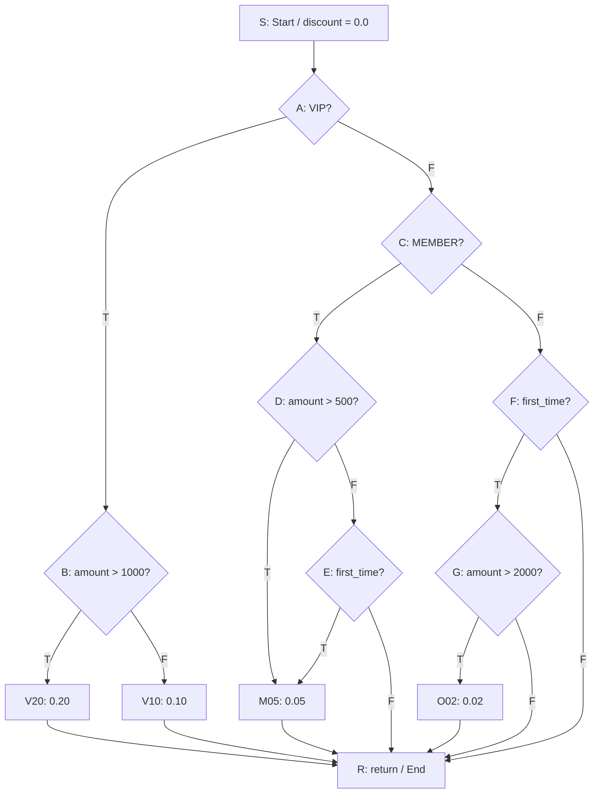
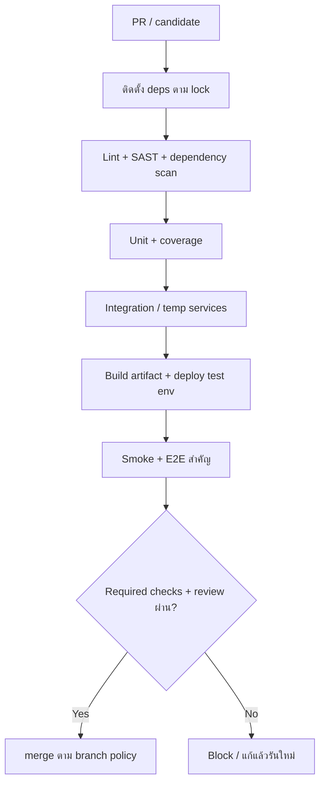

# ENGSE225: วิวัฒนาการซอฟต์แวร์และการบำรุงรักษา — เฉลยรวมฉบับถูกต้อง (Pre-Final)

> ครอบคลุมข้อสอบหลัก 5 ข้อ + เสริม 5 ข้อ จาก `Software Evolution and Maintenance.md`
> โค้ด/แบบออกแบบเป็นตัวอย่างประกอบคำตอบ ไม่ใช่หลักฐานว่าแก้/ทดสอบระบบจริง ตัวเลขสไลด์ที่ยกมาเป็นข้อมูลกรณีศึกษา

## ส่วน A — ข้อสอบหลัก Mini Inventory Legacy

### A1 — Refactoring และ Safety Net (สัปดาห์ 8)

**โจทย์ 1.1:** อธิบาย Extract Class/Extract Function แตก `main()` เป็น Product/InventoryRepository/InventoryService + Encapsulate Field & Parameterize Object เลิก `global x` ส่ง object ผ่านพารามิเตอร์ (DI) พร้อมโค้ดสั้น

**คำตอบ:**

Refactoring = เปลี่ยนโครงสร้างภายในโดยรักษาพฤติกรรมภายนอก (ยอดสต็อก เพิ่ม/ลดสินค้า) ต้องแยกจากเพิ่ม Barcode/แก้บั๊กที่เปลี่ยนพฤติกรรม

**Extract Function:** ย้ายชุดคำสั่งหน้าที่ชัดออกจาก `main()` ตั้งชื่อสื่อ input/output แทนที่เดิมด้วยการเรียก ทำให้เทสตรรกะได้โดยไม่เปิดเมนู

```python
# ก่อน: อยู่ใน main() พึ่ง global x
total = sum(item["q"] * item["p"] for item in x.values())
print(total)

# หลัง: ยังรับ schema/สูตรเดิมคงพฤติกรรม
def calculate_total_inventory_value(items):
    return sum(item["q"] * item["p"] for item in items.values())
```

**Extract Class:** แยกหน้าที่ปะปน

| คลาส | รับผิดชอบ | ไม่ปะปน |
|---|---|---|
| `Product` | ข้อมูล+กฎผูกสินค้า เช่น stock_value | เปิดไฟล์/input |
| `InventoryRepository` | โหลด/บันทึก/แปลง JSON↔object | พิมพ์เมนู |
| `InventoryService` | use case/กฎธุรกิจ เช่น total/low stock | รายละเอียด JSON/จอ |
| `ConsoleUI` | รับคำสั่ง/แสดงผล | คำนวณธุรกิจซ้ำ |

```python
from dataclasses import dataclass

@dataclass(frozen=True)
class Product:
    product_id: str
    name: str
    quantity: int
    price: float
    def stock_value(self):
        return self.quantity * self.price

class InventoryRepository:
    def __init__(self, products=()):
        self._products = {p.product_id: p for p in products}
    def load_all(self):
        return tuple(self._products.values())

class InventoryService:
    def __init__(self, repository):
        self._repository = repository
    def total_value(self):
        return sum(p.stock_value() for p in self._repository.load_all())
```

**Encapsulate Field:** ย้าย state จาก `global x` เข้าวัตถุ เข้าถึงผ่านเมธอด คืน tuple + frozen ช่วยลดแอบแก้จากภายนอก `_` ใน Python คือข้อตกลงไม่ใช่กันเข้าถึงเด็ดขาด ในระบบเต็มเพิ่มเมธอดแก้สต็อกผ่านกฎธุรกิจ อย่าเปลี่ยนกฎระหว่าง refactor โดยไม่อนุมัติ

**ส่ง object ผ่านพารามิเตอร์/DI:** ผู้ประกอบระบบสร้าง Repository แล้วฉีดเข้า Service `InventoryService(json_repo)` เทสใช้ `InventoryService(fake_repo)` ได้โดยไม่แตะ global คำว่า Parameterize Object ในโจทย์ใช้ในความหมายนี้ อย่าสับสนกับ Introduce Parameter Object (รวมหลายพารามิเตอร์เป็น object) แบ่งไฟล์อย่างเดียวไม่พิสูจน์ Clean Architecture ต้องดูทิศ dependency ว่า Domain พึ่ง abstraction ไม่พึ่ง implementation ภายนอก

ลำดับปลอดภัย: (1) ล็อกพฤติกรรมด้วย characterization/regression tests (2) แยกฟังก์ชันคำนวณ (3) แยก Product (4) ย้าย I/O สู่ Repository + adapter schema เดิม (5) ฉีดเข้า Service (6) ให้ UI เรียก Service แล้วลบ `global x` ทุกก้าวรัน tests

**โจทย์ 1.2:** ทำไมต้องมี Safety Net (PyTest) เสมอ? กฎเหล็กรัน Test ตอนผ่าตัดคืออะไร?

**คำตอบ:**

Legacy มี dependency/ผลข้างเคียงซ่อน การย้ายโค้ดอาจเปลี่ยนโหลด/ตัดสต็อก/คำนวณโดยไม่รู้ Safety Net ล็อกกรณีปกติ ขอบ เร่งพฤติกรรมสำคัญเดิมให้แจ้ง regression เร็ว

กฎเหล็ก: **เริ่มเมื่อ tests เดิมเขียว เปลี่ยนทีละน้อย กลับมาเขียวหลังแต่ละก้าวก่อนก้าวต่อไป** แดงให้หยุด/ย้อนเฉพาะก้าวล่าสุด ไม่เพิ่มฟีเจอร์กลบ ไม่ merge ที่ยังแดง Red ใน TDR คือล้มเหลวตั้งใจสำหรับพฤติกรรมใหม่ คนละบริบท ผ่านทั้งหมด = ผ่านชุดที่มีอยู่ ไม่ใช่พิสูจน์ไม่มีบั๊ก ต้องมี review + system test ร่วม

อิง ENGSE225 สัปดาห์ 2-3, 5-9

### A2 — Change Request, TDR, RCA (สัปดาห์ 8-10)

**โจทย์ 2.1:** CR-01 Barcode+Reorder Point + Emergency CR-02 CSV สต็อกต่ำ จงอธิบายจัดการตาม ISO/IEC 14764 / IEEE 1219 ตั้งแต่รับคำขอ Impact Analysis ถึง TDR

**คำตอบ (ประยุกต์กรอบ maintenance เป็นกระบวนการตรวจย้อนได้):**

1. **รับ/บันทึก:** CR ID ผู้ขอ เหตุธุรกิจ ขอบเขต ด่วน เกณฑ์ยอมรับ ไม่เริ่มจากปากเปล่า
2. **จำแนก:** CR-01/CR-02 = Perfective (เพิ่มความสามารถ) BUG-101 KeyError = Corrective ด่วนไม่เปลี่ยนประเภทอัตโนมัติ
3. **Impact Analysis:** ระบุ Domain/Service/Repository/UI schema migration tests เสี่ยง rollback ประเมิน man-hours ส่ง PM
4. **อนุมัติ:** PM/CCB Approve/Reject/Defer บันทึกขอบเขต/งบก่อน implement emergency แค่เร็วขึ้น ไม่ยกเลิกควบคุม/ทดสอบ
5. **พัฒนาแบบ TDR:** failing test แทน acceptance → โค้ดให้ผ่าน → จัดระเบียบโดย tests เขียว ใช้ branch แยกผูก CR-PR
6. **ตรวจรับ:** unit/integration/regression ระบบเดิม + review/CI + UAT ที่เกี่ยว อัปเดต CHANGELOG RTM maintenance records

| CR | กระทบหลัก | Acceptance tests ต้องมี |
|---|---|---|
| CR-01 | Product +`barcode:str` `reorder_point:int` Repository อ่าน/เขียน schema ใหม่+รองรับเก่า Service แจ้งเตือน UI รับ/แสดง | round-trip รวมศูนย์นำหน้า reorder ไม่ลบ quantity ต่ำกว่า/เท่า/สูงกว่าเกณฑ์ โหลดข้อมูลเก่า |
| CR-02 | `CsvReportExporter` แยกจาก UI/Repository รับ low stock จาก Service กำหนดสิทธิ์/path | header/ข้อมูลตรง เฉพาะ low stock ว่างยังมี header ไทย comma/quote เขียนล้มเหลวต้องแจ้ง |

เงื่อนไขบทเรียน `quantity <= reorder_point` ต้องเทส 3/5/6 → True/True/False

```python
from dataclasses import dataclass
import pytest
@dataclass(frozen=True)
class Product:
    product_id: str; name: str; quantity: int; price: float
    barcode: str = ""; reorder_point: int = 5
    def stock_value(self): return self.quantity * self.price
    def is_low_stock(self): return self.quantity <= self.reorder_point

@pytest.mark.parametrize("quantity, expected", [(3, True), (5, True), (6, False)])
def test_low_stock_boundary(quantity, expected):
    assert Product("P01","Pen",quantity,10.0,barcode="00123",reorder_point=5).is_low_stock() is expected
```

CR-02 บทเรียน Week 10 ประเมิน **4.5 man-hours: Exporter 2 + UI 1 + QA 1.5** แยก report จาก Repository งานปกติใช้ feature branch hotfix จาก production baseline เฉพาะปัญหาต้องปล่อยทันทีและต้อง merge กลับสายพัฒนา

**โจทย์ 2.2:** เปิด `data.json` เก่าไม่มี `barcode` แล้ว KeyError แครช จงทำ RCA 5 Whys + แก้ระดับสถาปัตยกรรม (Default Fallback ใน Repository)

**คำตอบ:**

| # | Why | ตอบตามสถานการณ์ |
|---|---|---|
| 1 | ทำไมล่ม? | อ่าน `row["barcode"]` ไม่มี key → KeyError |
| 2 | ทำไมไม่มี? | สร้างด้วย schema เก่าก่อน CR-01 |
| 3 | ทำไมเข้าโมเดลใหม่ไม่ได้? | deserializer บังคับฟิลด์ใหม่ทุกครั้ง ไม่มี migration/default |
| 4 | ทำไมไม่ fallback? | สมมุติข้อมูลทุกชุดเป็นรุ่นใหม่ เทสเฉพาะข้อมูลใหม่ |
| 5 | ทำไมไม่ถูกจับ? | เปลี่ยน schema ขาดข้อกำหนด backward compat + fixture ข้อมูลเก่าใน DoD |

ข้อ 4-5 ต้องยืนยันกับ PR/test history จริง ไม่โทษบุคคลจากถามครบ 5 ครั้ง

แก้ที่ **Repository/serialization boundary** แปลงภายนอกเป็น Domain มาตรฐานก่อนเข้า Service fallback เฉพาะ optional ตรวจ/แจ้งสำหรับ required ห้าม `except: pass` หรือเติม 0 ให้ข้อมูลเสียทุกกรณี

```python
def product_from_row(product_id, row):
    # legacy กรณีนี้ใช้ name/qty/price ถ้าใช้ n/q/p ต้องมี adapter อีกตัวชัดๆ
    return Product(product_id, row["name"], row["qty"], row["price"],
        barcode=row.get("barcode", ""), reorder_point=row.get("reorder_point", 5))
```

`.get` ช่วยเฉพาะ key หาย ไม่แก้ `null`/ผิดชนิด ต้องตรวจชนิด/ค่าลบด้วย ก่อนแก้สร้าง JSON เก่าใน `tmp_path` ทำบั๊กซ้ำ หลังแก้ตรวจโหลดครบ ค่าเดิมไม่เปลี่ยน default ถูก บันทึกโหลดกลับได้ เก็บใน regression ผูก `BUG-101→RCA→Repository→PR→test`

อิง ENGSE225 สัปดาห์ 8-10

### A3 — Atomic File Writing + Code Freeze (สัปดาห์ 11)

**โจทย์ 3.1:** เสี่ยง Data Corruption จาก `open(file,'w')` ตอนไฟดับ/Crash อย่างไร? Atomic (temp+os.replace) ช่วยให้ปลอดภัย 100% ได้อย่างไร?

**คำตอบ:**

`open(w)` ล้างของเดิมทันที ถ้าล่มระหว่าง `json.dump` ไฟล์อาจว่าง/ครึ่ง JSON โหลดกลับไม่ได้ เสียของที่เคยสมบูรณ์

Atomic = **เขียนไฟล์ใหม่ให้เสร็จก่อน แล้วสลับชื่อครั้งเดียว**:

1. สร้าง temp ใน directory เดียวกัน (filesystem เดียวกัน)
2. serialize ลง temp จนจบ ตรวจ error + flush
3. `os.fsync` ผลักลง storage
4. ปิดแล้ว `os.replace(temp,target)` แบบ atomic ตาม platform/filesystem
5. POSIX เพิ่ม dir fsync เพื่อความทนทานชื่อหลังไฟดับ จัดการ temp เมื่อพลาด

```python
import json, os, tempfile
from pathlib import Path
def atomic_save_json(target, data):
    target = Path(target); temporary = None
    try:
        with tempfile.NamedTemporaryFile(mode="w", encoding="utf-8",
            dir=target.parent, prefix=target.name+".", suffix=".tmp", delete=False) as s:
            temporary = Path(s.name)
            json.dump(data, s, ensure_ascii=False, allow_nan=False)
            s.flush(); os.fsync(s.fileno())
        os.replace(temporary, target); temporary = None
        if os.name == "posix":
            fd = os.open(target.parent, os.O_RDONLY)
            try: os.fsync(fd)
            finally: os.close(fd)
    finally:
        if temporary is not None: temporary.unlink(missing_ok=True)
```

สมมุติ dir มีอยู่ ผู้เขียนรายเดียว ล้มก่อน replace ของเดิมยังอยู่ replace สำเร็จผู้อ่านใหม่เจอไฟล์ครบ ไม่เจอครึ่งไฟล์ ถ้า dir fsync ล้มหลัง replace ต้องรายงานความทนทานไม่ยืนยัน

**แก้ถ้อยคำโจทย์: รับรอง 100% ทุกเหตุการณ์ไม่ได้** atomicity ≠ durability ไม่กัน disk เสีย ข้อมูลผิดตั้งแต่ต้น lost update ผู้เขียนพร้อมกัน ต้องมี backup/recovery drill validation locking/transaction เพิ่ม ดู `os.replace` docs

**โจทย์ 3.2:** Code Freeze ตาม ISO/IEC/IEEE 12207 คืออะไร วัตถุประสงค์ กฎเหล็กอะไร? ทำไม Week 11 ห้ามเพิ่มฟีเจอร์?

**คำตอบ:**

Code Freeze = ตรึงชุดโค้ดส่งมอบ จำกัดประเภทแก้เพื่อให้ release candidate นิ่ง ผลทดสอบ/UAT อ้างระบบชุดเดียวกัน เป็นนโยบายโครงการสนับสนุน configuration/integration/transition ตาม 12207 ไม่ใช่ข้อบังคับสากลว่าทุกโครงการต้อง freeze Week 11

กฎโครงการนี้:

* CR-01/CR-02 รวม+ผ่านเกณฑ์ก่อน freeze
* **No New Features:** ไม่เพิ่มฟีเจอร์/ปรับ UI/ refactor ใหญ่เสี่ยงช่วงตรวจรับ
* อนุญาต defect วิกฤต/security + เพิ่ม test ภายใต้ผู้อนุมัติ ทุก patch ผ่าน PR/CI/regression
* บันทึก commit/candidate ที่ตรวจรับ แก้แล้วรันทดสอบกระทบซ้ำ
* คำขอใหม่ลง future backlog จำเป็นจริงต้องผ่าน exception/change control + ปรับแผนตรวจรับ

เหตุผล: เพิ่มนาทีสุดท้ายขยายพื้นที่ regression UAT ต้องตรวจใหม่ คู่มือ/แพ็กเกจอาจไม่ตรงโค้ด freeze กันเวลา hardening/UAT Week 12

อิง ENGSE225 สัปดาห์ 11, 14

### A4 — UAT + Production Baseline (สัปดาห์ 12)

**โจทย์ 4.1:** ต่าง System Testing vs UAT อย่างไร (12207 Release Management)? ทำไมต้องแยก UAT Defect vs New Scope ให้เด็ดขาด?

**คำตอบ:**

| มิติ | System Testing | UAT |
|---|---|---|
| เป้า | ตรง functional/NFR รวมทำงานร่วมได้ | รองรับงานธุรกิจจริงผ่านเกณฑ์ตรวจรับ |
| หลัก | QA/วิศวกร | ผู้ใช้/ตัวแทนธุรกิจ ทีมช่วยเตรียม |
| ตัวอย่าง | โหลด JSON เก่า validation atomic save CR-01/02 integration error handling | รับ Milk 10 → ตัด 6 เหลือ 4 → เตือนเกณฑ์ 5 → เปิด CSV สั่งซื้อ |
| หลักฐาน | results defect coverage env | scenarios expected/actual ข้อยกเว้น sign-off |

System ≠ Unit และไม่ต้อง auto ทั้งหมด UAT เทียบ acceptance ที่ตกลง ไม่ใช่พอใจลอยๆ

* **UAT Defect:** ผิด requirement ที่อนุมัติ เช่น qty=5 ไม่เตือนที่ threshold 5 บันทึก severity/priority แก้ตาม release policy + retest
* **New Scope:** ไม่เคยตกลง เช่น ส่งอีเมลหา supplier อัตโนมัติ เปิด CR/future backlog ตาม Scope Freeze ไม่ปน defect

แยกเพื่อรักษาเกณฑ์ตรวจรับ/เงิน/เวลา ไม่ให้ “แก้บั๊ก” กลายเพิ่มฟีเจอร์ไม่จบ และไม่ให้ทีมอ้างงานใหม่เลี่ยงสิ่งที่รับปาก ยึด SRS/CR/RTM อนุมัติ Defect ใน UAT ไม่ใช่ Critical ทุกตัว ต้องประเมินธุรกิจก่อนตัดสินแก้ก่อน release หรือรับข้อยกเว้น

**โจทย์ 4.2:** SemVer 2.0.0 MAJOR.MINOR.PATCH คืออะไร? ทำไมเลื่อน `v1.0.0-baseline→v2.0.0-evolution` บน main ด้วย Annotated Tag?

**คำตอบ:**

SemVer อิง **public API/สัญญาประกาศ**: MAJOR=เปลี่ยนไม่ compatible MINOR=เพิ่มแบบ compatible PATCH=แก้บั๊กแบบ compatible

เรื่องเล่าวิชา `v1.0.0-baseline` = ฐานเก่า `v2.0.0-evolution` = milestone หลังแยก Product/Repository/Service + Barcode/Reorder/CSV ผ่าน UAT แล้ว **แต่ refactor ใหญ่ไม่บังคับ MAJOR** ถ้าสัญญาเดิมยังใช้ได้ เพิ่มแบบ compatible อาจเหมาะ MINOR ต้องพิสูจน์ breaking จริงจึงอ้าง MAJOR ตาม SemVer ได้เต็มปาก `-baseline/-evolution` ตามไวยากรณ์คือ prerelease ถ้าจะ stable ใช้ `2.0.0` tag `v2.0.0` + release title ว่า Evolution

ขั้นตอนกรณีศึกษา: UAT sign-off + regression + PR review → merge `main` → tag บน commit ที่ตรวจรับ

```bash
git tag -a v2.0.0-evolution -m "Accepted inventory evolution release"
```

Annotated เก็บคน/วัน/ข้อความ/ชี้ commit ใช้ตามรอย/checkout ย้อนได้ ควรกันย้าย/ลบหลังเผยแพร่ สร้าง tag ไม่ได้สร้าง GitHub Release/sign-off อัตโนมัติ tag ชี้ commit ไม่ผูก branch ถาวร

อิง ENGSE225 สัปดาห์ 3-4, 12

### A5 — Clean Environment + Maintenance Dossier (สัปดาห์ 13-15)

**โจทย์ 5.1:** ทำไมต้องติดตั้งบน Clean/Fresh Environment แก้ “It works on my machine”? Smoke vs Post-Maintenance Full Regression ต่างกันอย่างไร?

**คำตอบ:**

เครื่อง dev มี lib/env/cache/absolute path เฉพาะคน ทำให้รันได้ทั้งที่ของส่งมอบไม่ครบ Clean พิสูจน์ว่าคนใหม่ติดตั้งจาก artifacts+คู่มืออย่างเดียวได้

วิธี: checkout tag ที่ตรวจรับในโฟลเดอร์ใหม่ venv ไม่รับ site-packages เดิม ติดตั้ง deps ล็อก ตั้งค่าจาก `.env.example` ตรวจสิทธิ์/data/export dirs รัน Smoke→Full Regression บันทึก OS/Python/version/commit/คำสั่ง/ผล venv อย่างเดียวไม่แยก OS ทั้งหมด ข้อจำกัด OS ต้องใช้เครื่องใหม่/VM/container

| ประเด็น | Smoke | Full Regression |
|---|---|---|
| เป้า | build พร้อมเทสต่อไหม | บำรุงรักษาไม่ทำของเดิมเสียไหม |
| ขอบเขต | กว้างตื้นไม่กี่เส้นทาง | ครบ suite เดิม+ใหม่+ขอบ+ล้มเหลว |
| ตัวอย่าง | เปิดเมนู โหลดคลัง คำสั่งหลักไม่แครช | ยอด ตัดสต็อก default schema Barcode alert boundary CSV atomic failure |
| ไม่ผ่าน | แก้ติดตั้ง/พื้นฐานก่อน | เปิด defect แก้+เทสซ้ำก่อนส่ง |

Smoke ผ่านไม่แทน regression regression ผ่านไม่แทน UAT

**โจทย์ 5.2:** ตาม ISO/IEC 14764 (Clause 8.4: Maintenance Records) 3 องค์ประกอบใน Complete Dossier ให้ทีมถัดไปรับช่วงยั่งยืนคืออะไร?

**คำตอบ (โครง 3 ภาคของวิชา Week 14-15 รวม Week 13):**

1. **Quality/Metrics Audit:** ขอบเขต baseline As-Is vs As-Built arch/schema วิธีวัด+ผล complexity/coupling/coverage regression/UAT security/dependency clean install/recovery ระบุ version/ข้อจำกัด ตัวเลข 22→6 coverage 94% 18 tests ในสไลด์คือกรณีศึกษา ไม่ใช่ผลวัด repo นี้
2. **Traceability & History:** CR-01/02 impact มติ BUG-101 5 Whys CHANGELOG commit/PR tests UAT เชื่อมกัน อธิบายแก้อะไร ทำไม ใครอนุมัติ พิสูจน์อย่างไร เช่น `BUG-101→legacy compat→Repository.load_all→PR/commit→test_missing_barcode→release tag` ต้องใช้รหัสจริง ไม่คัดลอก hash ตัวอย่าง
3. **Admin/Operations & Handover:** ติดตั้ง/config lock migration เปิดระบบ/backup/restore/rollback Known Issues เพิ่มความสามารถ ผู้รับผิดชอบ escalation ส่งสิทธิ์ช่องทางเหมาะ ไม่ใส่ secrets ลงคู่มือ

**แก้การอ้างมาตรฐานในโจทย์:** สารบัญ 14764:2006 ที่บทเรียนใช้ **ไม่มี “8.4 Maintenance Records”** มี Modification Implementation ข้อ 5.3 และ Review/Acceptance ข้อ 5.4 สามภาคข้างต้นคือรูปแบบ Dossier ของวิชา ไม่ควรอ้างว่ามาตรฐานบังคับในข้อ 8.4

อิง ENGSE225 สัปดาห์ 13-15

## ส่วน B — ข้อสอบเสริม Testing/QA/Metrics

### B1 — CFG, Cyclomatic Complexity, Test Cases

**โจทย์:**

```python
def calculate_discount(customer_type, total_amount, is_first_time):
    discount = 0.0
    if customer_type == "VIP":
        if total_amount > 1000:
            discount = 0.20
        else:
            discount = 0.10
    elif customer_type == "MEMBER":
        if total_amount > 500 or is_first_time:
            discount = 0.05
    else:
        if is_first_time and total_amount > 2000:
            discount = 0.02
    return discount
```

จงวาด CFG + คำนวณ V(G) 2 สูตร + ออกแบบ Basis Paths 100% Path Coverage

**คำตอบ CFG (แยก `or`/`and` ตาม short-circuit Python ไม่รวม exception ผิดชนิด):**



**คำตอบ V(G):** N=13 (S A B C D E F G V20 V10 M05 O02 R) E=19 `S→A A→B A→C B→V20 B→V10 V20→R V10→R C→D C→F D→M05 D→E E→M05 E→R M05→R F→G F→R G→O02 G→R O02→R` P=1

```
V = E-N+2P = 19-13+2 = 8
Predicates A B C D E F G = 7 → V = 7+1 = 8
```

ถ้าผู้สอนใช้ CFG ระดับ statement รวม compound เป็น node เดียวจะมี 5 predicates → V=6 (N=11 E=15) ต้องใช้ granularity เดียวกันทั้ง 2 สูตร คำตอบหลักใช้ short-circuit ตาม Python จึงได้ 8

**คำตอบ Basis (8 เส้นทาง = ครบ feasible เพราะไม่มี loop VIP 2 + MEMBER 3 + GENERAL 3):**

| TC | type | amount | first | เส้นทาง | discount |
|---|---|---:|---|---|---:|
| T1 | VIP | 1001 | False | S-A-B-V20-R | 0.20 |
| T2 | VIP | 1000 | False | S-A-B-V10-R | 0.10 |
| T3 | MEMBER | 501 | False | S-A-C-D-M05-R | 0.05 |
| T4 | MEMBER | 500 | True | S-A-C-D-E-M05-R | 0.05 |
| T5 | MEMBER | 500 | False | S-A-C-D-E-R | 0.00 |
| T6 | GENERAL | 2001 | False | S-A-C-F-R | 0.00 |
| T7 | GENERAL | 2001 | True | S-A-C-F-G-O02-R | 0.02 |
| T8 | GENERAL | 2000 | True | S-A-C-F-G-R | 0.00 |

T3 ไม่ประเมิน `is_first_time` เพราะ `or` ตัวแรกจริง T6 ไม่ประเมินยอดเพราะ `and` ตัวแรกเท็จ โดยทั่วไป Basis ≠ All-Paths แต่ฟังก์ชันนี้มี 8 เส้นทางพอดีจึงครบ 100% path ภายใต้ขอบเขตนี้ ไม่ได้แปลเทสทุก input เสริม boundary 999/1000/1001 499/500/501 1999/2000/2001 + validation ตาม requirement อ้างอิง NIST SP 500-235

```python
import pytest
@pytest.mark.parametrize("kind, amount, first, expected", [
    ("VIP",1001,False,0.20),("VIP",1000,False,0.10),
    ("MEMBER",501,False,0.05),("MEMBER",500,True,0.05),("MEMBER",500,False,0.00),
    ("GENERAL",2001,False,0.00),("GENERAL",2001,True,0.02),("GENERAL",2000,True,0.00)])
def test_discount_paths(kind, amount, first, expected):
    assert calculate_discount(kind, amount, first) == pytest.approx(expected)
```

### B2 — Test Doubles + Integration Strategy

**โจทย์:** `OrderService.checkout()` เรียก Payment/Inventory/Email จงเทียบ Dummy/Stub/Mock/Fake ว่าใช้กับ Service ใดเพราะอะไร + เทียบ Top-Down vs Bottom-Up + Drivers/Stubs

**คำตอบ:**

| ประเภท | หน้าที่ | ตัวอย่าง checkout |
|---|---|---|
| Dummy | เติม parameter ไม่ถูกใช้ในเส้นทางนั้น | notifier ที่ไม่ควรถูกเรียกเมื่อ validation ปฏิเสธ |
| Stub | คืนค่ากำหนดล่วงหน้า | Payment คืน approved/declined/timeout ตามเคส ไม่เรียกเงินจริง |
| Mock | ตรวจปฏิสัมพันธ์ จำนวนครั้ง/args | ตรวจ Payment ด้วย amount/idempotency ถูก Email ส่งครั้งเดียวหลังสำเร็จ ไม่ส่งเมื่อจ่ายล้ม |
| Fake | ทำงานง่ายมี state ไม่เหมาะ prod | Inventory in-memory reserve/release/commit ทดสอบ stock หลัง checkout/compensation |

Dummy ≠ Stub เมื่อต้องใช้ผล dependency จะแทนด้วย Dummy ไม่ได้ Fake ควรผ่าน contract tests เทียบระบบจริง ไม่ให้ผ่านเพราะของจำลองง่ายเกินไป Unit ใช้ doubles เพื่อเร็ว/คุม failure Integration ต้องเชื่อมของจริงในขอบเขตประกาศ (Service+Repo+test DB / adapter+sandbox) ไม่เรียก integration จาก test ที่ mock ทุกตัว

ชุดเสนอ: สำเร็จ stub success + fake มีของ ตรวจ stock จอง/ตัดครั้งเดียว + mock email / ปฏิเสธตรวจ release + ไม่ paid + ไม่ส่งเมล / timeout เก็บรอยืนยัน ไม่หักซ้ำ retry ไม่แจ้งว่าจ่ายแล้วโดยไร้หลักฐาน / email ล้มหลังจ่ายไม่ย้อนจ่าย auto ให้ retry notification แยก เลือก mock vs stub ตามสิ่งที่พิสูจน์ ไม่มีบังคับว่า service หนึ่งใช้ได้ชนิดเดียว

| กลยุทธ์ | วิธี | ดี | จำกัด |
|---|---|---|---|
| Top-Down | เริ่ม checkout ใช้ stub ล่าง ค่อยแทนของจริง | เห็น orchestration/flow เร็ว | stub อาจไม่ตรง protocol/error จริง ต้องมี contract/integration เพิ่ม |
| Bottom-Up | เทส adapter/data ล่างจริงก่อน ใช้ driver แทนบน แล้วรวมขึ้น | เห็น data/protocol เร็ว | เห็น flow ช้า ต้องดูแล driver |

Driver = ผู้เรียกแทนบน Stub = dependency แทนล่าง ทั้งคู่ลดรอ component แต่ไม่พิสูจน์สิ่งที่แทน ต้องมี tests timeout/stock ไม่พอ/rollback/duplicate/email failure หลังจ่ายกันคิดเงินซ้ำ ใช้ผสม: unit orchestration top-down + integration adapters bottom-up + E2E flow สำคัญปิดท้าย

### B3 — Test Pyramid + CI Quality Gates

**โจทย์:** อธิบายสัดส่วน/เป้าหมาย Unit/Integration/E2E ทำไมไม่ควร E2E เป็นหลัก (Ice-Cream Cone) + เขียน CI Workflow + Quality Gate block merge ไป production

**คำตอบ:**

| ชั้น | ตัวอย่างเริ่มวางแผน | เป้า |
|---|---:|---|
| Unit 70% | ตรรกะย่อยเร็ว เช่น discount reorder boundary | เร็ว ระบุสาเหตุง่าย จำนวนมาก |
| Integration 20% | สัญญาเชื่อม Service-Repo JSON/CSV | จับ schema/auth/serialize |
| E2E/UI 10% | เส้นทางสำคัญ รับ→ตัด→export | เห็นระบบประกอบแล้ว |

**70/20/10 คือตัวอย่าง ไม่ใช่อัตราบังคับ** ปรับตามเสี่ยง/สถาปัตยกรรม ถ้าส่วนใหญ่ E2E = Ice-Cream Cone ช้า แพง เปราะต่อ UI/env หาต้นเหตุยาก feedback ช้า ทีมไม่เชื่อ CI แต่ไม่ลบ E2E หมดเพราะ unit อย่างเดียวไม่เห็นต่อระบบ



| ด่าน | เกณฑ์กรณีศึกษา | บังคับ |
|---|---|---|
| Lint | ไม่เหลือ error ตามกฎทีม | exit code ไม่ศูนย์เมื่อผิด |
| SAST/deps | ไม่มี Medium/High ค้างโดยไม่ triage/อนุมัติ Week 14 เป้า known CVE=0 (0 = เครื่องมือนั้นไม่พบ ไม่ใช่ปลอดภัยทุกกรณี) | required check + report + วัน/ฐานสแกน |
| Unit/regression | ที่บังคับผ่านทั้งหมด ไม่ retry กลบ flaky | fail/error = pipeline ไม่ผ่าน |
| Coverage | รวม ≥90% ตาม Week 11 + ดู branch/critical | fail-under จริง ไม่ใช่แค่โชว์ report สูงไม่แทน assertion/requirement ถูก |
| Integration | schema เก่า/ใหม่ contract ผ่าน ใช้ data แยก ล้างหลังเทส | report |
| Smoke/E2E | artifact ที่จะส่งมอบติดตั้งได้ flow สำคัญผ่าน | ทดสอบ artifact เดียวกัน |
| PR | reviewer ≥1 ประเด็นบังคับแก้ required checks ผ่านบน commit จะ merge กัน push ตรง/bypass | branch protection develop/main |

Workflow นี้คือออกแบบตอบโจทย์ ไม่ใช่รายงานว่าติดตั้ง pipeline จริง

### B4 — ISO/IEC 29110 + V&V Work Products

**โจทย์:** VSE Basic Profile (PM+SI) กิจกรรม SI ใดเป็น V&V โดยตรงต่อ Work Products? ทำ Peer/Code Review Checklist อย่างไรให้ Requirement→Implementation→Unit Test ไม่ตกหล่น?

**คำตอบ:**

Basic Profile แยก PM/SI ขอบเขตตาม ISO 29110-4-1 รายละเอียด verification/validation/testing ใน TR 29110-5-1-2 ตารางนี้คือประยุกต์ตอบโจทย์ ไม่ได้อ้างเลข task คำต่อคำทุกฉบับ

| กิจกรรม SI | Work Product | V&V ที่ควรมี |
|---|---|---|
| Requirements Analysis | Requirements/SRS RTM | Verify ครบ/สอดคล้อง/ไม่กำกวม/ทดสอบได้ + validate กับลูกค้าว่าตรงธุรกิจ |
| Arch/Detailed Design | Design | ตรวจครอบ requirements interface/constraints + trace + walkthrough/prototype |
| Construction | Components + Unit Tests | review เทียบ design/rules + unit เทียบสเปก |
| Integration/Tests | Integrated SW cases/procedures/report | ตรวจความครบ test ก่อนรัน + integration/system เทียบ requirements บันทึก defect/retest |
| Product Delivery | Configuration/ชุดส่งมอบ | ตรวจครบ code/คู่มือ/config + ลูกค้ายอมรับตามเกณฑ์ |

ต้องมีผลตรวจ รายการบกพร่อง ผู้แก้ ตรวจซ้ำ initiation แค่เตรียมแผน/env ไม่แทน V&V เหล่านี้

**Checklist:**

1. Requirement มี ID/version/owner/acceptance ชัดไหม?
2. เชื่อม design/component/test 2 ทิศได้ไหม? ไม่มี requirement ลอย ไม่มี code ไร้ที่มา?
3. ทำตามกฎครบ รวมขอบเขต/ล้มเหลว? เช่น low stock `<=` Barcode string schema เก่าแปลงที่ Repository?
4. แยก UI/logic/data ไม่เพิ่ม global คุมไม่ได้? input/exception/persistence กันไฟล์ครึ่ง แจ้ง failure ไม่ hardcode secrets?
5. unit มี expected จาก requirement ไม่คัดลอกตรรกะผิดจาก impl ไม่ assert แค่ “ไม่แครช”? integration/regression ครอบกระทบ + CI ผ่านบนรุ่นจะรวมจริง?
6. reviewer ดู revision เดียวกัน บันทึก finding ผู้แก้ ตรวจซ้ำก่อน approve อัปเดต RTM/CHANGELOG/คู่มือเมื่อพฤติกรรม/วิธีใช้เปลี่ยน?

ตัวอย่าง trace: `FR-LOW-01 qty≤threshold → Product+Service → qty 4,5,6/threshold 5→True,True,False` `FR-LEG-01 โหลดเก่าได้ → Repository adapter → JSON ขาด 2 ฟิลด์→barcode ว่าง threshold 5 ค่าเดิมครบ` `FR-CSV-01 export low → Exporter → header ถูก ไม่มี stock ปกติ` ต้องดู requirement ไร้ test และ test ไร้ requirement ด้วย เก็บ Pass/Fail/N/A + เหตุผล ไม่ติ๊กโดยไม่ดูหลักฐาน

### B5 — Quality Metrics + SUS

**โจทย์:** เทียบ Defect Density/Code Churn/Pass Rate + วิเคราะห์ “Pass 98% แต่ UAT defects สูง” เกิดจากออกแบบทดสอบอย่างไร? + SUS คำนวณ 1-5 คู่/คี่→0-100 อย่างไร เกณฑ์ Acceptable คือเท่าไร?

**คำตอบ:**

| Metric | สูตร/ความหมาย | ตีความ |
|---|---|---|
| Defect Density | defects ยืนยัน ÷ ขนาด เช่น defects/KLOC เช่น 12/4=3/KLOC | ระบุรุ่น ช่วง severity ตัวหาร ตัวเดียวเทียบข้ามบริบทไม่ได้ |
| Code Churn | บรรทัดเพิ่ม/ลบ/แก้ช่วงเวลาหนึ่งตามนิยามเครื่องมือ | ชี้จุดเปลี่ยนบ่อย/เสี่ยง สูงไม่แปลว่าห่วยเสมอ refactor ดี churn สูงได้ |
| Pass Rate | ผ่าน ÷ execute ×100 เช่น 98/100=98% | ผลชุดที่รัน ต้องแยก skipped/blocked/not-run ไม่ซ่อนช่องว่าง ไม่เท่ากับ coverage 98% หรือไร้บั๊ก 98% |

Churn = internal/change metric Density = internal/external ตามจุดพบ pass rate บอก execution ไม่บอก requirement ครบ

Pass สูงแต่ UAT แตก: เทสแต่ happy path assertion อ่อน doubles ไม่เหมือนจริง data ไม่มี legacy schema ขาด workflow/roles/edge business RTM ตก expected ผิด env/พฤติกรรมผู้ใช้ต่างจากเทส 2% ที่ตกอาจคือธุรกรรมวิกฤตทั้งหมด ใช้ % รวมอนุมัติ release ไม่ได้ แก้โดย map defects→RTM risk-based review เพิ่ม regression จากบั๊ก เพิ่ม boundary/negative/integration/UAT ตามเสี่ยง ทบทวน oracle ดู coverage/escaped/severity ร่วม ไม่ปั่น test ง่ายทำ % สวย

**SUS (10 ข้อ 1-5 คี่บวกคู่ลบ คิดรายคนก่อนแล้วเฉลี่ยกลุ่ม):**

```
คี่ 1,3,5,7,9: contribution = ตอบ-1
คู่ 2,4,6,8,10: contribution = 5-ตอบ
SUS = รวม 10 ข้อ (0-40) ×2.5 = 0-100
```

ตัวอย่าง `[4,2,4,2,4,2,4,2,4,2]` ได้ข้อละ 3 รวม 30 → **75** รายงาน mean + n + กระจาย + บริบท SUS ไม่ใช่ % สำเร็จ เกณฑ์ Bangor/Kortum/Miller ประมาณ **>70 Acceptable 50-70 Marginal <50 Not Acceptable** ค่า 68 คือ mean อ้างอิง ไม่ใช่เส้นผ่านสากลตายตัว 75 จึง acceptable ตามแนวนี้ ต้องดู task success/time/error จริงร่วม ไม่ให้พอใจสูงกลบปัญหาธุรกิจ
